# :cloud: CodePipeline - Build and Deploy Lambda :infinity:

### _TASK: write Pipeline_
1. Sourse:
   - Connect and configure GitHub 
2. CodeBuild step:
   - Write spec file:
      - build docker image (create Python script for lambda)
      - Add versioning for images 
      - Push to ecr
3. CodeDeploy step:
   - Write CloudFormation template
   - Deploy lambda (use CloudFormation Stack  with parameters and template file)
   - Transfer parameter (Image TAG) from Build stage to Deploy stage in pipeline
   - Invoke Lambda and check responce!
4. Configure API Gateway:
   - GET request
   - POST request

#### :bangbang: _Prerequisites:_
1. IAM ROLES:
   - for build
   - for deploy (CloudFormation)
   - for pipeline
2. S3 Bucket (I use **"cdp-aws-task-code-for-lambda"**)


### _Sourse: connect and configure GitHub_
1. Go to **CodePipeline** service and click **Create Pipeline**
   - Pipeline name: cdp-AWS-Task
   - Service role: Existing service role
   - Select your role 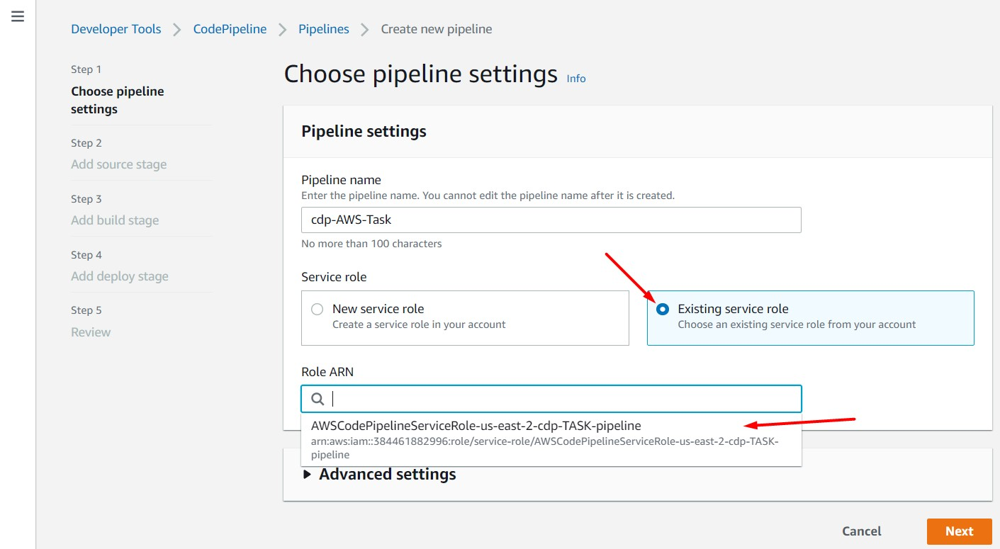
   - NEXT
2. Connect our Git:
   - Action name: Source
   - Action provider: GitHub (Version 2) :warning:
   - Select **Connect to GitHub** and enter your credentials from your git account! 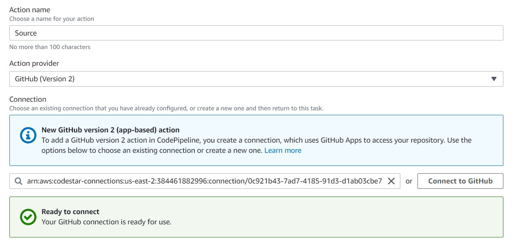
3. Configure:
   - Repository name: select your Repo
   - Branch name: select branch, where place your code!
   - Select - **Start the pipeline on source code change**
   - Select - **Full clone** :grey_exclamation: :warning: 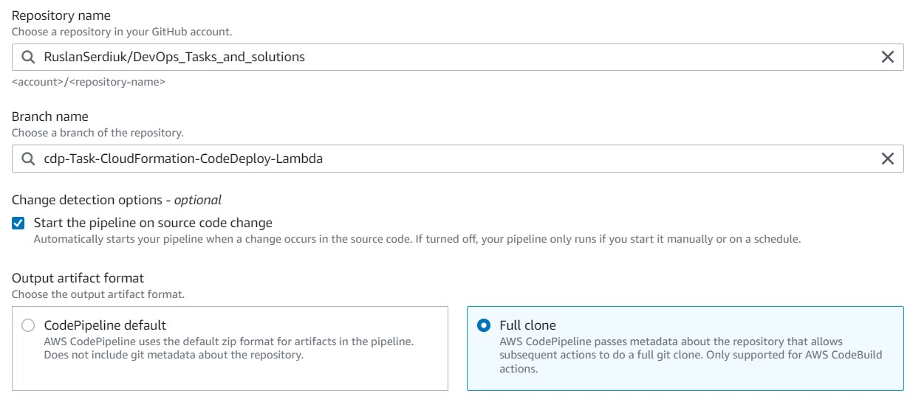
   - NEXT


### _CodeBuild:_
1. Prepare your CodeBuild [buildspec.yaml]() :arrow_down:
    ```
    version: 0.2
    
    env:
      variables:
        AWS_DEFAULT_REGION: "us-east-2"
        AWS_ACCOUNT_ID    : "384461882996"
        ECR_REPO_NAME     : "ruslan.serdiuk"
        ECR_IMAGE_TAG     : "latest"
        BUCKET            : "cdp-aws-task-code-for-lambda"
    
    phases:
      install:
        runtime-versions:
          python: 3.9
        commands:
          - echo "Check aws and git version"
          - aws --version
          - git --version
    
      pre_build:
        commands:
          - echo "Login to AWS ECR and get commit id"
          - aws ecr get-login-password --region $AWS_DEFAULT_REGION| docker login --username AWS --password-stdin $AWS_ACCOUNT_ID.dkr.ecr.$AWS_DEFAULT_REGION.amazonaws.com
          - COMMIT_ID=$(git rev-parse --short HEAD)
    
      build:
        commands:
          - echo Building the Docker image...
          - docker build -f ./AWS/CodePipeline-CodeDeploy/Dockerfile -t $ECR_REPO_NAME:$ECR_IMAGE_TAG ./AWS/CodePipeline-CodeDeploy/
          - docker tag $ECR_REPO_NAME:$ECR_IMAGE_TAG $AWS_ACCOUNT_ID.dkr.ecr.$AWS_DEFAULT_REGION.amazonaws.com/$ECR_REPO_NAME:$ECR_IMAGE_TAG
          - docker tag $ECR_REPO_NAME:$ECR_IMAGE_TAG $AWS_ACCOUNT_ID.dkr.ecr.$AWS_DEFAULT_REGION.amazonaws.com/$ECR_REPO_NAME:$COMMIT_ID
          - ls $CODEBUILD_SRC_DIR
          - ls AWS
          - ls AWS/CodePipeline-CodeDeploy
          - aws cloudformation package --template-file ./AWS/CodePipeline-CodeDeploy/template.yaml --s3-bucket $BUCKET --output-template-file ./AWS/CodePipeline-CodeDeploy/outputtemplate.yaml
          - ls AWS/CodePipeline-CodeDeploy
          - export TAG=$ECR_IMAGE_TAG
    
      post_build:
        commands:
          - echo Pushing the Docker image...
          - docker push $AWS_ACCOUNT_ID.dkr.ecr.$AWS_DEFAULT_REGION.amazonaws.com/$ECR_REPO_NAME:$ECR_IMAGE_TAG
          - docker push $AWS_ACCOUNT_ID.dkr.ecr.$AWS_DEFAULT_REGION.amazonaws.com/$ECR_REPO_NAME:$COMMIT_ID
    artifacts:
      type: zip
      files:
        - ./AWS/CodePipeline-CodeDeploy/template.yaml
        - ./AWS/CodePipeline-CodeDeploy/outputtemplate.yaml
    ```

2. Of course, prepare your [lambda.py]() too :arrow_down:
    ```
    import json
    import uuid
    
    GET_RAW_PATH = "/getlambda"
    POST_RAW_PATH = "/postlambda"
    
    def lambda_handler(event, context):
        print(event)
        if event['rawPath'] == GET_RAW_PATH:
            print('Start request for getlambda')
            personId = event['queryStringParameters']['personId']
            print("Received request with personId=" + personId)
            return { "firstName": "Ruslan" + personId, "lastName": "Serdiuk", "email": "Ruslan.serdiuk.w@gmail.com" }
        elif event['rawPath'] == POST_RAW_PATH:
            print('Start request for postlambda')
            decodedEvent = json.loads(event['body'])
            firstName = decodedEvent['firstName']
            print('Received request with firstName=' + firstName)
            return { "personId": str(uuid.uuid1())}
    ```

3. And finaly, prepare your [Dockerfile]() :arrow_down:
    ```
    FROM public.ecr.aws/lambda/python:3.8
    
    COPY lambda.py ./
    
    CMD [ "lambda.lambda_handler" ]
    ```

5. Now let's **Configure Build stage**:
   - In the Build provider select - **AWS CodeBuild**
   - To the right of Project name, select **Create project**
   - **Project configuration:** 
     - Project name: "cdp-AWS-lambda-container"
     - Select - **Restrict number of concurrent builds this project can start**
     - Concurrent build limit: **1** 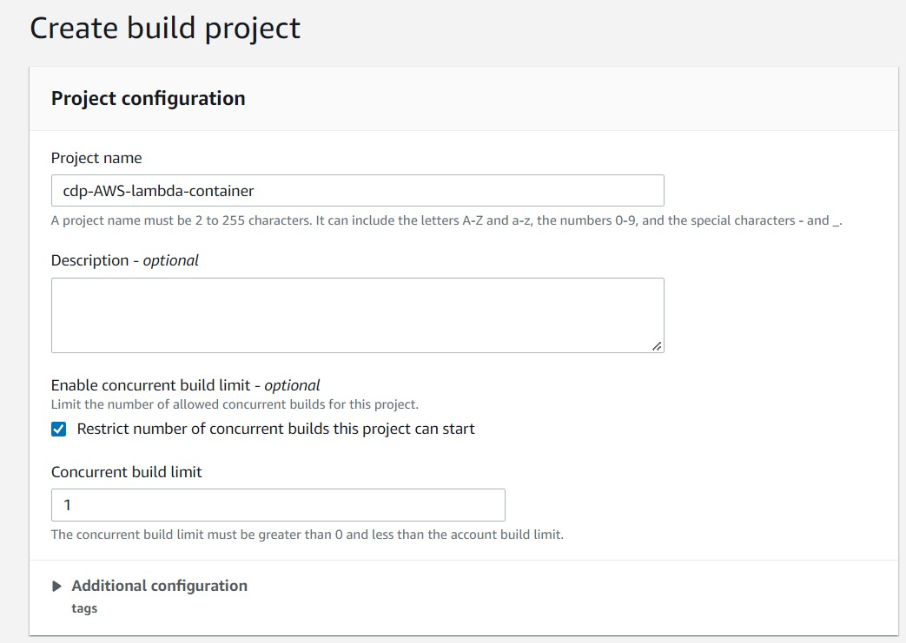
   - **Environment:**
     - Environment image: **Managed image**
     - Operating system: **Amazon Linux 2**
     - Runtime(s): **Standard**
     - Image: **aws/codebuild/amazonlinux2-x86_64-standard:4.0** 
       - [AWS CodeBuild manages the following Docker images that are available in the CodeBuild and AWS CodePipeline consoles.](https://docs.aws.amazon.com/codebuild/latest/userguide/build-env-ref-available.html)
     - Image version: **Always use tha latest image for this runtime version**
     - Environment type: **Linux**
     - Select - **Enable this flag if you want to build Docker images or want your builds to get elevated privileges**
     - Service role: **Existing service role**
     - Role ARN: **Select your role**
     - Don't select - **Allow AWS CodeBuild to modify this service role so it can be used with this build project** :warning: 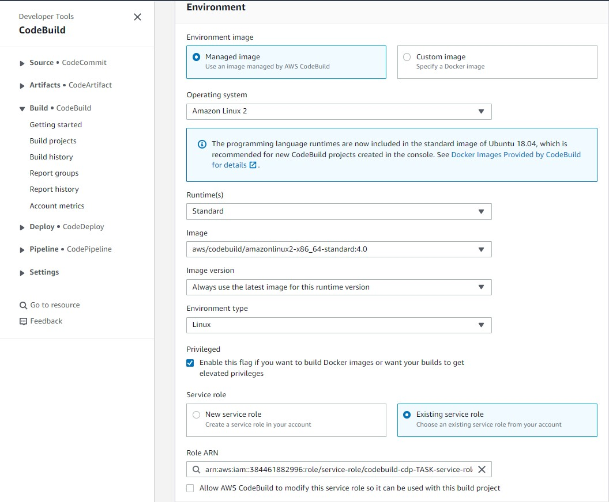
   - **Buildspec:**
     - Build specifications: **Use a buildspec file**
     - Buildspec name: **AWS/CodePipeline-CodeDeploy/buildspec.yaml** 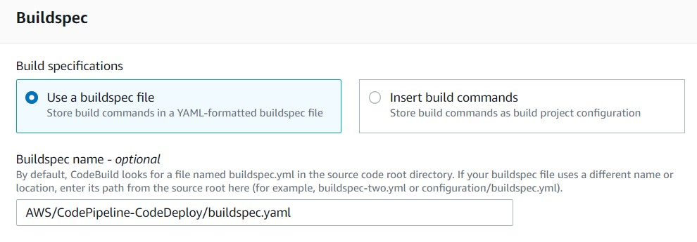
     - **Continue to CodePipeline** 


    
### _CodeDeploy:_
1. Prepare your CloudFormation [template.yaml]() :arrow_down:
    ```
    AWSTemplateFormatVersion: 2010-09-09
    Parameters:
      ImageId:
        Type: String
        Description: Enter image's ID + tag
    
    Resources:
      AWSTask:
        Type: "AWS::Lambda::Function"
        Properties:
          FunctionName: "cdp-AWS-Task"
          Role: "arn:aws:iam::384461882996:role/JenkinsTask"
          PackageType: "Image"
          Code: 
            ImageUri: !Ref ImageId
          Timeout: 300
    ```

2. **Add deploy stage:**
   - Deploy provider: **AWS CloudFormation**
   - Action mode: **Create or update a stack** 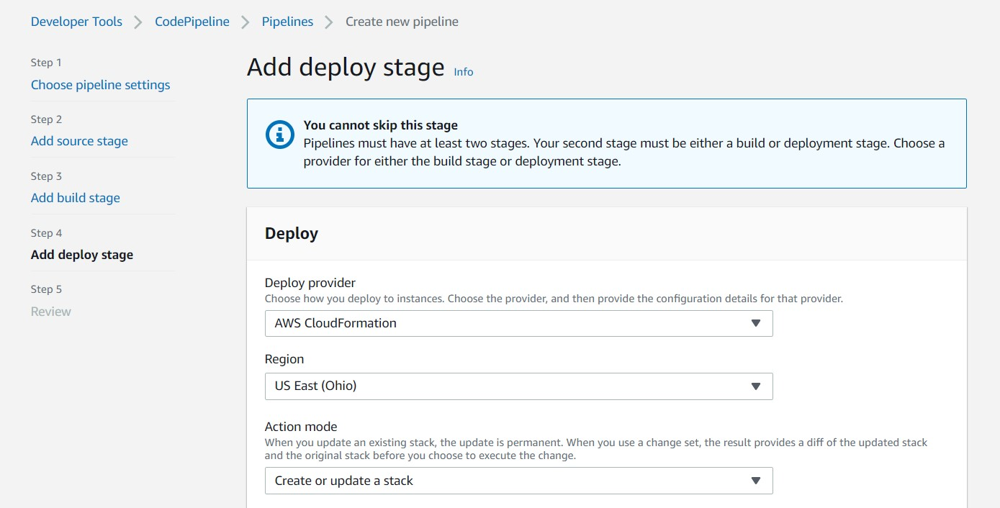
   - Stack name: **cdp-AWS-stack**
   - Template:
     - Artifact name: **SourceArtifact**
     - File name: **AWS/CodePipeline-CodeDeploy/outputtemplate.yaml**
   - Capabilities: **CAPABILITY_IAM**s
   - Role name: **Select your role** 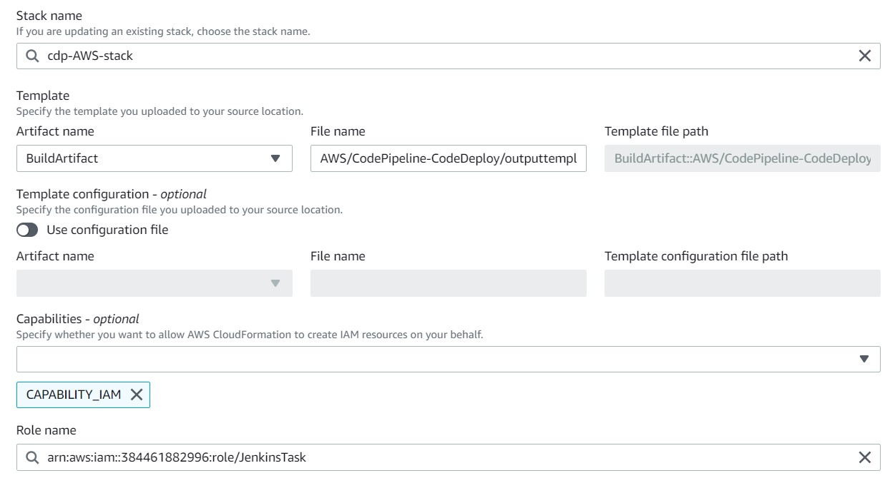
   - Advanced: 
     - Parameter overrides: **{"ImageId":"384461882996.dkr.ecr.us-east-2.amazonaws.com/ruslan.serdiuk:latest"}** 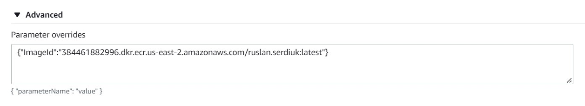
   - NEXT


### _Release change_
 - After that pipeline automaticaly started: 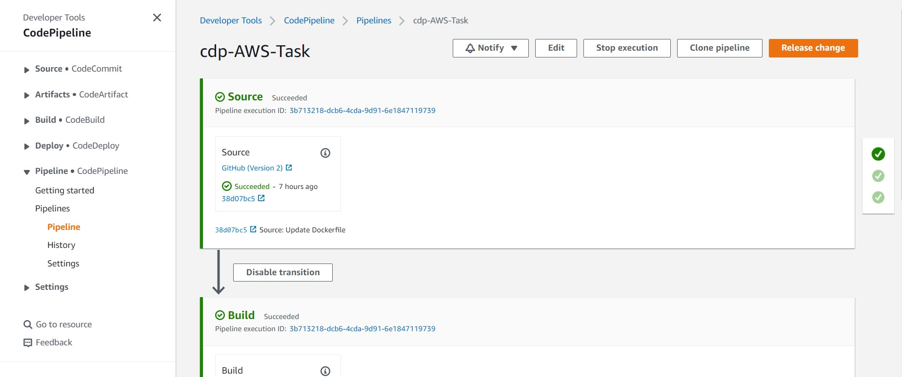 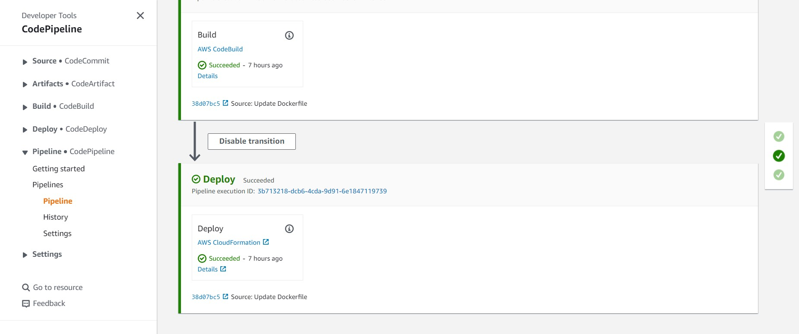
 - Check CloudFormation Stask: 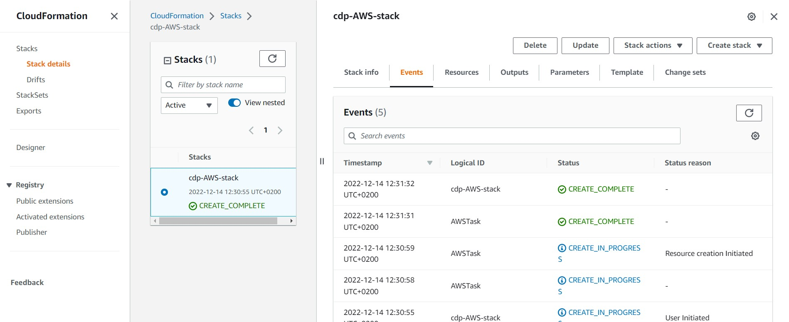
 - Check Lambda: 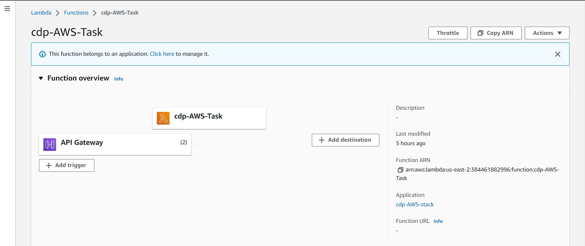


