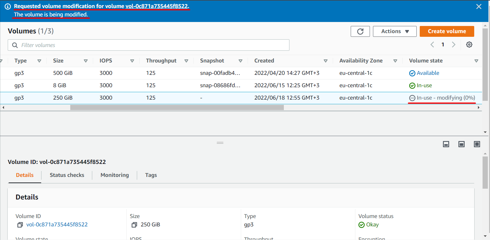

# :infinity: Increase Volume Size on the AWS Instance :infinity:

:bangbang: Sometimes situations arise where you run out of disk space. We are faced with the question of adding volume space and expanding the file system.

## _AWS Console:_

+ EC2 > Volumes > Actions > Modify

+ Add space that you need and click "Modify".

+ AWS created a request to resize the volume. Wait for it to process it.

+ Check:

## _Connect to insatnce:_

#### Install parter: 
+ `apt-get update`
+ `sudo apt-get -y install parted`

#### Check all partition
+ `lsblk`

#### Select partition
+ `parted /dev/nvme0n1`

#### Resize our part:
+ `resizepart`
+ `2`(enter the number your partition)
+ and enter "end size". Fro example: `288GB`

#### Check new size:
+ `lsblk`
+ `df -h`

#### Now resize volume
+ `e2fsck -f /dev/nvme0n1p2`
+ `sudo resize2fs /dev/nvme0n1p2`

#### Check result:
+ `df -h`

## _Links:_
+ _https://docs.aws.amazon.com/AWSEC2/latest/UserGuide/recognize-expanded-volume-linux.html_
+ _https://www.thegeekdiary.com/resize2fs-permission-denied-to-resize-filesystem-error-while-online-resize-of-a-filesystem/_
+ _https://docs.rackspace.com/support/how-to/create-remove-swap-file-in-ubuntu/_
