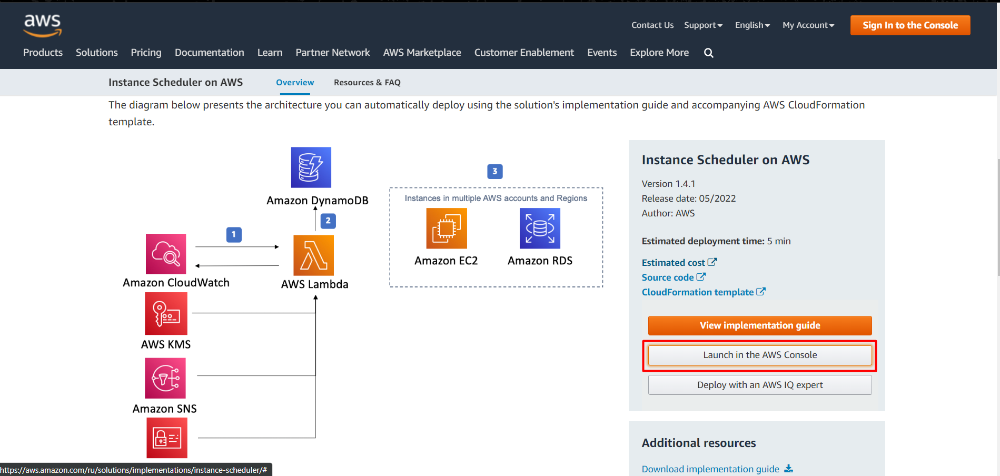
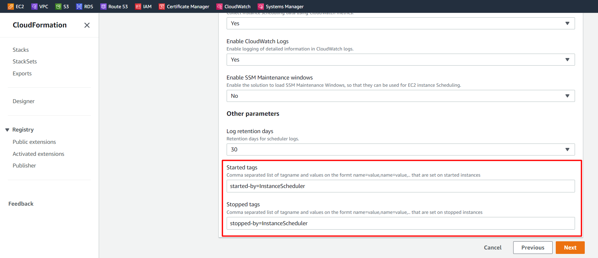
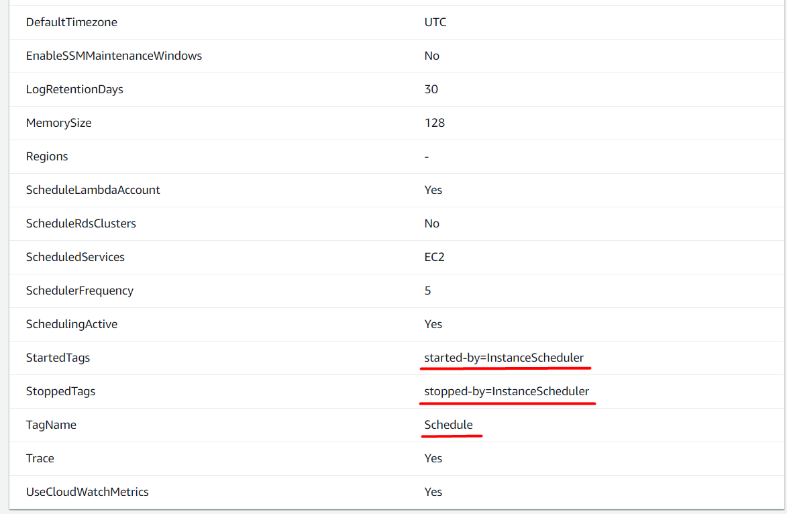
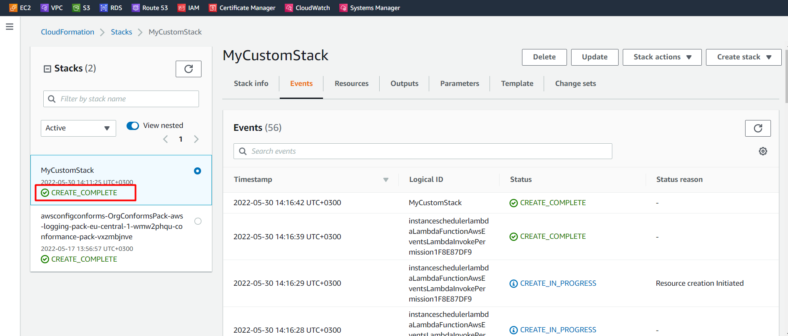
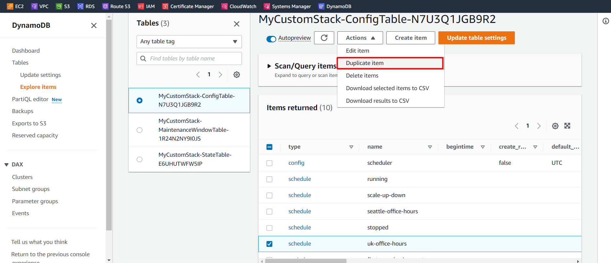
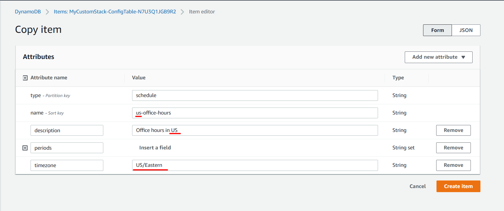
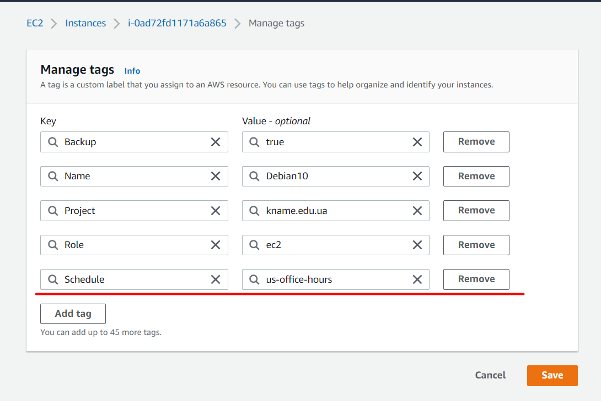
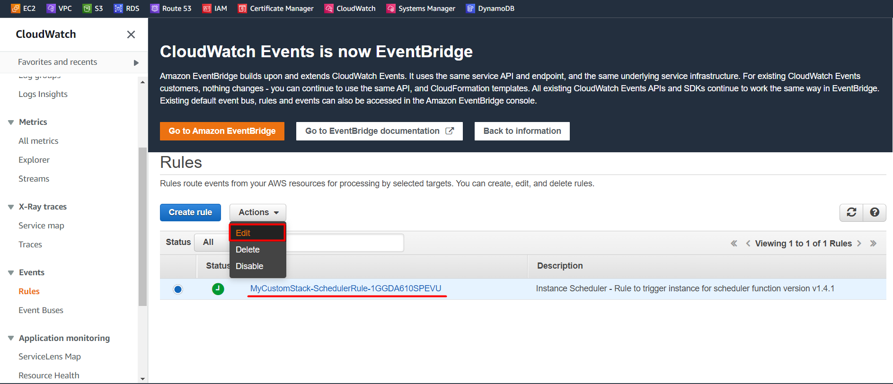
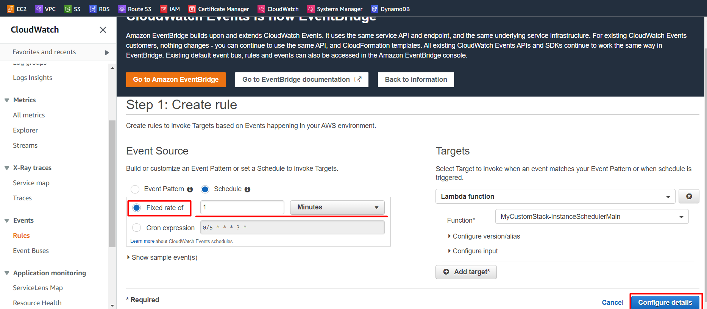
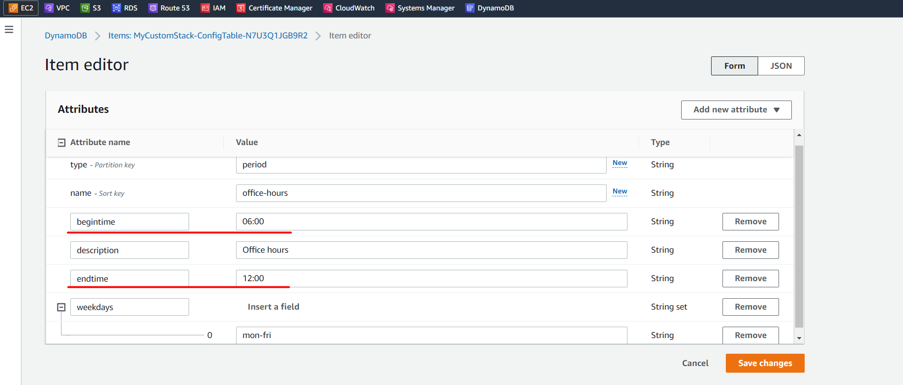

# Implementing Instance Scheduler in your account

## _[Deploy AWS Instance Scheduler](https://aws.amazon.com/ru/solutions/implementations/instance-scheduler/)_

### Navigate to the AWS Instance Scheduler.
> Click **Launch solution in the AWS Console.**

> In the CloudFormation console, enter a name for our CloudFormation stack.
> 
> Add tags:
> 
> **started-by=InstanceScheduler**
> 
> **stopped-by=InstanceScheduler**

> Check Parameters Stack:

> And click **Create Stack**

> Wait until it is time for the stack to finish creating all the resources!

> Congratulation!
> It's success)

### Edit the DynamoDB Tables

> Navigate to **DynamoDB** > **Tables**.
> 
> Select the **ConfigTable**. 
> 
> Select the **uk-office-hours** item.
> 
> Click Actions > Duplicate.

> Change the description to **"Office hours in US"**.
> 
> Change the string to **"us-office-hours"**.
> 
> Change the time zone to **"US/Eastern"**.

> Click **Create item** and then refresh the table.

### Add Tag to EC2 Instance

> Navigate to **EC2** > **Instances**.
> 
> Select the **running instance**.
> 
> Add the following tag:
> 
> Key: **Schedule**
> 
> Value: **us-office-hours**

> Click Save.

### Update Amazon EventBridge Events Rule

> Navigate to **Amazon EventBridge** > **Events** > **Rules**.
> 
> Select the **listed rule**.
> 
> Click **Actions** > **Edit**.

> Then next change the* 0/5 minutes* to 1 minute.

> Click Next, Next, Next. 
> Click Update rule.

### Update DynamoDB Config Table

> Navigate to DynamoDB > Tables.
> 
> Click the ConfigTable.
> 
> Update the **begintime** and **endtime**

> Click Save.

### Verify EC2 Instance Stopped
> Navigate to **EC2** > **Instances**.
> 
> Verify our EC2 instance has stopped.

# _Links:_
- https://docs.aws.amazon.com/solutions/latest/instance-scheduler-on-aws/sample-schedule.html
- https://docs.aws.amazon.com/solutions/latest/instance-scheduler-on-aws/sample-schedule.html
- https://docs.aws.amazon.com/solutions/latest/instance-scheduler-on-aws/components.html