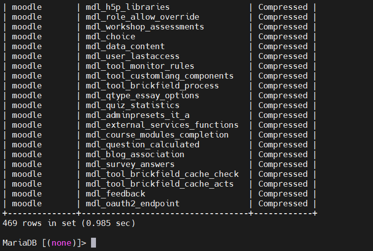

# AWS Database Migrate Service
### TASK: 
1. Migrate MariaDB to RDS Aurora Serverless v1
2. Problem solving in the migration process

## PART 1 - [Migrate MariaDB to RDS Aurora Serverless v1]

#### One of the most important aspects of any migration of data to the cloud is cost optimization. Luckily, AWS has made this relatively simple thanks to the Database Migration Service. I use the Database Migrations Service (DMS) to migrate a MariaDB database from an EC2 server to an RDS Aurora Serverless v.1 MySQL database.

### _Create Replication Instance_

Name our replication instance aurorareplication
Give it a Description of mysql to aurora
Leave most of the defaults, but change the Allocated storage from 50 to 10
Leave Multi-AZ unchecked
Uncheck publicly accessible
Choose the one with Lab_VPC in the title from the dropdown, but for VPC security group select the security group for our databases.
Multi AZ: Choose Dev or test workload (Single-AZ)
Uncheck the Publicly accessible box
Click Create

### _Create Endpoints_
> Create a Target Endpoint
 
Note: The lab uses an RDS MySQL instance target to stand in for an Aurora DB to speed the lab's setup for you. The migration process is the same.

Start off with our Target Endpoint
Check the box for RDS instance
Select new-db for the RDS instance
Leave defaults:
Target Engine: mysql
Keep the default Server name
Leave Port: set to 3306
leave cloud_user as User Name
Copy the password from the Linux Academy Credentials page and paste it in
Run test
Create the Target Endpoint

> Create Source Endpoint

Select Source Endpoint

Do not check the box for RDS instance

Set Endpoint identifier to my-db-source

Leave the defaults, and set Source engine to mysql

Set Server Name to the private IP address found on the LA credentials page

Leave Port set at 3306, and leave cloud_user as User name

Copy the password from the LA credentials page and paste it into the Password field

Run a test

Create the source endpoint

### _Create the Migration Task_

Add Identifier: aurorareplicationtask
Choose our Replication Instance
Choose our Source Endpoint
Choose our Target Endpoint
Check the box to make sure the task starts on creation
Choose Migration Type
Choose to not include large objects column
Do not enable validation because it will take longer for creation
Leave CW logs unchecked
Leave default for Table mappings
Create new Selection Rule:
Leave Schema as default
Leave Table name as default
Set Schema name to classicmodels
Leave Action set to Include
Create the task


## PART 2 - [Problem solving in the migration process]

> Error: "Index column size too large. The maximum column size is 767 bytes" While migrate database "moodle" using mysqldump from MariaDB to RDS Aurora Serverless

1. What's the problem?
InnoDB engine (up to MySQL version 5.5.14) has the following limitations on the length of a field with a unique key:
- for utf8 encoding and TEXT and VARCHAR field types, the maximum field length is 255 bytes;
- for utf8mb4 encoding and TEXT and VARCHAR field types, the maximum field length is 191 bytes;

In utf8 (utf8mb3) encoding, one character takes 3 bytes, i.e. 3 * 255 gives us our 767 bytes limit.
In utf8mb4 encoding one character takes 4 bytes, that is 4 * 191 we get our 767 bytes limit.

2. Backup all data.
3. Solution.

Since MySQL 5.6.3 there is an InnoDB_large_prefix option, which increases the limit from 767 bytes to 3072 bytes, but only for tables with DYNAMIC and COMPRESSED format rows and only for Barracuda file format (innodb_file_format=Barracuda) and only when the innodb_file_per_table=ON option is enabled. For COMPACT and REDUNDANT format strings the 767 bytes limit remains.

Given that in different MySQL versions the innodb_large_prefix, innodb_file_format and innodb_file_per_table parameters may or may not be enabled by default, it largely depends on knowing the MySQL version how to correctly solve the "Index column size too large. The maximum column size is 767 bytes.".

So, we need to configure these parameters correctly:

large_prefix = ON

file_format = Barracuda

file_per_table = ON

default_row_format = DYNAMIC


4. Amazon Aurora MySQL does not support compressed tables.

If you check the amazon documentation https://docs.aws.amazon.com/dms/latest/sbs/chap-mysql2aurora.rdsmysql.html, it can be found that Aurora MySQL does not support compressed tables (that is, tables created with ROW_FORMAT=COMPRESSED).

Ok. Let's check ROW_FORMAT in our database: 
`SELECT TABLE_SCHEMA,TABLE_NAME,ROW_FORMAT FROM INFORMATION_SCHEMA.TABLES WHERE TABLE_SCHEMA = 'moodle';`



So, as we can see, this format does not suit us. We need a Dynamic, according to amazon's documentation: https://docs.aws.amazon.com/dms/latest/userguide/CHAP_Source.MySQL.html#CHAP_Source.MySQL.CustomerManaged.

> These actions can be dangerous for the contents of the database! Before you do them, make sure you have a backup.

For a single table, you need to run the following: 
```ALTER TABLE `our_table` ROW_FORMAT=DYNAMIC;```

But what if there are thousands of such tables?
Just use this script: `change_row_format.sh`


#### Congratulations! You have successfully change ROW_FORMAT in all tables in your database. Now, you can create new dump and migrate/restoring a MySQL database from a dump.


## _Useful links:_
- fq
 