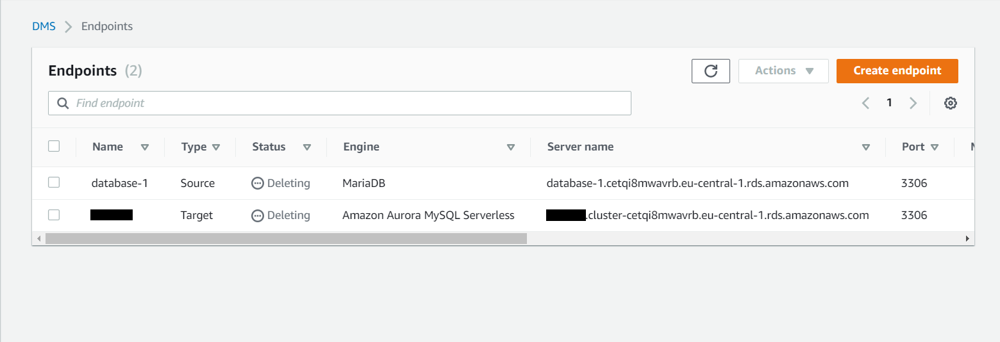
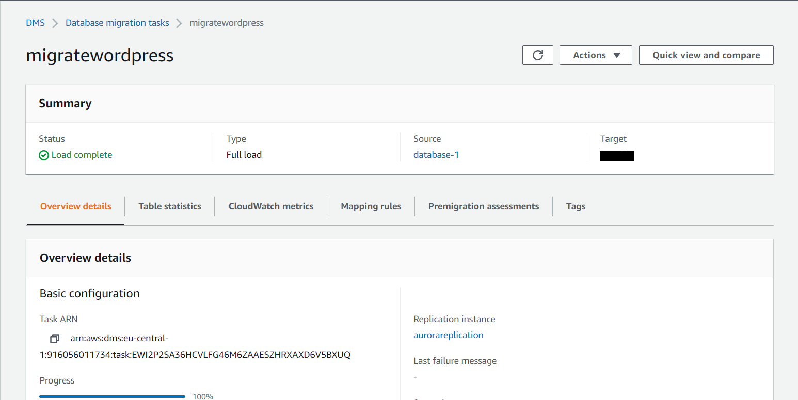
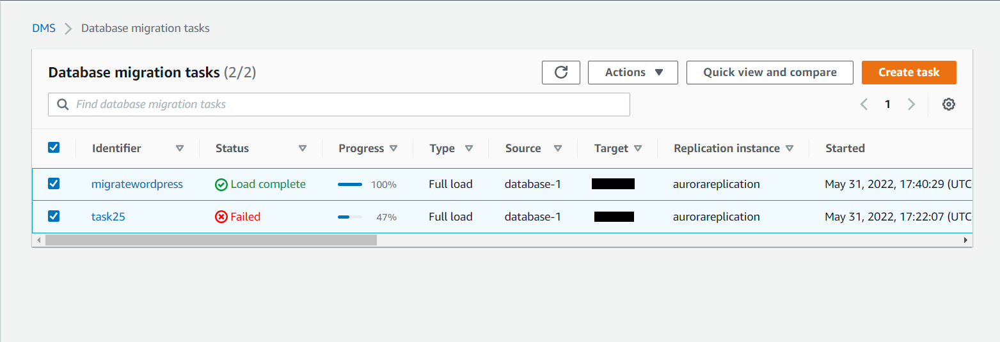
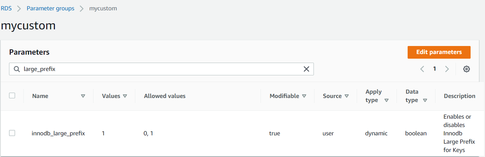

# :infinity: AWS Database Migrate Service
### TASK: 
:white_check_mark: Migrate MariaDB to RDS Aurora Serverless v1

:white_check_mark: Problem solving in the migration process

## PART 1 - [Migrate MariaDB to RDS Aurora Serverless v1]

#### One of the most important aspects of any migration of data to the cloud is cost optimization. Luckily, AWS has made this relatively simple thanks to the Database Migration Service. I use the Database Migrations Service (DMS) to migrate a MariaDB database from an EC2 server to an RDS Aurora Serverless v.1 MySQL database.

### :white_large_square: _Create Replication Instance_

  :one: Name our replication instance **aurorareplication**

  :two: Give it a Description of **mariadb to aurora**

  :three: Leave most of the defaults, but change the **Allocated storage 30**

:four: Leave Multi-AZ unchecked

:five: Uncheck publicly accessible

:six: Choose the one with your VPC in the title from the dropdown, but for VPC security group select the security group for your databases.

:seven: Multi AZ: **YES**

8️⃣ Uncheck the **Publicly** accessible box

:nine: Click **Create**


### :white_large_square: _Create Endpoints_
:green_square: _**Create a Target Endpoint**_ :green_square:

  :one: Start off with our Target Endpoint
  
  :two: Check the box for _RDS instance_
  
  :three: Select **[name your database in RDS]** for the RDS instance
  
  :four: Leave defaults:
  
   - Target Engine: **Amazon Aurora MySQL Serverless**
     
   - Keep the default **Server name**
     
   - Leave Port: **set to 3306**
     
   - leave `master_user(RDS)` as **User Name**
     
   - leave `master_password(RDS)` as **Password**
  
  :five: Run test
  
  :six: Create the Target Endpoint

:red_square: _**Create Source Endpoint**_ :red_square:

  :one: Select **Source Endpoint**
  
  :two: **Do not check the box** for _RDS instance_
  
  :three: _Set Endpoint identifier_ to **my-db-source**
  
  :four: Leave the defaults, and set _Source engine_ to **MariaDB**
  
  :five: Set _Server Name_ to the **private IP** address your **instance with the database**
  
  :six: Leave _Port_ set at **3306**, and leave `database_user(MariaDB)` as **User name**
  
  :seven: Paste your `password database(MariaDB)` into the **Password** field
  
  :eight: Run a test
  
  :nine: Create the source endpoint


### :white_large_square: _Create the Migration Task_

1. Add Identifier: **migratewordpress** (or anything other)
2. Choose our **Replication Instance**
3. Choose our **Source Endpoint**
4. Choose our **Target Endpoint**
5. _Check the box to make sure the task starts on creation_
6. Choose **Migration Type**
7. Choose to **not include large objects column**
8. Do **not enable validation** because it will take longer for creation
9. Leave CW logs unchecked
10. Leave default for Table mappings
11. Create new **Selection Rule**:
    - Leave Schema as default 
    - Leave Table name as default 
    - Set Schema name to wordpress (or your database) 
    - Leave Action set to Include
12. **Create the task**




## PART 2 - [Problem solving in the migration process]

> :warning: Error: "Index column size too large. The maximum column size is 767 bytes" While migrate database "moodle" using mysqldump from MariaDB to RDS Aurora Serverless

### What's the problem?
```
InnoDB engine (up to MySQL version 5.5.14) has the following limitations on the length of a field with a unique key:
- for utf8 encoding and TEXT and VARCHAR field types, the maximum field length is 255 bytes;
- for utf8mb4 encoding and TEXT and VARCHAR field types, the maximum field length is 191 bytes;

In utf8 (utf8mb3) encoding, one character takes 3 bytes, i.e. 3 * 255 gives us our 767 bytes limit.
In utf8mb4 encoding one character takes 4 bytes, that is 4 * 191 we get our 767 bytes limit.
```
### :warning: Backup all data :bangbang:
### Solution: :point_down:

Since MySQL 5.6.3 there is an InnoDB_large_prefix option, which increases the limit from 767 bytes to 3072 bytes, but only for tables with DYNAMIC and COMPRESSED format rows and only for Barracuda file format (innodb_file_format=Barracuda) and only when the innodb_file_per_table=ON option is enabled. For COMPACT and REDUNDANT format strings the 767 bytes limit remains.

Given that in different MySQL versions the innodb_large_prefix, innodb_file_format and innodb_file_per_table parameters may or may not be enabled by default, it largely depends on knowing the MySQL version how to correctly solve the "Index column size too large. The maximum column size is 767 bytes.".

So, we need to configure these parameters correctly:
```
large_prefix = ON
file_format = Barracuda
file_per_table = ON
default_row_format = DYNAMIC
```


### Amazon Aurora MySQL does not support compressed tables.

If you check the amazon documentation https://docs.aws.amazon.com/dms/latest/sbs/chap-mysql2aurora.rdsmysql.html, it can be found that Aurora MySQL does not support compressed tables **(that is, tables created with ROW_FORMAT=COMPRESSED)**.

Ok. Let's check ROW_FORMAT in our database: 
`SELECT TABLE_SCHEMA,TABLE_NAME,ROW_FORMAT FROM INFORMATION_SCHEMA.TABLES WHERE TABLE_SCHEMA = 'moodle';`


:red_square: So, as we can see, this format does not suit us. **We need a Dynamic**, according to amazon's documentation: https://docs.aws.amazon.com/dms/latest/userguide/CHAP_Source.MySQL.html#CHAP_Source.MySQL.CustomerManaged.

### :exclamation: These actions can be dangerous for the contents of the database! Before you do them, make sure you have a backup :exclamation:

:white_medium_square: **For a single table, you need to run the following:**
```ALTER TABLE `our_table` ROW_FORMAT=DYNAMIC;```

:white_medium_square: **But what if there are thousands of such tables?**
Just use this script: [change_row_format.sh](https://github.com/RuslanSerdiuk/DevOps_Tasks_and_solutions/blob/AWS/AWS/Migrate_MariaDB_to_RDS_Aurora_Serverless_v1/change_row_format.sh) :point_left:


### :green_circle: Congratulations! You have successfully change ROW_FORMAT in all tables in your database. Now, you can create new dump and migrate/restoring a MySQL database from a dump.


## _Useful links:_
- _https://rtfm.co.ua/aws-database-migration-service-obzor-i-primer-migracii-self-hosted-mariadb-v-aws-aurora-rds/_
- _https://docs.aws.amazon.com/AmazonRDS/latest/AuroraMySQLReleaseNotes/AuroraMySQL.Updates.ServerlessUpdates.html_
- _https://docs.aws.amazon.com/AmazonRDS/latest/AuroraUserGuide/aurora-serverless.relnotes.html_
- _https://docs.aws.amazon.com/dms/latest/sbs/chap-mariadb2auroramysql.html_
 
