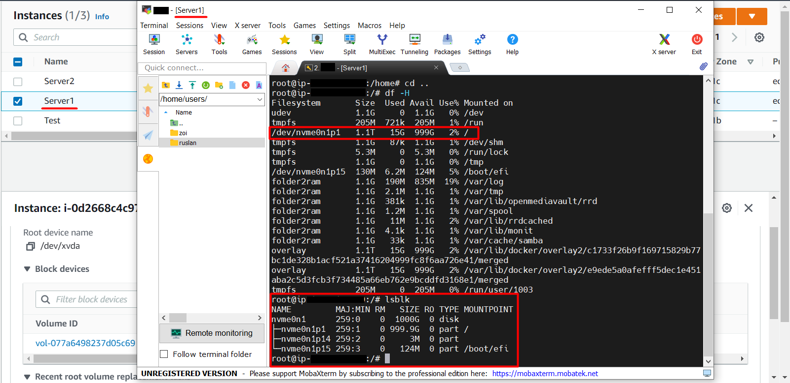
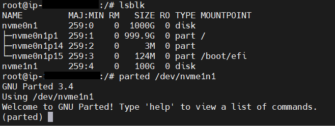
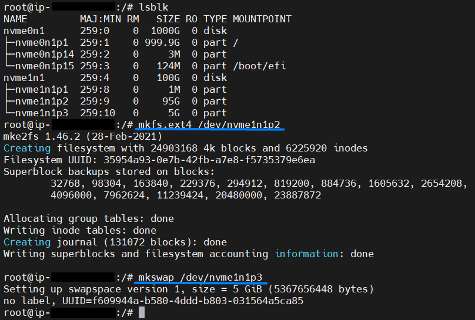
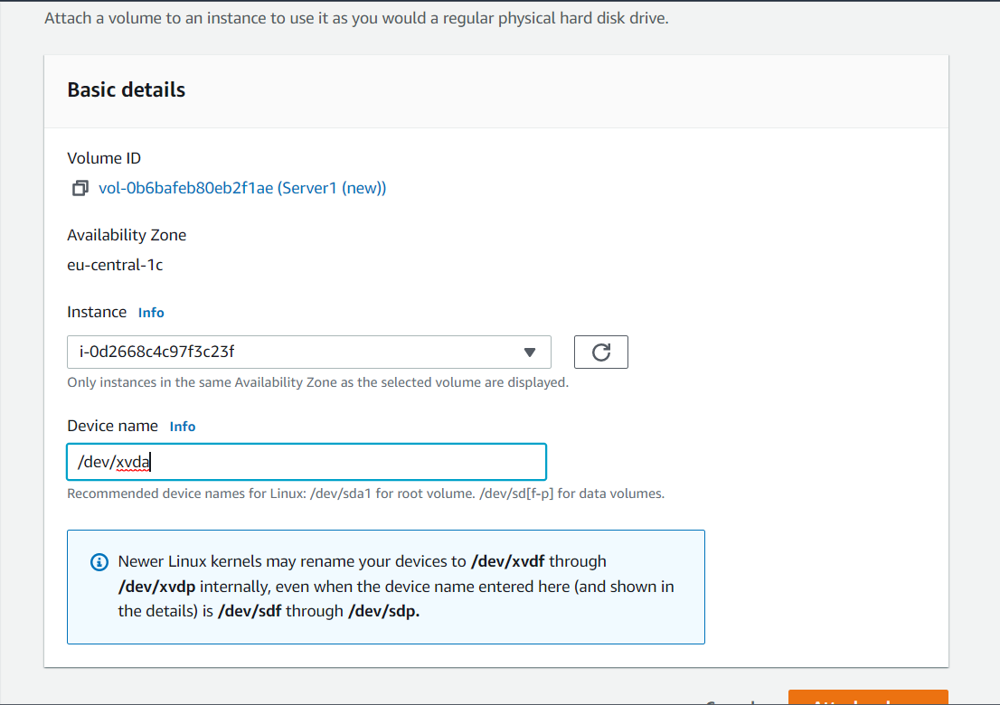

# Reduce Volume Size in AWS Instance

## Instance parameters:
- OS: Debian (Inferred)
- AMI ID: ami-0287979b9904dc23a
- AMI Name: debian-11-amd64-20220503-998-a264997c-d509-4a51-8e85-c2644a3f8ba2
- AMI Location: aws-marketplace/debian-11-amd64-20220503-998-a264997c-d509-4a51-8e85-c2644a3f8ba2
- Volume: 1TB


> Only 15 GB of the 1 TB are used:


#### Check mysql (or any other process in your instance) before reduce


=========================================================================================
## _Create a new EBS volume_
In our example we will create a smaller volume of 100 GB, not 1 TB, **in the same availability zone as your instance**. Since I only use 1-2% of the total space


Attach New Volume to our Instance:


Click "Attach volume"

Check:


=========================================================================================

## _Create Partition on New Volume_

#### Install parter:

- `apt-get update`

- `sudo apt-get -y install parted`

#### Get a list of storage devices and partitions: 

- `lsblk`

### Partition the disk using the `parted`:

#### Open dick:
- `parted /dev/nvme1n1`



#### To create a partition table, enter the following: 
- `mklabel gpt`

#### Check the table
- `print`

#### Next:
- `mkpart bbp 1MB 2MB`

#### Set partition 1 as BIOS boot partition
- `set 1 bios_grub on`

#### Allocate the remaining space (2MB to 90%) to the root partition.
- `mkpart root ext4 2MB 90%`

- `mkpart swap linux-swap 90% 100%`

#### Check:
- `unit GiB`

- `p`


#### To save your actions and exit, enter the command: 
- `quit`

#### After splitting, use again: 
- `lsblk`


=========================================================================================

## _Format New Volume_

#### Format new partition: 
- `mkfs.ext4 /dev/xvdf2` 
- `mkswap /dev/xvdf3`



=========================================================================================

## _Mount New Volume_

#### Creating directories: 
- `mkdir -p /mnt/myroot` 

#### Check: 
- `apt-get install tree` 
- `tree /mnt` 

#### Mounting: 
- `mount /dev/xvdf2 /mnt/myroot`

#### Check: 
- `df -h` 


=========================================================================================
## _Copy Data_

#### Install rsync  
- `sudo apt-get -y install rsync` 

#### Data transfer 
- `sudo rsync -axv / /mnt/myroot`


=========================================================================================

## _Install GRUB on New Volume_

#### Disable the `/etc/grub.d/10_linux` and `/etc/grub.d/20_linux_xen` scripts: (_add the exit command to the second line of both files, just after #!/bin/sh_) 
- `vim etc/grub.d/10_linux` 
- `vim /etc/grub.d/20_linux_xen`


#### Install grub in new volume: 
- `grub-install --target=i386-pc --directory=/mnt/myroot/usr/lib/grub/i386-pc --recheck --boot-directory=/mnt/myroot/boot /dev/xvdf`


#### Do not forget to re-enable the 10_linux and 20_linux_xen scripts when you are finished 
- `vim etc/grub.d/10_linux`  
- `vim /etc/grub.d/20_linux_xen`


=========================================================================================
## _Change UUID_
#### You need to change the uuid in the following two files: 
- `/mnt/myroot/boot/grub2/grub.cfg #or /mnt/myroot/boot/grub/grub.cfg`
- `/mnt/myroot/etc/fstab`

#### First create backups these files: 
- `sudo cp /mnt/myroot/boot/grub/grub.cfg /mnt/myroot/boot/grub/grub.cfg.orig`
- `sudo cp /mnt/myroot/etc/fstab /mnt/myroot/etc/fstab.orig`

#### First, you need to specify the UUID of the corresponding volume
- `blkid`


#### You can see that the uuid of the root partition of the old large volume:           
- EBS — 8fee2a17-de2a-4336-9a82-68be6e435b44 
#### And the uuid of the new small volume:           
- EBS — 35954a93-0e7b-42fb-a7e8-f5735379e6ea
- swap — f609944a-b580-4ddd-b803-031564a5ca85

#### Use the `sed` command to replace:
- `sed 's/8fee2a17-de2a-4336-9a82-68be6e435b44/35954a93-0e7b-42fb-a7e8-f5735379e6ea/g' /mnt/myroot/boot/grub/grub.cfg >> /mnt/myroot/boot/grub/grub2.cfg`

- `cat /mnt/myroot/boot/grub/grub2.cfg > /mnt/myroot/boot/grub/grub.cfg`

- `sed 's/8fee2a17-de2a-4336-9a82-68be6e435b44/35954a93-0e7b-42fb-a7e8-f5735379e6ea/g' /mnt/myroot/etc/fstab >> /mnt/myroot/etc/fstab2`

- `cat /mnt/myroot/etc/fstab2 > /mnt/myroot/etc/fstab`

#### And correct `/mnt/myroot/etc/fstab`
```
UUID=35954a93-0e7b-42fb-a7e8-f5735379e6ea / ext4 rw,discard,errors=remount-ro,x-systemd.growfs 0 1
UUID=f609944a-b580-4ddd-b803-031564a5ca85 swap swap defaults 0 0
tmpfs                                     /tmp tmpfs defaults,noatime,nodev,noexec,nosuid,size=256m 0 0
```


#### Let's unmount it: 
- `sudo umount /mnt/myroot`

=========================================================================================

## _Detach two volumes then re-attach only the new small volume like root volume_

#### Then detach both volumes (stop the instance first, of course):


#### Now reconnect the new volume as the root device by entering the device name here: 
- `/dev/xvda`




## _Check Success:_


## _Links:_
- https://docs.aws.amazon.com/AWSEC2/latest/UserGuide/ebs-using-volumes.html
- https://serverfault.com/questions/673048/how-to-reduce-aws-ebs-root-volume-size
- https://docs.aws.amazon.com/AWSEC2/latest/UserGuide/instance-booting-from-wrong-volume.html
- https://medium.com/@m.yunan.helmy/decrease-the-size-of-ebs-volume-in-your-ec2-instance-ea326e951bce#:~:text=You%20might%20be%20wondering%2C%20can,only%20be%20increased%2C%20not%20decreased%20.
- https://www.daniloaz.com/en/partitioning-and-resizing-the-ebs-root-volume-of-an-aws-ec2-instance/
- https://www.daniloaz.com/en/the-importance-of-properly-partitioning-a-disk-in-linux/
