# :infinity: Implement SSM + CloudWatch Agent to your instance :computer:

#### :purple_square: SSM is needed in case you lose access to your instance. For example, you lost your ssh key.
#### :purple_square: CloudWatch Agent is needed to get metrics from your volum. such as free space

## _Part 1 - [Create role]_

First of all we need create Role for our agents :exclamation:

:white_medium_square: Click **IAM** > **Roles** > **Create Role** and Select **EC2**
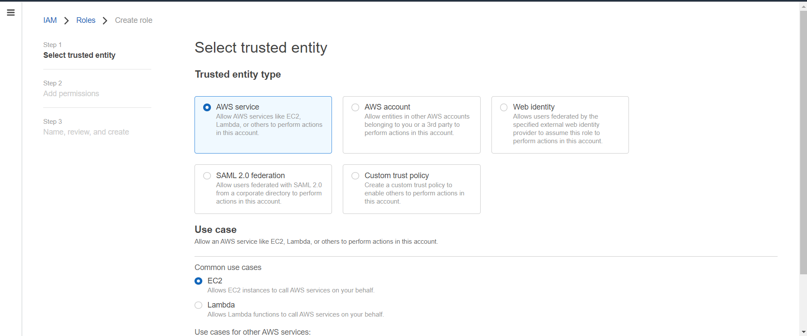

:white_medium_square: Next add **AmazonSSMManagedInstanceCore**
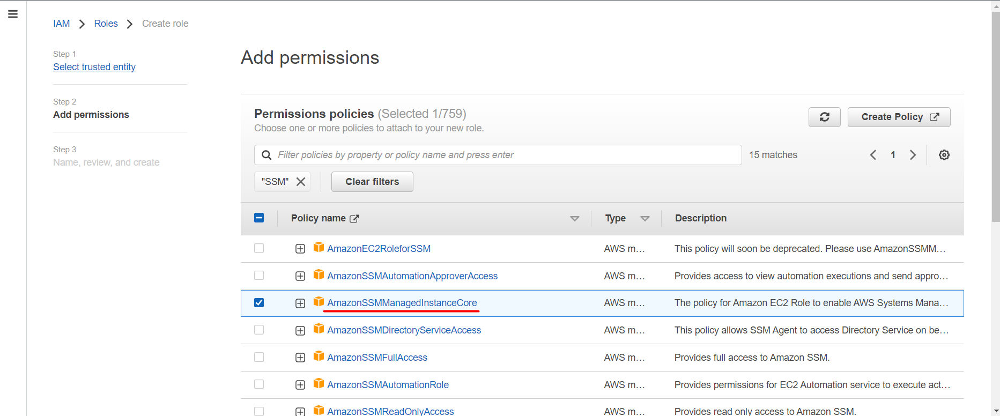

:white_medium_square: and add **CloudWatchAgentAdminPolicy** and **CloudWatchAgentServerPolicy**
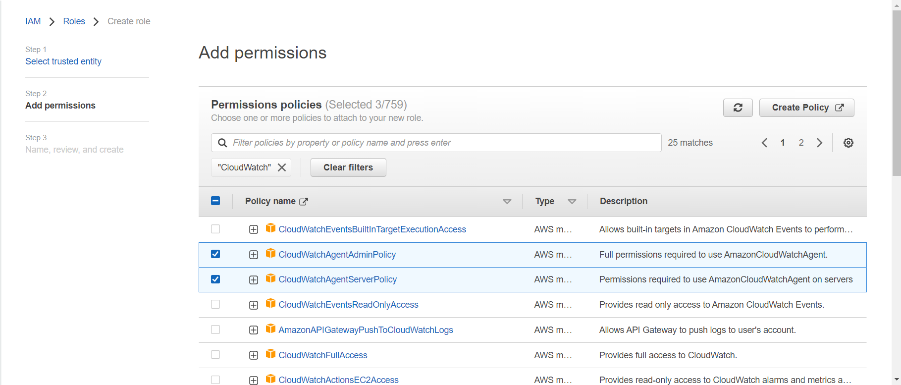

:white_medium_square: So, give name **"SSM_CloudWatch_role"** for your role:
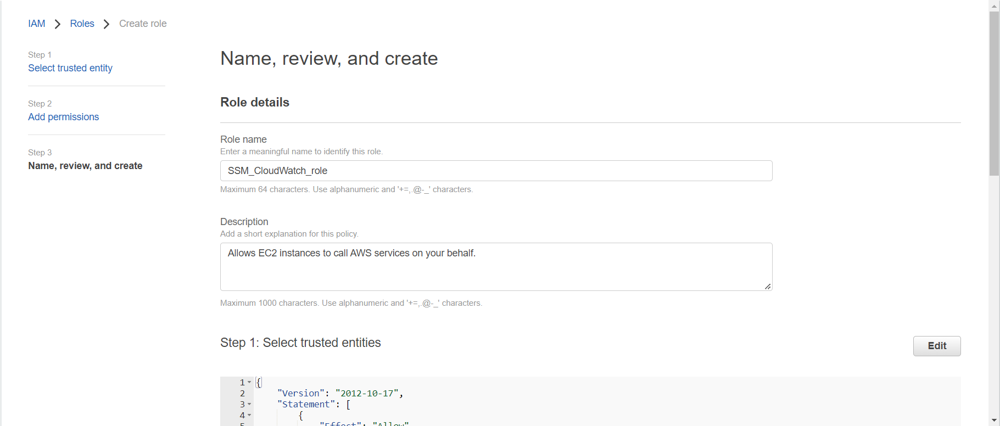

:white_medium_square: And check all permitions:
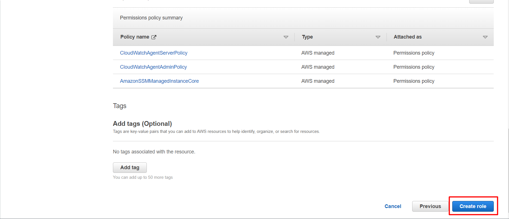
Now just click **Create role**

:white_medium_square: Next attach your role to your instance:

:white_small_square: Select your instance

:white_small_square: right-click on it

:white_small_square: Select **Security**

:white_small_square: and Select **Modify IAM Role**
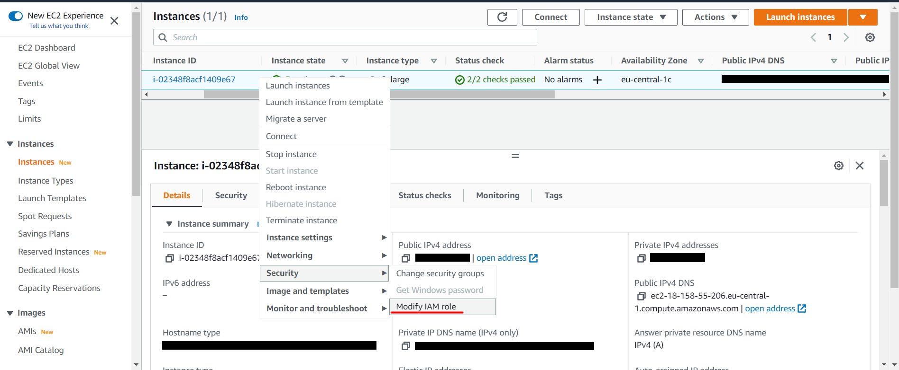

:white_medium_square: Now just select your role from list:
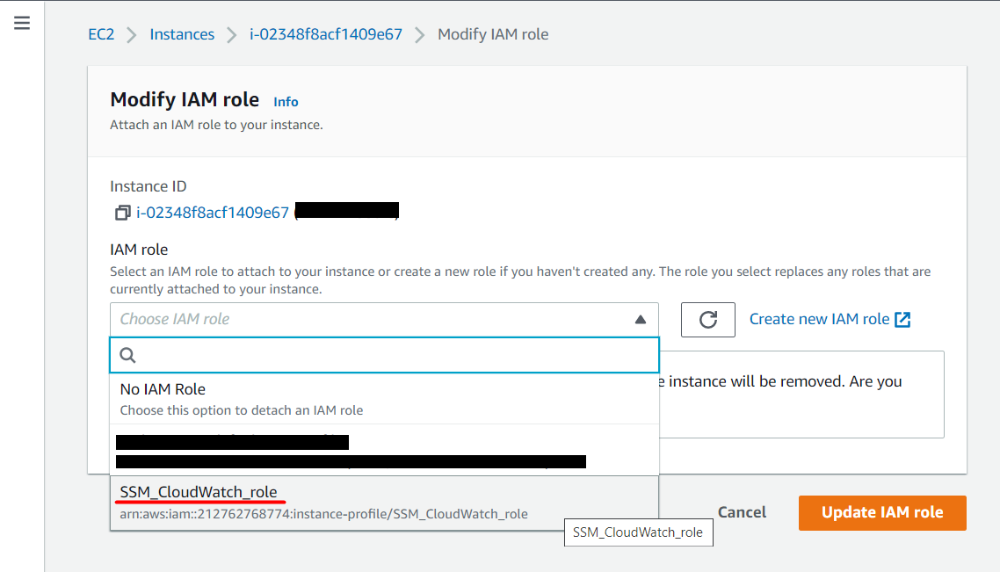

:white_medium_square: Congratulations! Your role has been attached.
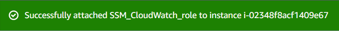

## _PART 2 - [Install SSM Agent to your instance]_

:bangbang: WARNING :warning:

> **If you don't have access to your instance, the ssm agent can only be implemented by creating a new instance!**
> 
> You should already have access to your instance. For example ssh.

:white_medium_square: In most cases, SSM Agent is preinstalled on AMIs provided by AWS for the following operating systems (OSs):

	- Amazon Linux Base AMIs dated 2017.09 and later 

	- Amazon Linux 2 

	- Amazon Linux 2 ECS-Optimized Base AMIs 

	- macOS 10.14.x (Mojave), 10.15.x (Catalina), and 11.x (Big Sur)

	- SUSE Linux Enterprise Server (SLES) 12 and 15 

	- Ubuntu Server 16.04, 18.04, and 20.04 

	- Windows Server 2008-2012 R2 AMIs published in November 2016 or later 

	- Windows Server 2016, 2019, and 2022

:white_medium_square: I using [AWS documentation](https://docs.aws.amazon.com/systems-manager/latest/userguide/sysman-manual-agent-install.html) and choosing my  version OS.
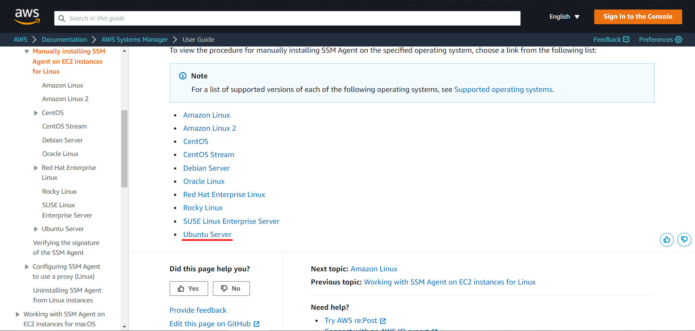

:white_medium_square: I Have Ubuntu Server 20.10 STR 64-bit (Snap package installation).

:white_medium_small_square: So, I just Run the following command to determine if SSM Agent is running: `sudo systemctl status snap.amazon-ssm-agent.amazon-ssm-agent.service`

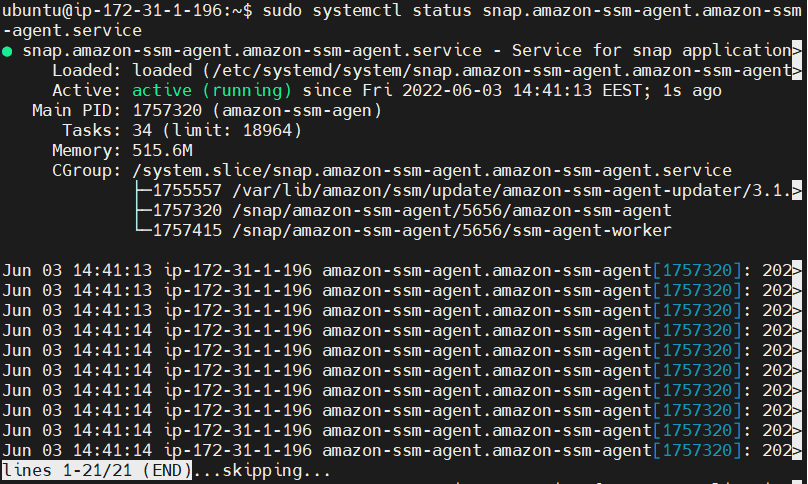

:white_medium_small_square: and a few other commands:

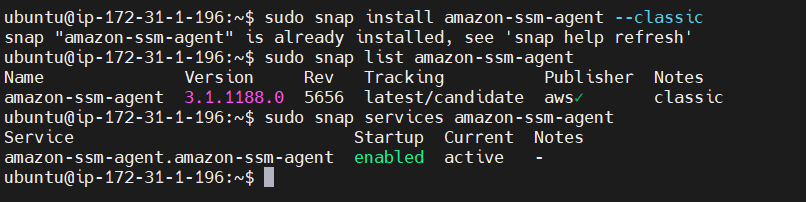

#### So, SSM Agent is installed and running. Ok, run the SSM Session. (before it wait 5-10 minutes)

:white_medium_square: Select **AWS Systems Manager** > **Session Manager**
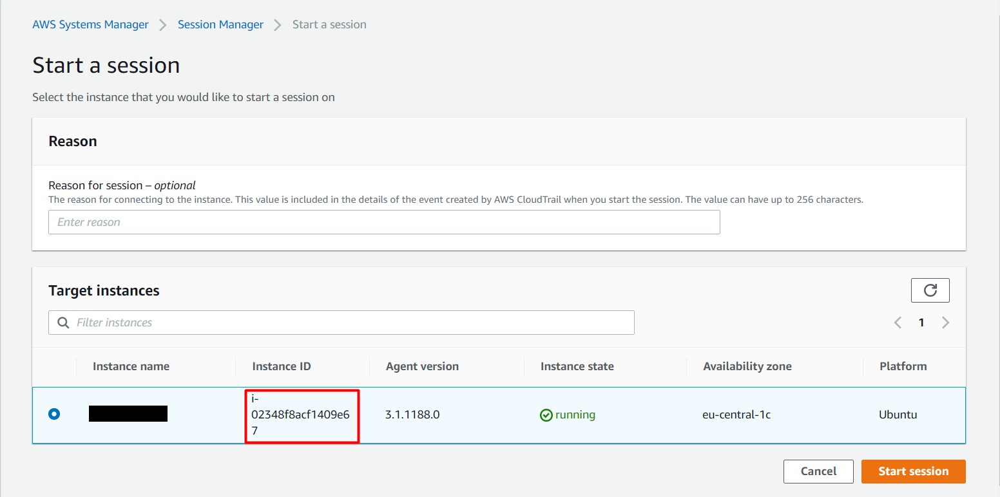
:white_medium_small_square: Select your instance and click **Start session**

:green_circle: Congratulations!
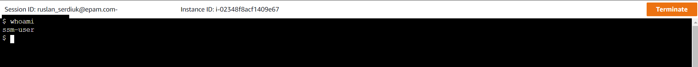

## _PART 3 - [Install CloudWatch Agent to your instance]_

:white_medium_square: I using [AWS documentation](https://docs.aws.amazon.com/AmazonCloudWatch/latest/monitoring/download-cloudwatch-agent-commandline.html) too.

:white_medium_small_square: Select your version OS and copy link for download:


:white_medium_square: Run the command: 
`wget https://s3.amazonaws.com/amazoncloudwatch-agent/ubuntu/amd64/latest/amazon-cloudwatch-agent.deb`
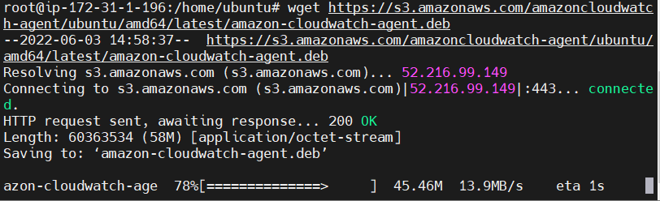

:white_medium_square: If you downloaded a DEB package on a Linux server, change to the directory containing the package and enter the following: 
`sudo dpkg -i -E ./amazon-cloudwatch-agent.deb`
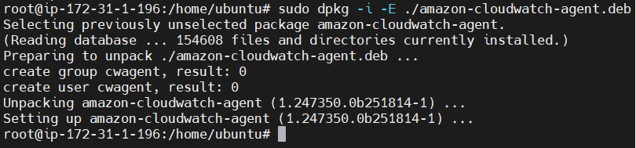


#### Ok, now create the [CloudWatch agent configuration file](https://docs.aws.amazon.com/AmazonCloudWatch/latest/monitoring/create-cloudwatch-agent-configuration-file-wizard.html) with the wizard!

:white_medium_square: Start the CloudWatch agent configuration wizard by entering the following: `sudo /opt/aws/amazon-cloudwatch-agent/bin/amazon-cloudwatch-agent-config-wizard`

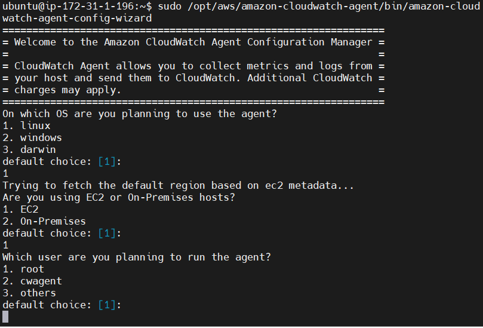
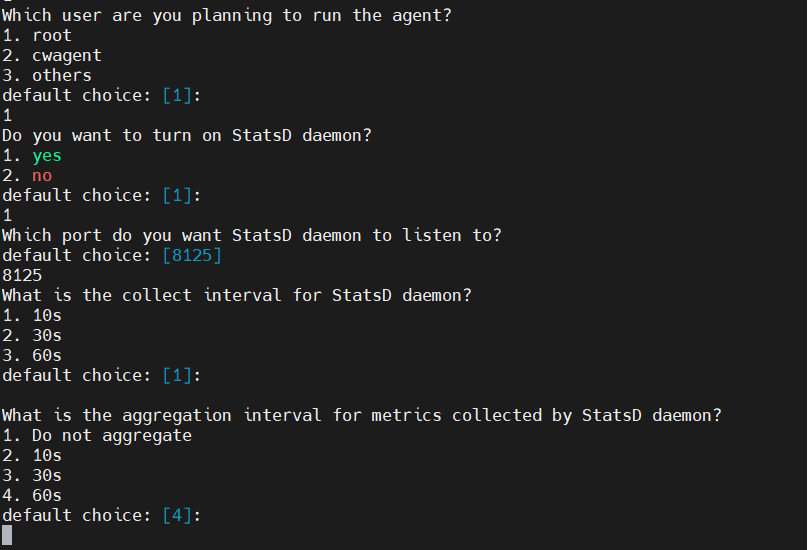
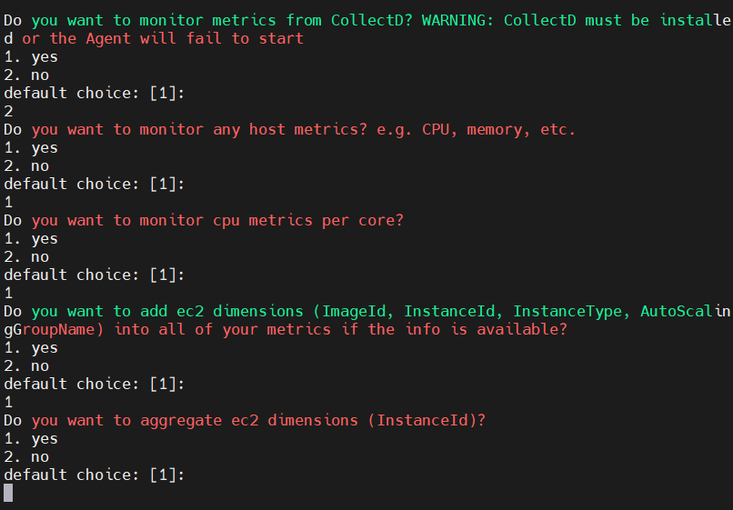
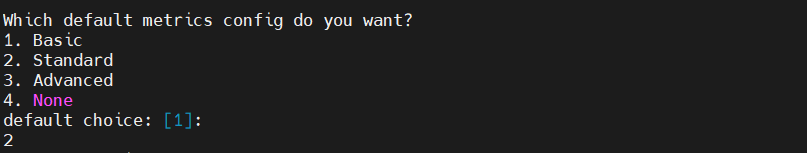

#### So, we got the json configuration file:
```
{
        "agent": {
                "metrics_collection_interval": 60,
                "run_as_user": "root"
        },
        "metrics": {
                "aggregation_dimensions": [
                        [
                                "InstanceId"
                        ]
                ],
                "append_dimensions": {
                        "AutoScalingGroupName": "${aws:AutoScalingGroupName}",
                        "ImageId": "${aws:ImageId}",
                        "InstanceId": "${aws:InstanceId}",
                        "InstanceType": "${aws:InstanceType}"
                },
                "metrics_collected": {
                        "cpu": {
                                "measurement": [
                                        "cpu_usage_idle",
                                        "cpu_usage_iowait",
                                        "cpu_usage_user",
                                        "cpu_usage_system"
                                ],
                                "metrics_collection_interval": 60,
                                "resources": [
                                        "*"
                                ],
                                "totalcpu": false
                        },
                        "disk": {
                                "measurement": [
                                        "used_percent",
                                        "inodes_free"
                                ],
                                "metrics_collection_interval": 60,
                                "resources": [
                                        "*"
                                ]
                        },
                        "diskio": {
                                "measurement": [
                                        "io_time"
                                ],
                                "metrics_collection_interval": 60,
                                "resources": [
                                        "*"
                                ]
                        },
                        "mem": {
                                "measurement": [
                                        "mem_used_percent"
                                ],
                                "metrics_collection_interval": 60
                        },
                        "statsd": {
                                "metrics_aggregation_interval": 60,
                                "metrics_collection_interval": 10,
                                "service_address": ":8125"
                        },
                        "swap": {
                                "measurement": [
                                        "swap_used_percent"
                                ],
                                "metrics_collection_interval": 60
                        }
                }
        }
```

:white_medium_square: Let's to store the config in the SSM parameter store:
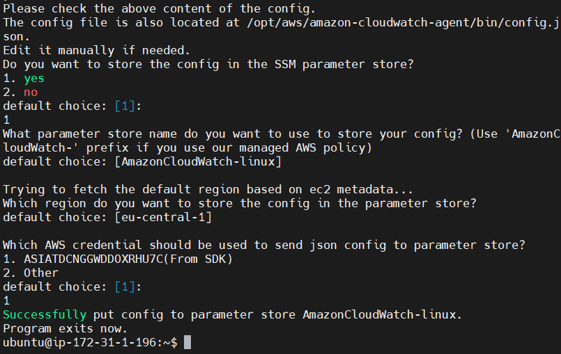

:white_medium_square: And check our file in Parameter Store:
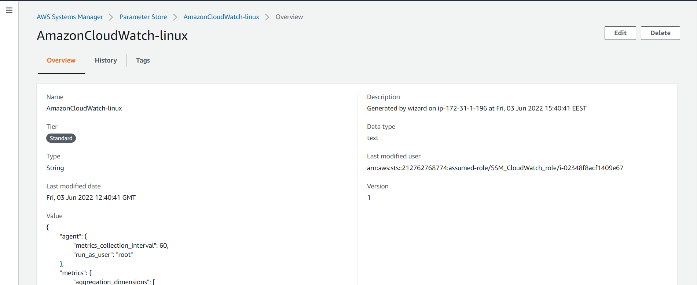


:brown_square: Let's replace the configuration file with our custom configuration file: `sudo vim /opt/aws/amazon-cloudwatch-agent/bin/config.json`
```
{
        "agent": {
                "metrics_collection_interval": 60,
                "run_as_user": "root"
        },
        "metrics": {
                "aggregation_dimensions": [
                        [
                                "InstanceId"
                        ]
                ],
                "append_dimensions": {
                        "AutoScalingGroupName": "${aws:AutoScalingGroupName}",
                        "ImageId": "${aws:ImageId}",
                        "InstanceId": "${aws:InstanceId}",
                        "InstanceType": "${aws:InstanceType}"
                },
                "metrics_collected": {
                        "collectd": {
                                "metrics_aggregation_interval": 60
                        },
                        "cpu": {
                                "measurement": [
                                        "cpu_usage_idle",
                                        "cpu_usage_iowait",
                                        "cpu_usage_user",
                                        "cpu_usage_system"
                                ],
                                "metrics_collection_interval": 60,
                                "resources": [
                                        "*"
                                ],
                                "totalcpu": false
                        },
                        "disk": {
                                "measurement": [
                                        "used_percent"
                                ],
                                "metrics_collection_interval": 60,
                                "resources": [
                                        "*"
                                ]
                        },
                        "diskio": {
                                "measurement": [
                                        "io_time"
                                ],
                                "metrics_collection_interval": 60,
                                "resources": [
                                        "*"
                                ]
                        },
                        "mem": {
                                "measurement": [
                                        "mem_used_percent",
                                        "available_percent",
                                        "total",
                                        "used",
                                        "free",
                                        "available"
                                ],
                                "metrics_collection_interval": 60
                        },
                        "statsd": {
                                "metrics_aggregation_interval": 60,
                                "metrics_collection_interval": 10,
                                "service_address": ":8125"
                        },
                        "swap": {
                                "measurement": [
                                        "swap_used_percent"
                                ],
                                "metrics_collection_interval": 60
                        }
                }
        }
}
```

:white_medium_square: And in Parameter Store, just click **Edit**
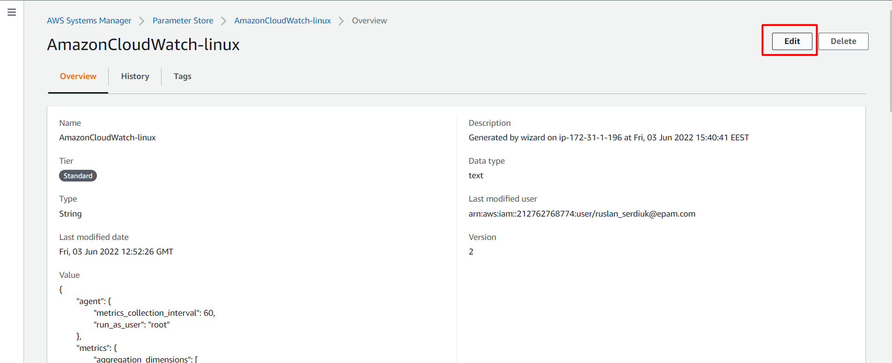

:white_medium_square: And paste your custom configuration code here:
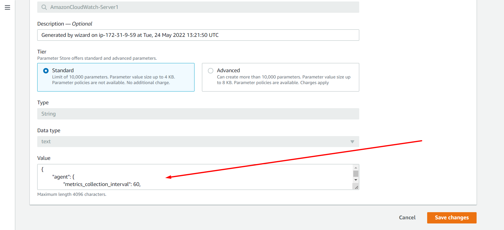
:white_medium_small_square: And click **Save changes**


:white_medium_square: Next you need Select **AWS Systems Manager** > **Run Command** > and click **Run Command**

:white_medium_small_square: Search **AmazonCloudWatch-ManageAgent**
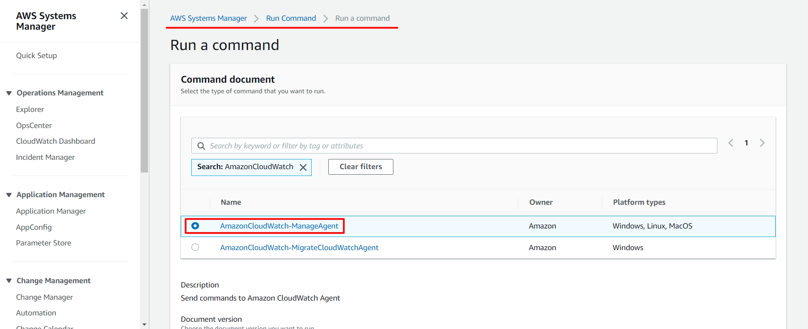

#### 	:white_large_square: Command parameters:
:black_medium_small_square: Action: **configure**

:black_medium_small_square: Optional Configuration Location: **AmazonCloudWatch-linux** from Parameter Store

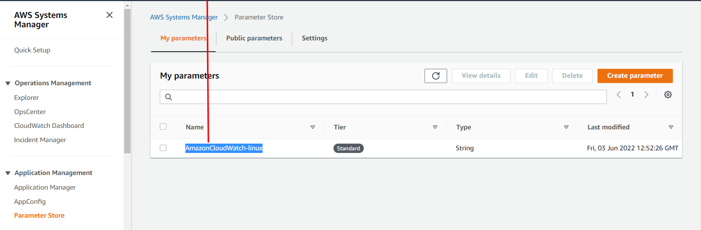

:black_medium_small_square: Targets:
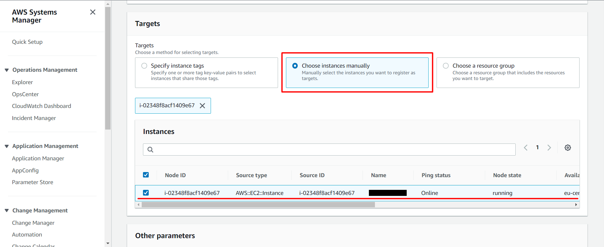

:white_medium_small_square: And click **Run**
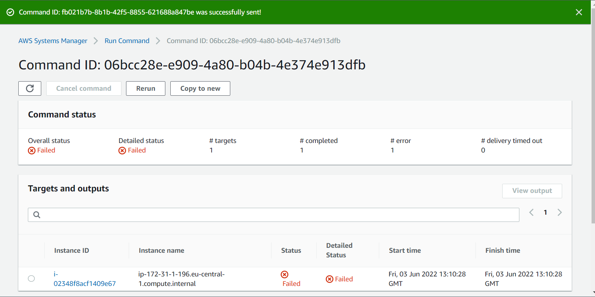

:red_circle: Failed. Hmm...

:yellow_square: Let's check the output:
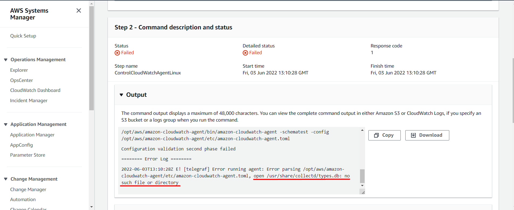

:large_orange_diamond: **Just install CollectD: `sudo apt install collectd`:**

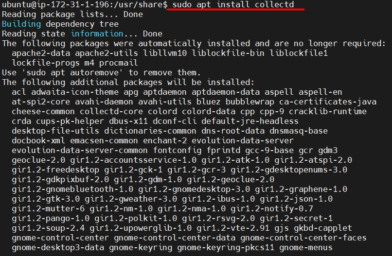

:small_orange_diamond: **Or choose "no" at this point:**


:white_medium_square: Now click **Return**
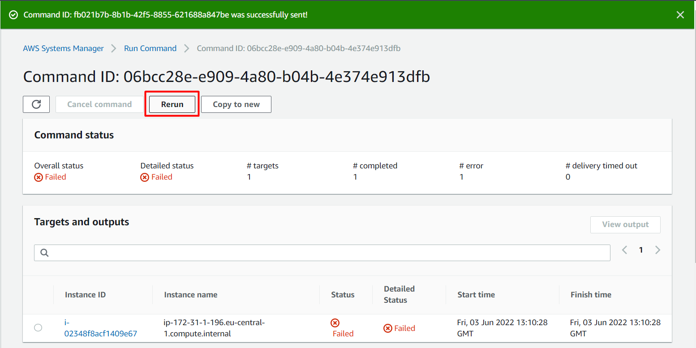


:green_circle: **YES!**
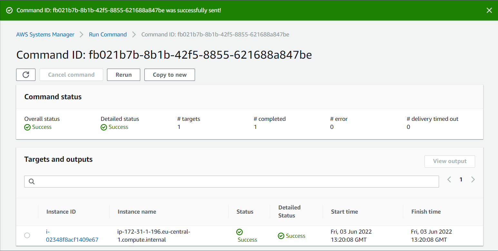

## _PART 4 - [Config Cloud Watch Dashboard]_

:white_medium_square: Go to the Cloud Watch and create my own dashboard and add widget:
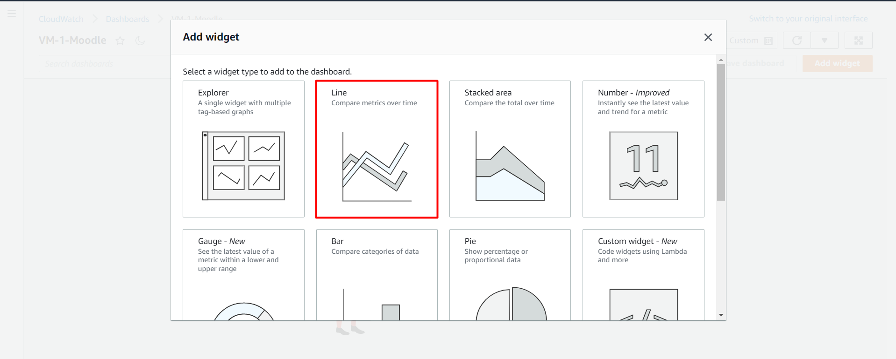
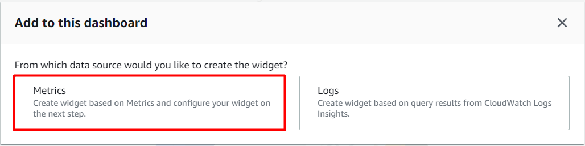
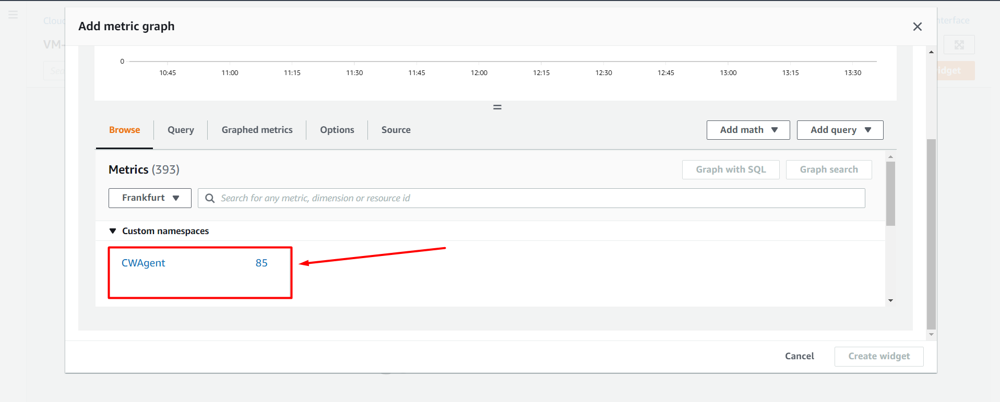
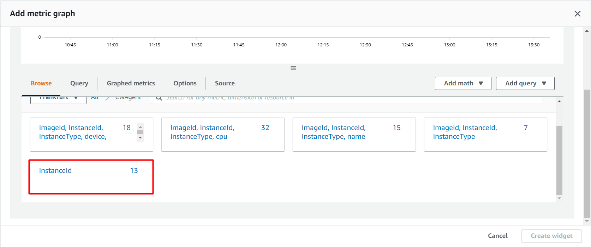

:white_medium_square: **Adding used disk space**
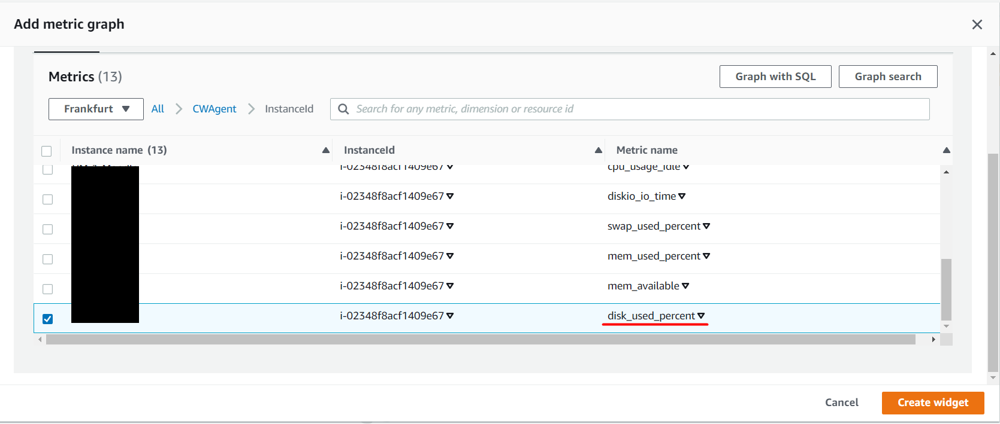
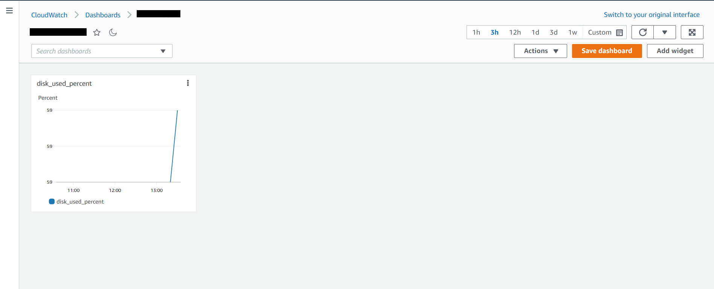

:white_medium_square: And some more metrics

:white_medium_small_square: and click **Save dashboard**

## :purple_circle: _Useful links:_
- _https://docs.aws.amazon.com/AmazonCloudWatch/latest/monitoring/install-CloudWatch-Agent-on-EC2-Instance.html_
- _https://docs.aws.amazon.com/AmazonCloudWatch/latest/monitoring/download-cloudwatch-agent-commandline.html_
- _https://docs.aws.amazon.com/AmazonCloudWatch/latest/monitoring/create-cloudwatch-agent-configuration-file-wizard.html_
- _https://docs.aws.amazon.com/systems-manager/latest/userguide/ssm-agent.html_
