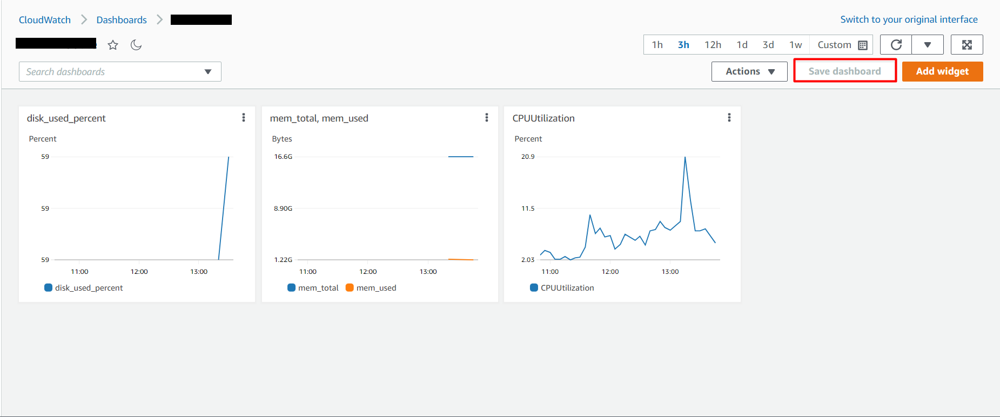

# Implement SSM + CloudWatch Agent to your instance

#### SSM is needed in case you lose access to your instance. For example, you lost your ssh key.
#### CloudWatch Agent is needed to get metrics from your volum. such as free space

## _Part 1 - [Create role]_

First of all we need create Role for our agents. 

> Click **IAM** > **Roles** > **Create Role** and Select **EC2**
> 

> Next add **AmazonSSMManagedInstanceCore**
> 

> and add **CloudWatchAgentAdminPolicy** and **CloudWatchAgentServerPolicy**
> 

> So, give name **"SSM_CloudWatch_role"** for your role:
> 

> And check all permitions:
> 
> Now just click **Create role**

> Next attach your role to your instance:
> 
> Select your instance
> 
> right-click on it
> 
> Select **Security**
> 
> and Select **Modify IAM Role**
> 

> Now just select your role from list:
> 

> Congratulations! Your role has been attached.
> 

## _PART 2 - [Install SSM Agent to your instance]_

> WARNING! 
> 
> **If you don't have access to your instance, the ssm agent can only be implemented by creating a new instance!**
> 
> You should already have access to your instance. For example ssh.

> In most cases, SSM Agent is preinstalled on AMIs provided by AWS for the following operating systems (OSs):
> 
> - Amazon Linux Base AMIs dated 2017.09 and later 
>
> - Amazon Linux 2 
> 
> - Amazon Linux 2 ECS-Optimized Base AMIs 
> 
> - macOS 10.14.x (Mojave), 10.15.x (Catalina), and 11.x (Big Sur)
> 
> - SUSE Linux Enterprise Server (SLES) 12 and 15 
> 
> - Ubuntu Server 16.04, 18.04, and 20.04 
> 
> - Windows Server 2008-2012 R2 AMIs published in November 2016 or later 
> 
> - Windows Server 2016, 2019, and 2022

> I using [AWS documentation](https://docs.aws.amazon.com/systems-manager/latest/userguide/sysman-manual-agent-install.html) and choosing my  version OS.
> 

> I Have Ubuntu Server 20.10 STR 64-bit (Snap package installation).
> 
> So, I just Run the following command to determine if SSM Agent is running: `sudo systemctl status snap.amazon-ssm-agent.amazon-ssm-agent.service`
> 
>  
> and a few other commands:
> 
> 

#### So, SSM Agent is installed and running. Ok, run the SSM Session.

> Select **AWS Systems Manager** > **Session Manager**
> 
> Select your instance and click **Start session**

> Congratulations!
> 

## PART 3 - [Install CloudWatch Agent to your instance]

> I using [AWS documentation](https://docs.aws.amazon.com/AmazonCloudWatch/latest/monitoring/download-cloudwatch-agent-commandline.html) too.
> Select your version OS and copy link for download:
> 

> Run the command: `wget https://s3.amazonaws.com/amazoncloudwatch-agent/ubuntu/amd64/latest/amazon-cloudwatch-agent.deb`
> 

> If you downloaded a DEB package on a Linux server, change to the directory containing the package and enter the following: `sudo dpkg -i -E ./amazon-cloudwatch-agent.deb`
> 

#### Ok, now create the [CloudWatch agent configuration file](https://docs.aws.amazon.com/AmazonCloudWatch/latest/monitoring/create-cloudwatch-agent-configuration-file-wizard.html) with the wizard!

> Start the CloudWatch agent configuration wizard by entering the following: `sudo /opt/aws/amazon-cloudwatch-agent/bin/amazon-cloudwatch-agent-config-wizard`
> 
> 
> 
> 

#### So, we got the json configuration file:
```
{
        "agent": {
                "metrics_collection_interval": 60,
                "run_as_user": "root"
        },
        "metrics": {
                "aggregation_dimensions": [
                        [
                                "InstanceId"
                        ]
                ],
                "append_dimensions": {
                        "AutoScalingGroupName": "${aws:AutoScalingGroupName}",
                        "ImageId": "${aws:ImageId}",
                        "InstanceId": "${aws:InstanceId}",
                        "InstanceType": "${aws:InstanceType}"
                },
                "metrics_collected": {
                        "cpu": {
                                "measurement": [
                                        "cpu_usage_idle",
                                        "cpu_usage_iowait",
                                        "cpu_usage_user",
                                        "cpu_usage_system"
                                ],
                                "metrics_collection_interval": 60,
                                "resources": [
                                        "*"
                                ],
                                "totalcpu": false
                        },
                        "disk": {
                                "measurement": [
                                        "used_percent",
                                        "inodes_free"
                                ],
                                "metrics_collection_interval": 60,
                                "resources": [
                                        "*"
                                ]
                        },
                        "diskio": {
                                "measurement": [
                                        "io_time"
                                ],
                                "metrics_collection_interval": 60,
                                "resources": [
                                        "*"
                                ]
                        },
                        "mem": {
                                "measurement": [
                                        "mem_used_percent"
                                ],
                                "metrics_collection_interval": 60
                        },
                        "statsd": {
                                "metrics_aggregation_interval": 60,
                                "metrics_collection_interval": 10,
                                "service_address": ":8125"
                        },
                        "swap": {
                                "measurement": [
                                        "swap_used_percent"
                                ],
                                "metrics_collection_interval": 60
                        }
                }
        }
```

> Let's to store the config in the SSM parameter store:
> 

> And check our file in Parameter Store:
> 


Let's replace the configuration file with our custom configuration file: `sudo vim /opt/aws/amazon-cloudwatch-agent/bin/config.json`
```
{
        "agent": {
                "metrics_collection_interval": 60,
                "run_as_user": "root"
        },
        "metrics": {
                "aggregation_dimensions": [
                        [
                                "InstanceId"
                        ]
                ],
                "append_dimensions": {
                        "AutoScalingGroupName": "${aws:AutoScalingGroupName}",
                        "ImageId": "${aws:ImageId}",
                        "InstanceId": "${aws:InstanceId}",
                        "InstanceType": "${aws:InstanceType}"
                },
                "metrics_collected": {
                        "collectd": {
                                "metrics_aggregation_interval": 60
                        },
                        "cpu": {
                                "measurement": [
                                        "cpu_usage_idle",
                                        "cpu_usage_iowait",
                                        "cpu_usage_user",
                                        "cpu_usage_system"
                                ],
                                "metrics_collection_interval": 60,
                                "resources": [
                                        "*"
                                ],
                                "totalcpu": false
                        },
                        "disk": {
                                "measurement": [
                                        "used_percent"
                                ],
                                "metrics_collection_interval": 60,
                                "resources": [
                                        "*"
                                ]
                        },
                        "diskio": {
                                "measurement": [
                                        "io_time"
                                ],
                                "metrics_collection_interval": 60,
                                "resources": [
                                        "*"
                                ]
                        },
                        "mem": {
                                "measurement": [
                                        "mem_used_percent",
                                        "available_percent",
                                        "total",
                                        "used",
                                        "free",
                                        "available"
                                ],
                                "metrics_collection_interval": 60
                        },
                        "statsd": {
                                "metrics_aggregation_interval": 60,
                                "metrics_collection_interval": 10,
                                "service_address": ":8125"
                        },
                        "swap": {
                                "measurement": [
                                        "swap_used_percent"
                                ],
                                "metrics_collection_interval": 60
                        }
                }
        }
}
```

> And in Parameter Store, just click **Edit**
> 

> And paste your custom configuration code here:
> 
> And click **Save changes**


> Next you need Select **AWS Systems Manager** > **Run Command** > and click **Run Command**
> 
> Search **AmazonCloudWatch-ManageAgent**
> 

#### Command parameters:
> Action: **configure**
> 
> Optional Configuration Location: **AmazonCloudWatch-linux** from Parameter Store
> 
> 

> Targets:
> 

> And click **Run**
> 

> Failed. Hmm...
> 
> Let's check the output:
> 

> **Just install CollectD: `sudo apt install collectd`:**
> 
> 
> 
> **Or choose "no" at this point:**
> 
> 

> Now click **Return**
> 


> **YES!**
> 

## _PART 4 - [Config Cloud Watch Dashboard]_

> Go to the Cloud Watch and create my own dashboard and add widget:
> 
> 
> 
> 
> 
> **Adding used disk space**
> 
> 
> 
> And some more metrics
> 
> and click **Save dashboard**

## _Useful links:_
- https://docs.aws.amazon.com/AmazonCloudWatch/latest/monitoring/install-CloudWatch-Agent-on-EC2-Instance.html
- https://docs.aws.amazon.com/AmazonCloudWatch/latest/monitoring/download-cloudwatch-agent-commandline.html
- https://docs.aws.amazon.com/AmazonCloudWatch/latest/monitoring/create-cloudwatch-agent-configuration-file-wizard.html
- https://docs.aws.amazon.com/systems-manager/latest/userguide/ssm-agent.html