# AWS - Task #1  [Simple Application]

### Развернуть https://github.com/FaztWeb/php-mysql-crud  следующим образом:
```
Создать VPC
Создать Application Load Balancer.
- Балансер должен быть доступен из Интернет, но ограничен определенными айпишниками (For example ваш домашний)
- Один Listener слушает на 80 и редиректит на HTTPS
- Второй Listener слушает на 443 и редиректит всё на таргетгруппу
- Таргеты созданы Auto Scaling Group
     o Инстансы создаются в приватной сети
     o Код проекта должен лежать на S3
            - S3 бакет не публичный
База данных в RDS. Для RDS своя security group с доступом только для машин из ASG.
Создать пользователя Best_friend@mulo.com  в IAM для проверки.

Будет плюсом:
+ DNS имя для лоад балансера, управляемое через Route53
+ работающий HTTPS сертификат, управляемый через Certificate Manager
```
> **All actions were done in my account in Amazon Web Services.**

### _Here I will briefly describe the actions that were taken to reach the solution_


## _Part one_

> 1. **A domain was created on a third-party hosting service**

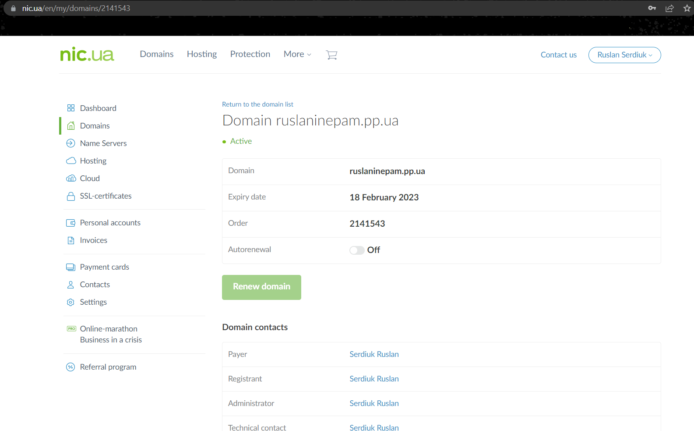

> 2. **The domain was added to Route 53 and the host zone was created. Also 2 records were added**

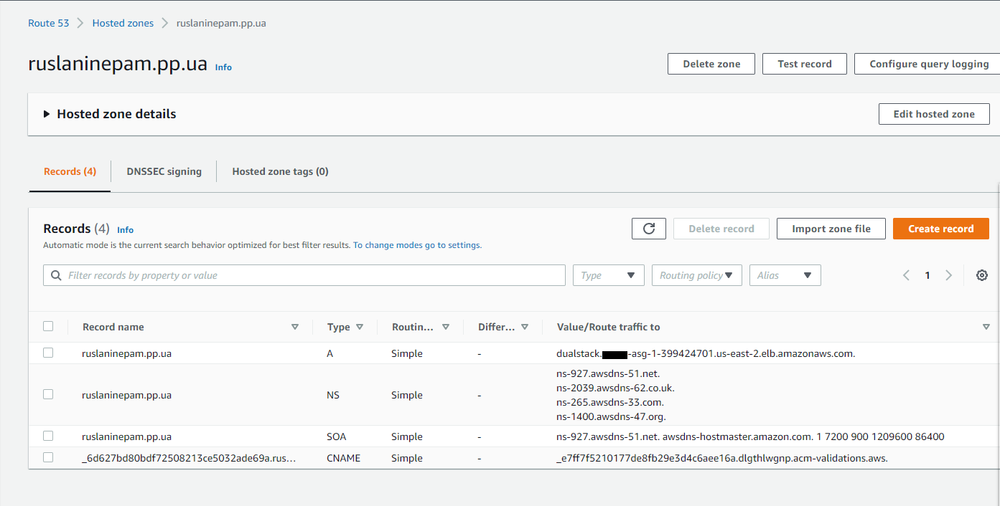

> 3. **After that, a request for an SSL certificate was submitted to the certificate manager**

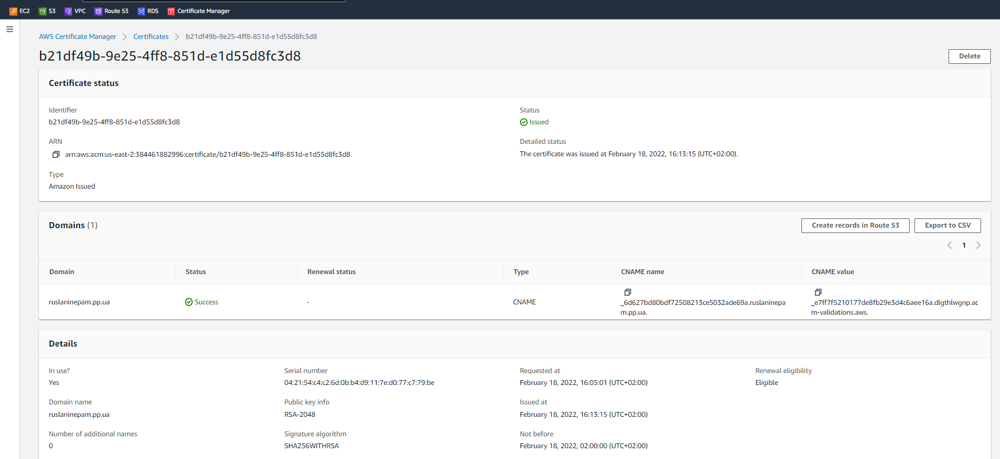


## _Part two (config network)_

> 1. **In this part I created my VPC network with this block of addresses:`10.23.0.0/20`**

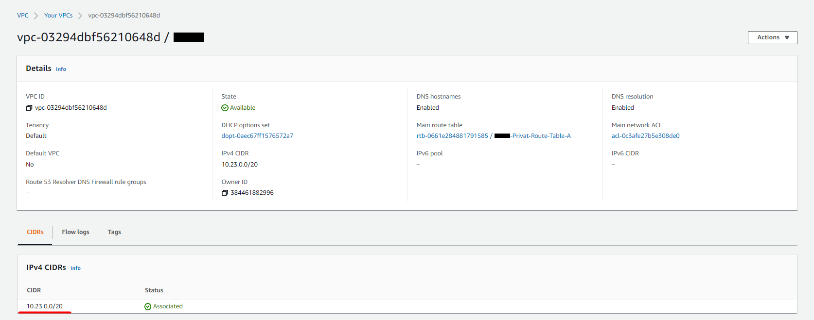

> 2. **Four subnets were also created. 2 private ones for our instances and 2 public ones for Bastion Host and Nat Gateways**

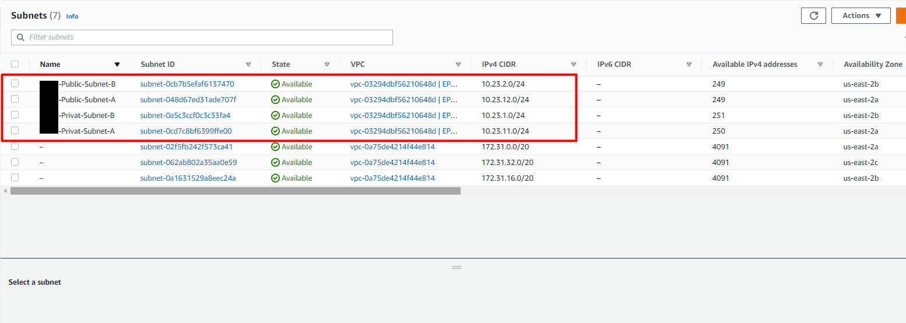

> 3. **The Internet Gateway was created to operate the public subnets**

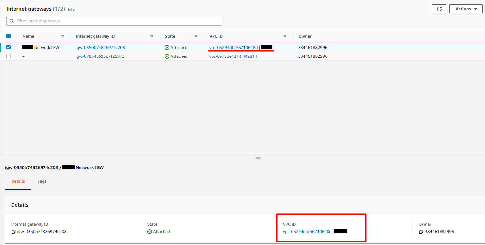

> 4. **Two Elastic IP addresses were created for the NAT Gateway**

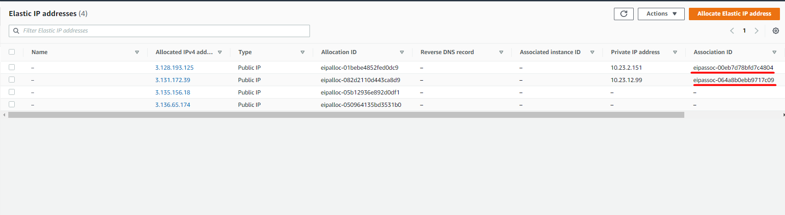

> 5. **Finally two NAT Gateways were created for each of our private subnets**

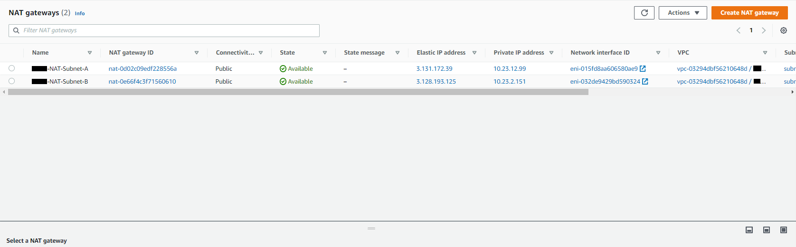

> 6. **Route tables were created and configured for each subnets**

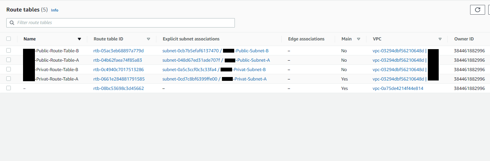


## _Part three (security groups)_

> 1. **A total of three security groups were created. The first is for the database:**

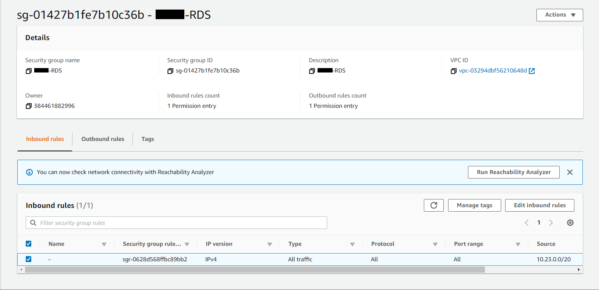

> 2. **The second is for a private subnet:**

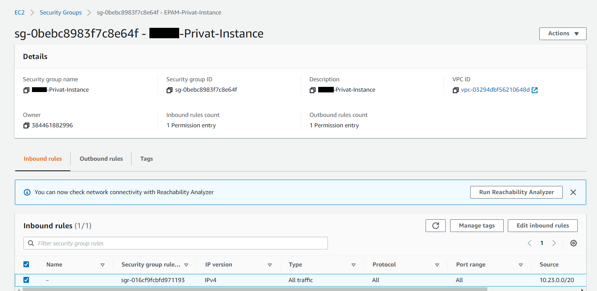

> 3. **And the third is for a public subnet:**

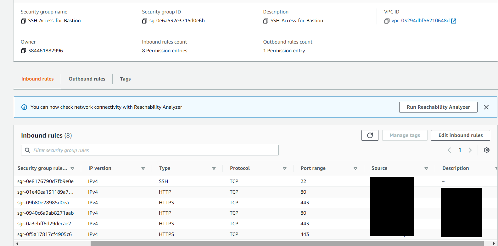


## _Part four_

> 1. **Created RDS**

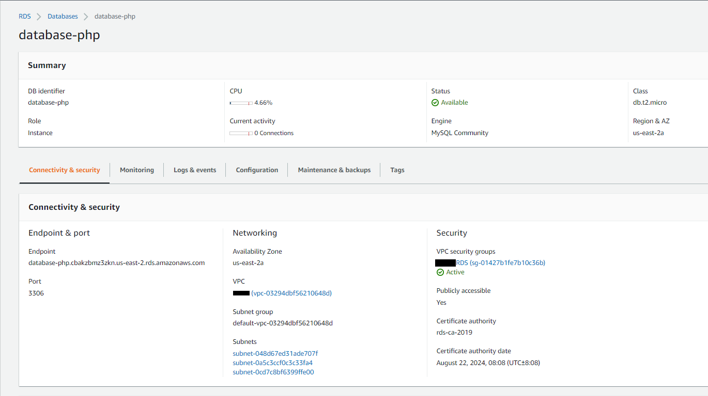

> 2. **Create S3 Bucket**

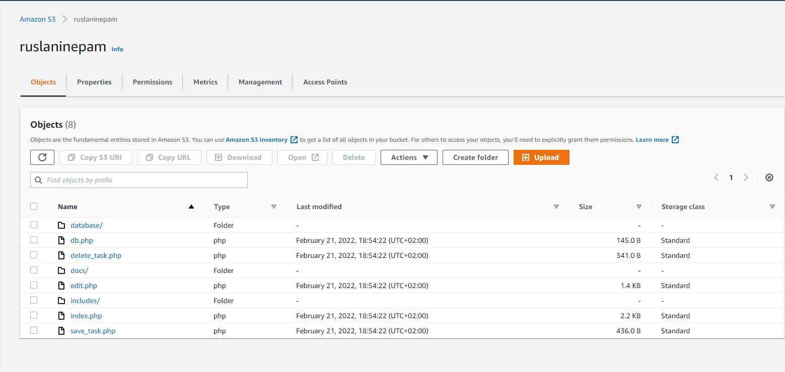

> 3. **Create IAM Role for S3**

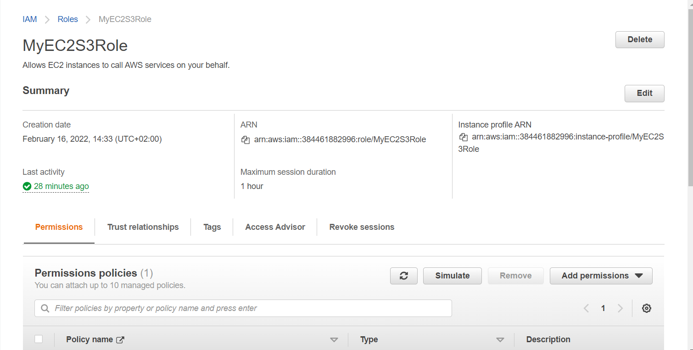


## _Part five_

> 1. **Created a target group for Load Balancer**

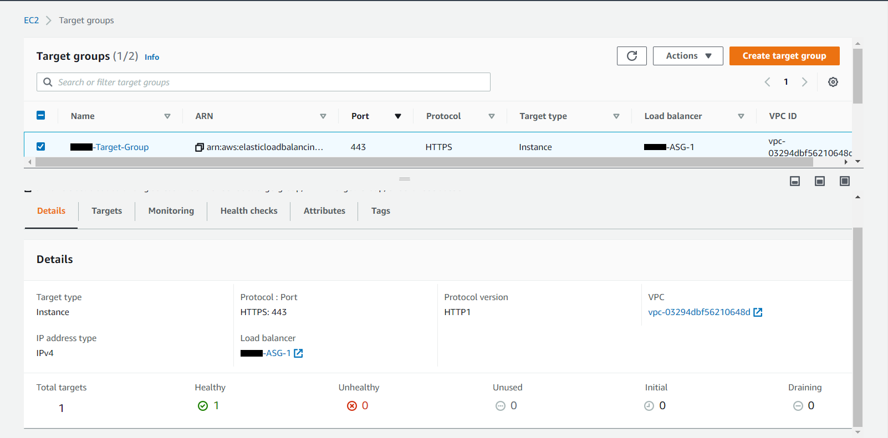

> 2. **In this important part, Load Balancer was created and configured**

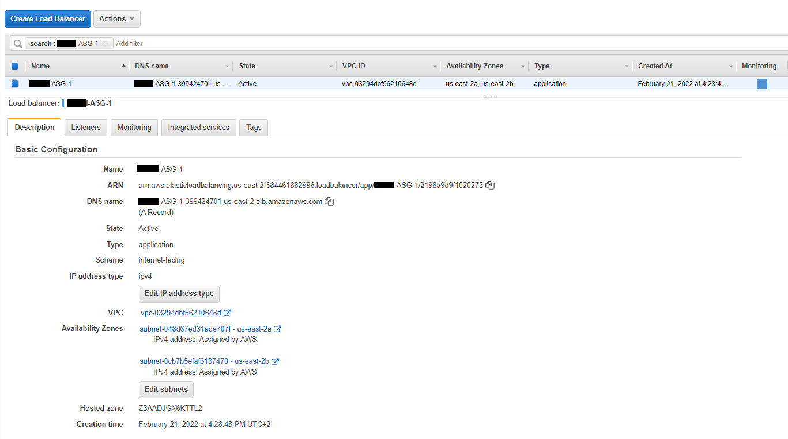
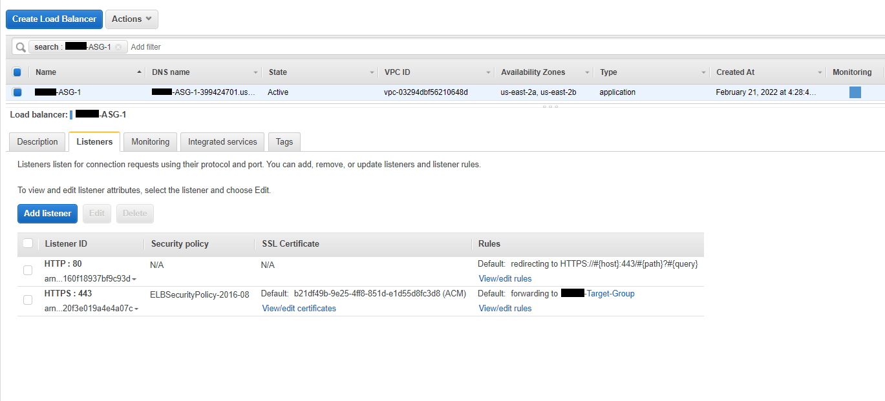

> 3. **Next, I created a launch configuration in which I placed my script:**
>
```
#!/bin/bash

sudo su

yum update -y
amazon-linux-extras install -y lamp-mariadb10.2-php7.2 php7.2

yum install -y httpd
systemctl start httpd
systemctl enable httpd

usermod -a -G apache ec2-user

systemctl restart httpd

chown -R ec2-user:apache /var/www
sudo chmod 2775 /var/www
find /var/www -type d -exec sudo chmod 2775 {} \;
find /var/www -type f -exec sudo chmod 0664 {} \;

cd /var/www
mkdir inc
cd inc

cat <<EOF > dbinfo.inc
<?php

define('DB_SERVER', 'database-php.cbakzbmz3zkn.us-east-2.rds.amazonaws.com');
define('DB_USERNAME', 'admin');
define('DB_PASSWORD', 'password123');
define('DB_DATABASE', 'php_mysql_crud');

?>
EOF

cd /var/www/html

aws s3 sync s3://ruslaninepam/ .

sed -i 's/db.php/..\/inc\/dbinfo.inc/g' index.php
sed -i '/header.php/a \
<?php \
$conn = mysqli_connect(DB_SERVER, DB_USERNAME, DB_PASSWORD); \
if (mysqli_connect_errno()) echo "Failed to connect to MySQL: " . mysqli_connect_error(); \
mysqli_select_db($conn, DB_DATABASE); \
?>' index.php

sed -i 's/db.php/..\/inc\/dbinfo.inc/g' save_task.php
sed -i '/dbinfo.inc/a \
$conn = mysqli_connect(DB_SERVER, DB_USERNAME, DB_PASSWORD); \
if (mysqli_connect_errno()) echo "Failed to connect to MySQL: " . mysqli_connect_error(); \
mysqli_select_db($conn, DB_DATABASE);' save_task.php

sed -i 's/db.php/..\/inc\/dbinfo.inc/g' edit.php
sed -i '/dbinfo.inc/a \
$conn = mysqli_connect(DB_SERVER, DB_USERNAME, DB_PASSWORD); \
if (mysqli_connect_errno()) echo "Failed to connect to MySQL: " . mysqli_connect_error(); \
mysqli_select_db($conn, DB_DATABASE);' edit.php

sed -i 's/db.php/..\/inc\/dbinfo.inc/g' delete_task.php
sed -i '/dbinfo.inc/a \
$conn = mysqli_connect(DB_SERVER, DB_USERNAME, DB_PASSWORD); \
if (mysqli_connect_errno()) echo "Failed to connect to MySQL: " . mysqli_connect_error(); \
mysqli_select_db($conn, DB_DATABASE);' delete_task.php

cd /etc/httpd/conf/

sed -i '/# Supplemental configuration/i \
<VirtualHost *:80> \
RewriteEngine On \
RewriteCond %{HTTP:X-Forwarded-Proto} =http \
RewriteRule .* https://%{HTTP:Host}%{REQUEST_URI} [L,R=permanent] \
</VirtualHost>' httpd.conf

yum install -y mod_ssl
cd /etc/pki/tls/certs
./make-dummy-cert localhost.crt
cd /etc/httpd/conf.d/
sed -i 's/SSLCertificateKeyFile/#SSLCertificateKeyFile/g' ssl.conf
systemctl restart httpd
```

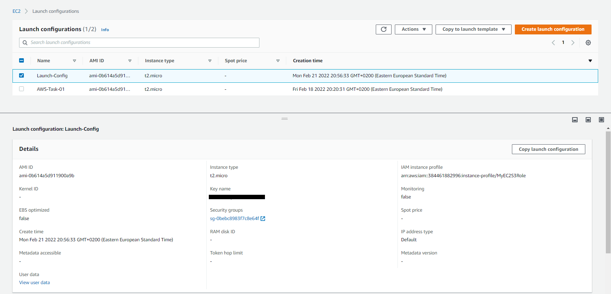

> 3. **Finally, we can create an Auto Scaling Group and raise our entire infrastructure**

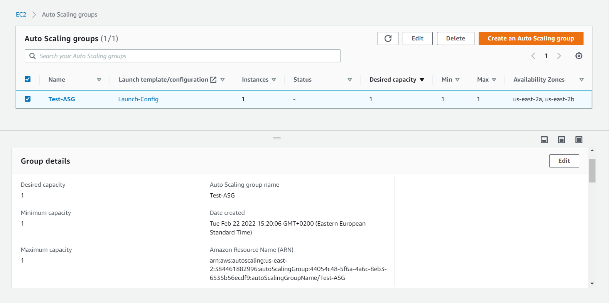
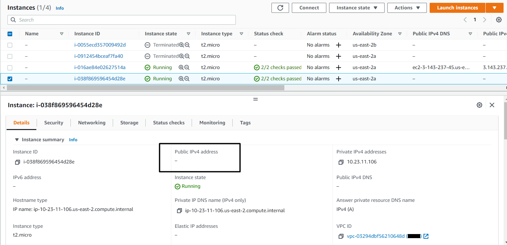

> 4. **Create user in IAM for check solution**

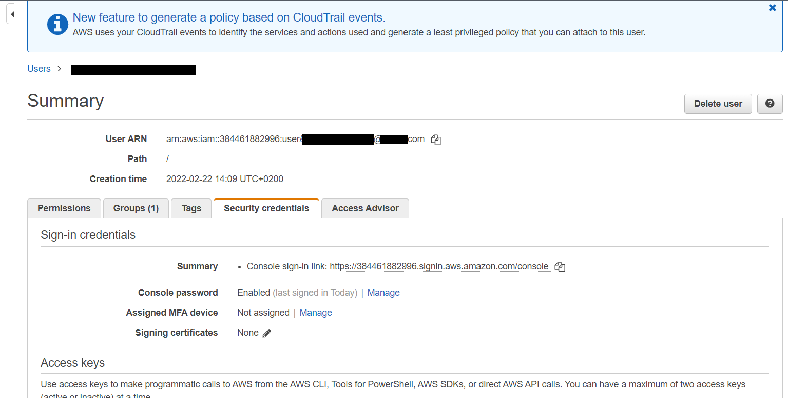


## You can check the connection to the database using this domain: ruslaninepam.pp.ua


### _Official documentation was used for this assignment:_
+ https://docs.aws.amazon.com/vpc/latest/userguide/VPC_Scenario2.html
+ https://docs.aws.amazon.com/AmazonS3/latest/userguide/creating-bucket.html
+ https://docs.aws.amazon.com/AmazonRDS/latest/UserGuide/CHAP_SettingUp.html
+ https://docs.aws.amazon.com/Route53/latest/DeveloperGuide/resolver-dns-firewall.html
+ https://docs.aws.amazon.com/acm/latest/userguide/import-certificate.html

### _Also I used unofficial sources:_
+ https://www.youtube.com/watch?v=KNMmSQf0crs&list=PLg5SS_4L6LYsxrZ_4xE_U95AtGsIB96k9&index=59
+ https://www.youtube.com/watch?v=SeTTD2zP_3A&list=PLg5SS_4L6LYsxrZ_4xE_U95AtGsIB96k9&index=10
+ https://www.youtube.com/watch?v=UuJcSaA9H6s&list=PLg5SS_4L6LYsxrZ_4xE_U95AtGsIB96k9&index=10
+ https://www.youtube.com/watch?v=CG4PwqKKVaM&list=PLg5SS_4L6LYsxrZ_4xE_U95AtGsIB96k9&index=25
+ https://www.youtube.com/watch?v=zPjVWiPpT-8&list=PLg5SS_4L6LYsxrZ_4xE_U95AtGsIB96k9&index=27
+ https://learn.acloud.guru/course/aws-certified-sysops-admin-associate/learn/e6e4e2b6-24b1-496a-8096-d6218f997ee2/0cd312c6-884a-4f9d-9638-457bf70552ad/watch
+ https://learn.acloud.guru/course/aws-certified-sysops-admin-associate/learn/90bb381f-a218-4152-bd7c-12b4d95e8a08/72f23ac7-61ea-41cf-bc95-4dc4ded60237/watch
+ https://www.youtube.com/watch?v=AP6H3ZG7LGM&list=PLg5SS_4L6LYsxrZ_4xE_U95AtGsIB96k9&index=60


### _Also you can find all screenshots [HERE](https://git.epam.com/ruslan_serdiuk/devops-21q4-22q1-serdiuk-ruslan/-/tree/m7-AWS-Task-01/Module-07_AWS/Task-01/Screenshots)_
