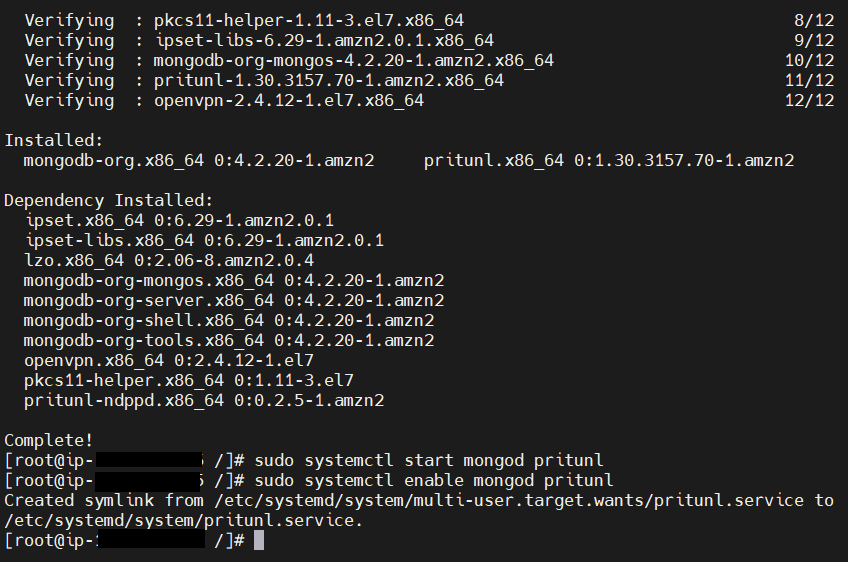
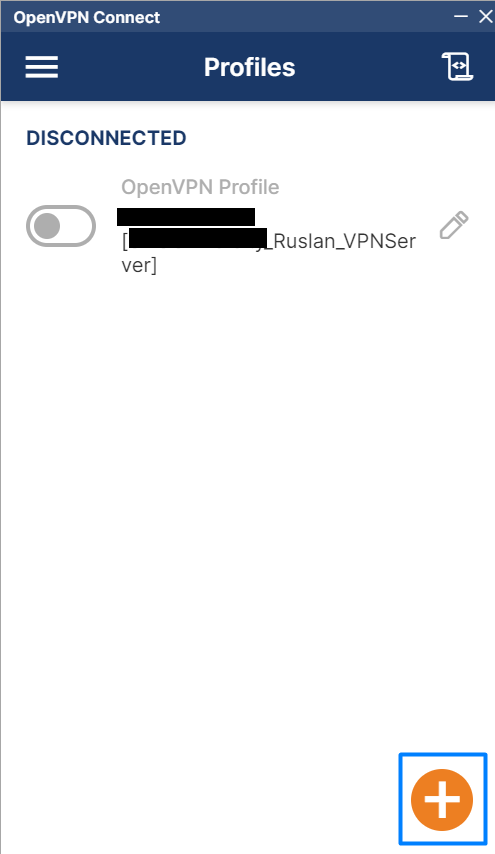

# Deploying and replacing the AWS VPN Service with Pritunl on a separate instance

:bangbang: There are situations when we or our customer need to connect to the instance from different IP addresses. **We cannot open port 22 to the whole world!** 
So we will use a VPN. But amazon's VPN is quite expensive. 


:grey_exclamation: And in order to save money there is an alternative solution. 
**This is to deploy a VPN Server on a separate instance.**

## :white_medium_square: _Launch instance and Setup VPN Server "Pritunl"_
- [Official site](https://pritunl.com/vpc)
- [Documentation](https://docs.pritunl.com/docs/installation)

EC2 > Launch Instance:

Use Free tier only)

Create Security Group:


Connect to instance and run command `yum update`


Next, just run these commands :point_down:
```
sudo tee /etc/yum.repos.d/mongodb-org-4.2.repo << EOF
[mongodb-org-4.2]
name=MongoDB Repository
baseurl=https://repo.mongodb.org/yum/amazon/2/mongodb-org/4.2/x86_64/
gpgcheck=1
enabled=1
gpgkey=https://www.mongodb.org/static/pgp/server-4.2.asc
EOF

sudo tee /etc/yum.repos.d/pritunl.repo << EOF
[pritunl]
name=Pritunl Repository
baseurl=https://repo.pritunl.com/stable/yum/amazonlinux/2/
gpgcheck=1
enabled=1
EOF


sudo rpm -Uvh https://dl.fedoraproject.org/pub/epel/epel-release-latest-7.noarch.rpm

gpg --keyserver hkp://keyserver.ubuntu.com --recv-keys 7568D9BB55FF9E5287D586017AE645C0CF8E292A

gpg --armor --export 7568D9BB55FF9E5287D586017AE645C0CF8E292A > key.tmp;

sudo rpm --import key.tmp; rm -f key.tmp

sudo yum -y install pritunl mongodb-org 
sudo systemctl start mongod pritunl 
sudo systemctl enable mongod pritunl
```



**Check our Server `sudo systemctl status mongod pritunl`** :mag:


## :white_medium_square: _Configurating Server_

Go to the Public IP:


Click "Advanced"


Click to unsafe link:


We are now on our server:


Go to the console and run command: `sudo pritunl setup-key` and and **paste the result into the appropriate field** on our server in the browser 

And click "Save"

Next, the server will update


Press "Advanced" again


And again click on the unsafe link


Go to the console and run command: `sudo pritunl default-password` and and **paste the result into the appropriate fields** on our server in the browser 

And click **"Sing in"**

### :arrows_counterclockwise: Change credentials:

Now, enter new User and Password:

After that, click **"Save"**

:warning: **But our server will change the Public IP every time the instance is restarted.
Let's give it a permanent IP Address.**

Go to the AWS:

Elastic IP addresses > **Allocate Elastic IP address** > and click "Allocate"


Now select your new Elastic IP and click **"Action"** and > **"Associate Elastic IP address"**

Select **your instance** and **Privat IP**

And click **"Associate"**

Next, open your Elastic IP in your browser and enter User and Password.

Click **"Setting"** and enter the **Elastic IP** in the **public address**:

Click **"Save"**

 :clap: Great! Now our server will always be on the same IP Address.

1. Go to the **Users** > click **Add Organization** > give name:


2. Next, click **Add user** > give name and pin **(REMEMBER IT)**:


3. Go to the **Servers** > click **Add Server**. Enter the **Name** and **Port UDP (this UDP port must be open in the Security Group in the AWS Account)**:


+ Enable **"Allow Multiple Devices"**
+ Disable **"Inter-client Routing"**


4. Attach an Organization and click **Start Server**!


5. Now, go to the **Users** and click **"Get temporary profile links"** and chose any link for you and download


6. Select zip archive and download:


## :white_medium_square: _Setup and Configurating OpenVPN Client_


1. Download the OpenVPN Client: https://openvpn.net/client-connect-vpn-for-windows/
2. Run OpenVPN Client and click **"Import Profile"**



3. Chose **"FILE"** and **Select your profile that you downloaded**.


4. Enter **name** and **pin**

 


5. Success.


7. Check your IP [here](https://www.ipchicken.com/)


## :white_medium_square: _Correct Security Group on the Main Server_

EC2 > SG > Edit inbound rules:

Add rule > Type: **All traffic** > Source: **Elastic IP your VPN Server**

Click **"Save Rules"**

#### The End. Now you can give your client access to the VPN server. And your client can create the necessary number of users to access the main server.

### Congratulation! :thumbsup:


## _Links:_
+ _https://www.linuxteacher.com/how-to-setup-pritunl-vpn-server-on-aws-to-access-private-servers/_
+ _https://www.youtube.com/watch?v=pvxbxccf4xM&t=1s_
+ _https://docs.pritunl.com/docs/aws_
