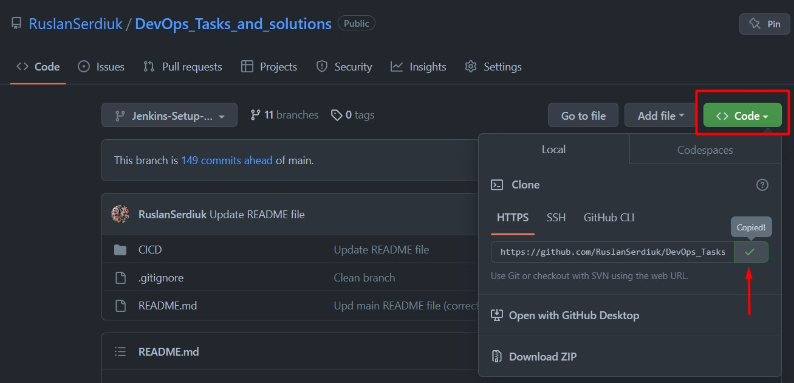
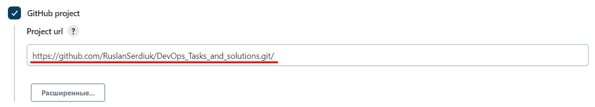
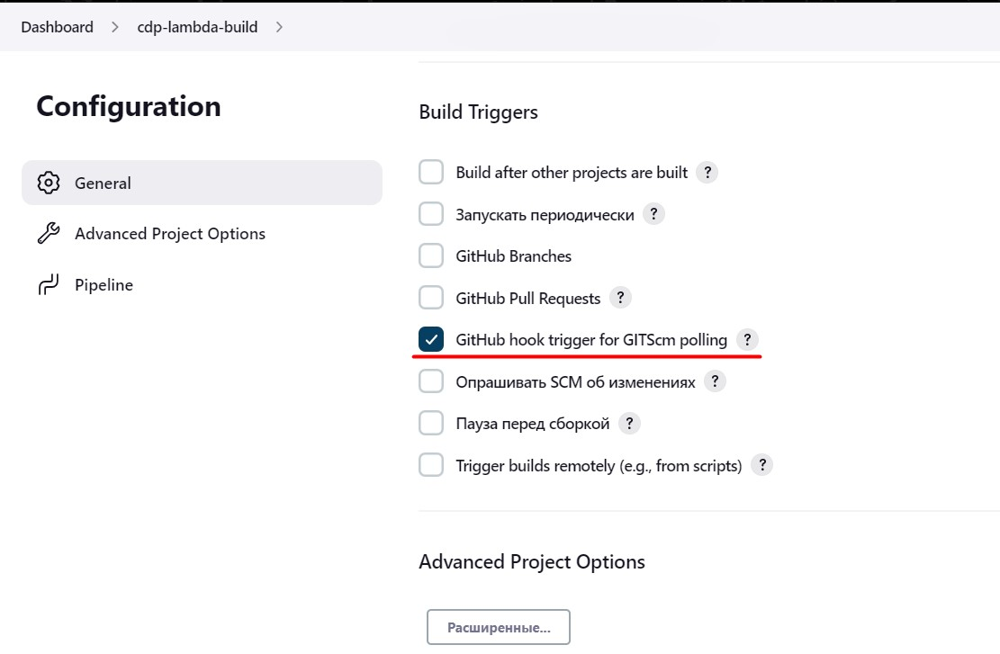
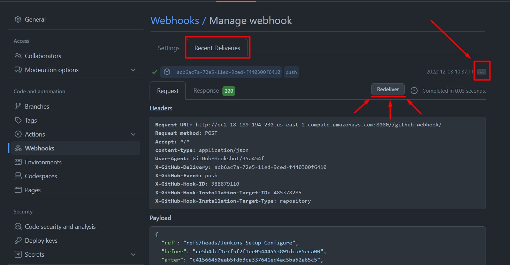
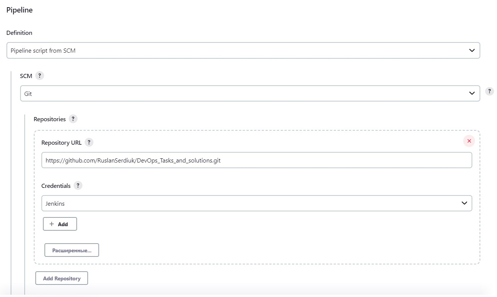
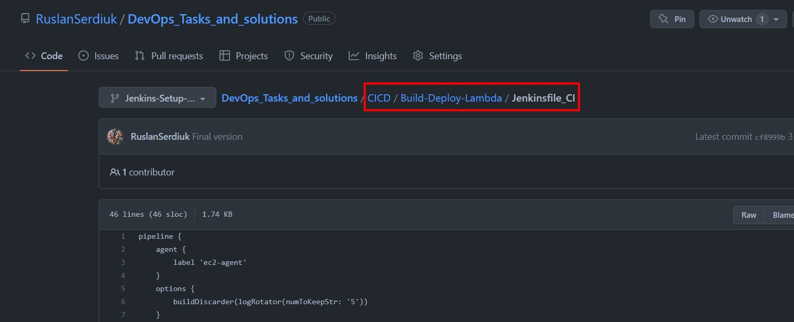
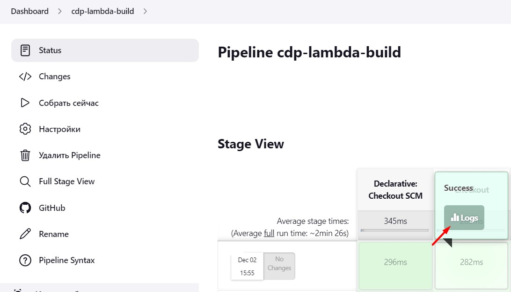
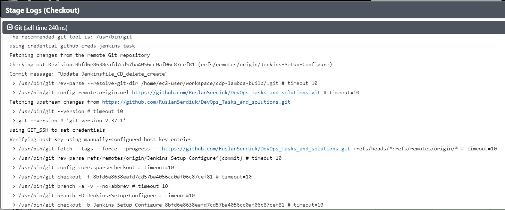

# Jenkins - Build and Deploy Lambda

### _TASK: write pipeline_
1. Create image (create script for run lambdas simple)
2. Requirement: add versioning for images
3. Push to ecr
4. Notifications
5. Addition:
   - Trigger another job in pipeline
   - Transfer some parameters to another Job in pipeline
   - Deploy lambda (create CloudFormation Stack  with parameters and use template file)
   - Invoke Lambda and check responce!
   - Set description for Job

#### _Prerequisites:_
1. [Installed and Configured Jenkins Server + Worker Node in AWS]() 


### _Connect Git to Jenkins Server_
1. [Generate your ssh-key](https://phoenixnap.com/kb/generate-ssh-key-windows-10)
2. Go to the your **GitHub** - **Settings** - **Deploy Keys** - **Add deploy key** - and put your **public** key! 
3. Open your dashboard - **Manage Jenkins** - **Credentials** - **add credentials** 
4. 
   - **Kind:** SSH Username with private key**
   - **ID:** github-creds-jenkins-task
   - **Username:**  Jenkins (or anything else that your entered in the **title** fiel of GitHub, when adding the Deploy key)
   - **Private Key:** your ssh private key. 
   


### _Create Job: cdp-lambda-build_
Go to the **Dashboard** - **Create Item** - select **pipeline** - give name "cdp-lambda-build" and **Create**
1. Add this url:  to the **GitHub Project**: 
2. Next - **Delete outdated builds** and set at least 5.
3. Select **Build Triggers** - **GitHub hook trigger for GITScm polling**: 
4. Go to the **GitHub** - **Webhooks** - **add webhook**:
   - **Payload URL:** <your_jenkins_master_public_dns>**:8080//github-webhook/**
   - **Content type:** application/json
   - **Secret:** empty field
   - **Which events would you like to trigger this webhook?** - Just the push event. 
   - Create! 
5. After that, click **Recent Deliveries** - three dots - and click **Redeliver!** Must be green: 
6. Back to the settings. Now **Pipeline**:
   - **Definition:** Pipeline script from the SCM.
   - **SCM:** Git
   - **Repository URL:** Add this url: 
   - **Credentials:** seclect "Jenkins" (we created it earlier in the credentials) 
   - **Branches to build:** fill in the name of the branch where your pipeline will be located. */Jenkins-Setup-Configure
   - **Script Path:** fill in the path, where your pipeline will be located.  CICD/Build-Deploy-Lambda/Jenkinsfile_CI
   - **Save!**


### _Create Piupeline:_
> Jenkinsfile is a text file that contains the definition of a Jenkins Pipeline and is checked into source control. 

1. Go to our Repo "CICD/Lambda-Build-Deploy" and create pipeline **Jenkinsfile_CI**:
   ```
   pipeline {
       agent {
           label 'ec2-agent'
       }
       options {
           buildDiscarder(logRotator(numToKeepStr: '5'))
       }
       stages {
           stage('Checkout') {
               steps{
                   git branch: "Jenkins-Setup-Configure", credentialsId: 'github-creds-jenkins-task', url: 'https://github.com/RuslanSerdiuk/DevOps_Tasks_and_solutions.git'
                   }
           }
       }
   }
   ```

2. Check the work: commit + push to Repo! Go to **Dashboard** - select job **cdp-lambda-build**:  
   - As we can see, our trigger works and Jenkinsfile_CI too! :ok_hand:


### _Stage: "Checkout"_
The [following GIT plugin](https://plugins.jenkins.io/git/#plugin-content-checkout-extensions) provides functionality available through Pipeline-compatible steps.

Checkout extensions modify the git operations that place files in the workspace from the git repository on the agent. The extensions can adjust the maximum duration of the checkout operation, the use and behavior of git submodules, the location of the workspace on the disc, and more.


