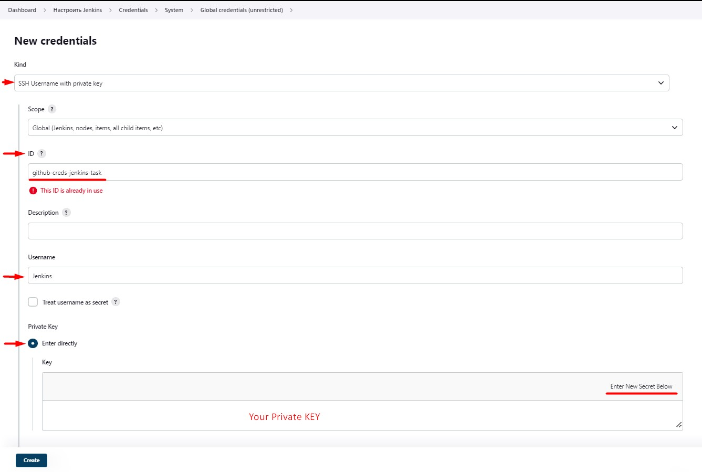

# Jenkins - Setup and Configure

### _TASK: write pipeline_
1. Create image (create script for run lambdas simple)
2. Requirement: add versioning for images
3. Push to ecr
4. Notifications
5. Addition:
   - Trigger another job in pipeline
   - Transfer some parameters to another Job in pipeline
   - Deploy lambda (create CloudFormation Stack  with parameters and use template file)
   - Invoke Lambda and check responce!
   - Set description for Job

#### _Prerequisites:_
1. [Installed and Configured Jenkins Server + Worker Node in AWS]() 

### _Connect Git to Jenkins Server_
1. [Generate your ssh-key](https://phoenixnap.com/kb/generate-ssh-key-windows-10)
2. Go to the your **GitHub** - **Settings** - **Deploy Keys** - **Add deploy key** - and put your **public** key! 
3. Open your dashboard - **Manage Jenkins** - **Credentials** - **add credentials** 
4. 
   - **Kind:** SSH Username with private key**
   - **ID:** GitHub
   - **Username:**  Jenkins (or anything else that your entered in the **title** fiel of GitHub, when adding the Deploy key)
   - **Private Key:** your ssh private key. 
   

### _Create Job: cdp-build-lambda_

### _Stage: "Checkout"_
The [following GIT plugin](https://plugins.jenkins.io/git/#plugin-content-checkout-extensions) provides functionality available through Pipeline-compatible steps.

Checkout extensions modify the git operations that place files in the workspace from the git repository on the agent. The extensions can adjust the maximum duration of the checkout operation, the use and behavior of git submodules, the location of the workspace on the disc, and more.

