# GitLab - Build Deploy Python Application

## _TASK:_
Create full GitLab CICD Pipeline with this [simple Python Flask web application](https://github.com/benc-uk/python-demoapp). The app provides system information and a realtime monitoring screen with dials showing CPU, memory, IO and process information.


### Pre-reqs

- GitLab Account
- [DockerHub Accout](https://hub.docker.com/_/python) - for running in GitLab build job, linting, running tests etc
- [Docker](https://docs.docker.com/get-docker/) - for running as a container, or image build and push

Clone the project to any directory where you do development work

```
git clone https://github.com/benc-uk/python-demoapp.git
```
## _Run Tests:_
### Create .gitlab-ci.yml
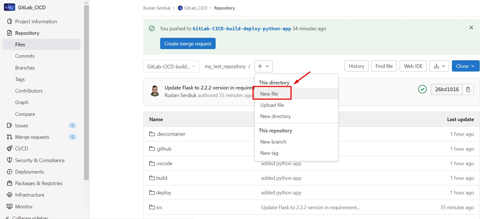
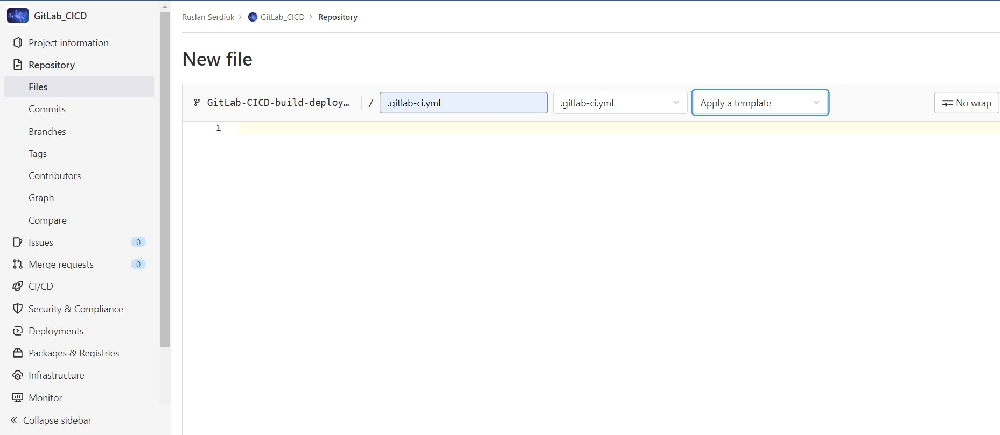

```
run_tests:
  image: python:3.9-slim-buster
  before_script:
    - apt-get update && apt-get install make
  script:
    - make test
```

#### Where:
- **image:** image where will be running python tests.
- **before_cript:** commands that are executed before the main script (for preinstall necessary tools).
- **script:** run main tests.

#### Now just commit your changes and Pipeline will start automatically:
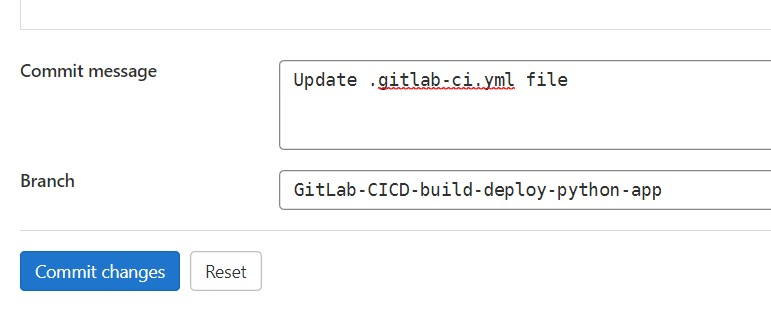

### Check pipeline
Go to **CI/CD** - **Pipeline**:
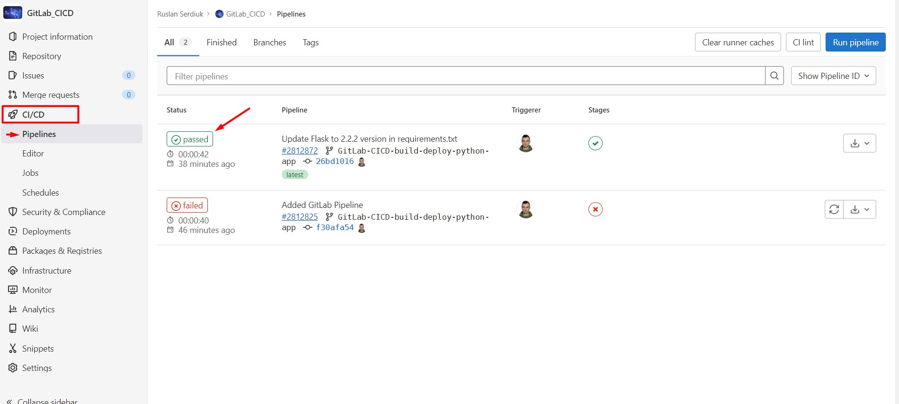

### Check job
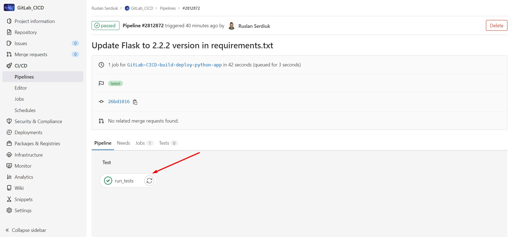

Select the **run_tests** job and check logs:


## _Build Image:_
Go to **Editor** and edit pipeline (create build stage):
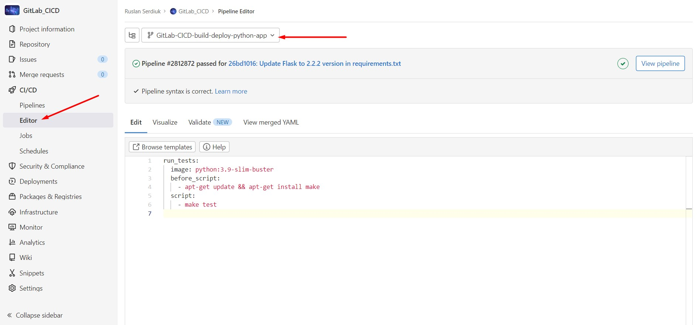

#### BUT! :red_circle:
> Firstly you need create Environment Variables for DockerHub Credentials!

Go to the **Settings** - **CI/CD**:
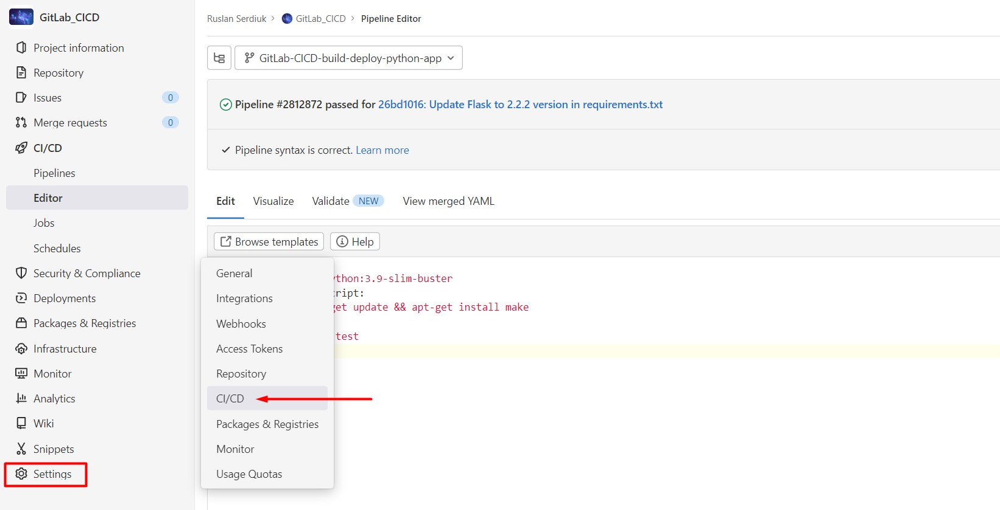
Chose **Variables** - **Expand**:
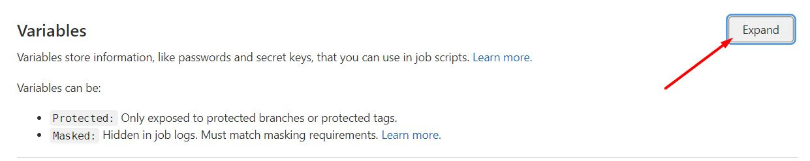
Next click **Add Variable** and fill **Key** and **Value**:
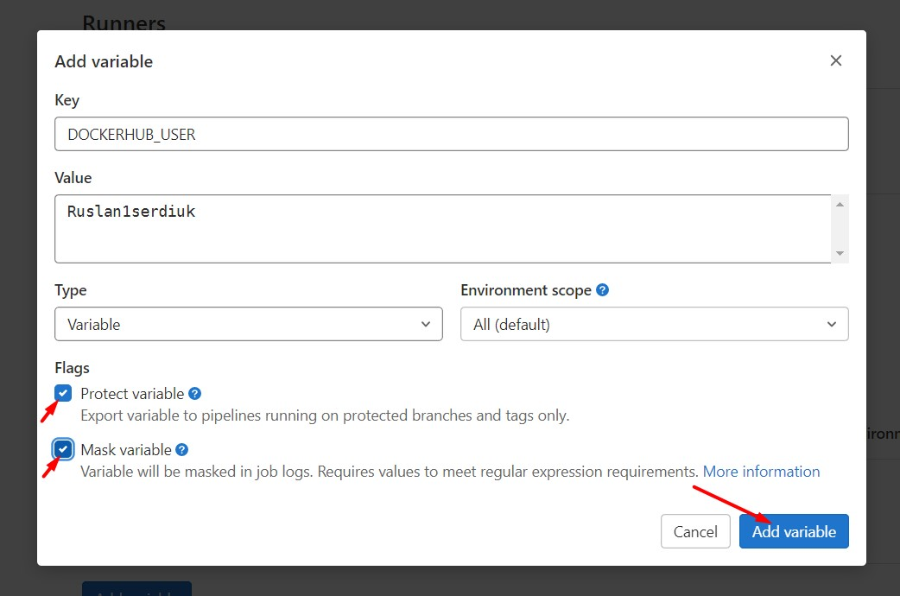
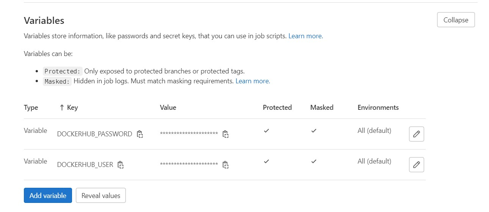


### Now - edit Pipeline and add build stage! :green_circle:
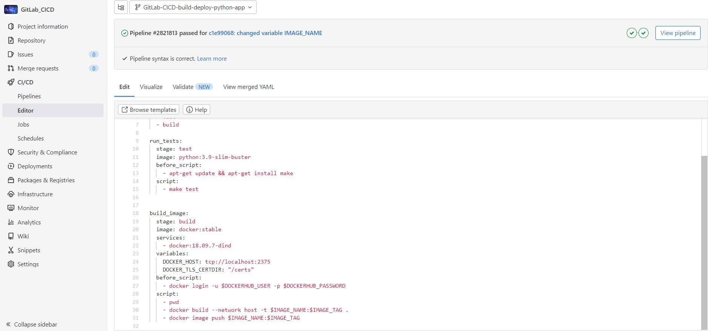

```
variables:
  IMAGE_NAME: ruslan1serdiuk/gitlab-ci
  IMAGE_TAG: python-app-1.0

stages:
  - test
  - build

run_tests:
  stage: test
  image: python:3.9-slim-buster
  before_script:
    - apt-get update && apt-get install make
  script:
    - make test


build_image:
  stage: build
  image: docker:stable
  services:
    - docker:18.09.7-dind
  variables:
    DOCKER_HOST: tcp://localhost:2375
    DOCKER_TLS_CERTDIR: "/certs"
  before_script:
    - docker login -u $DOCKERHUB_USER -p $DOCKERHUB_PASSWORD
  script:
    - pwd
    - docker build --network host -t $IMAGE_NAME:$IMAGE_TAG .
    - docker image push $IMAGE_NAME:$IMAGE_TAG
```

Next **commit** and **Check**:
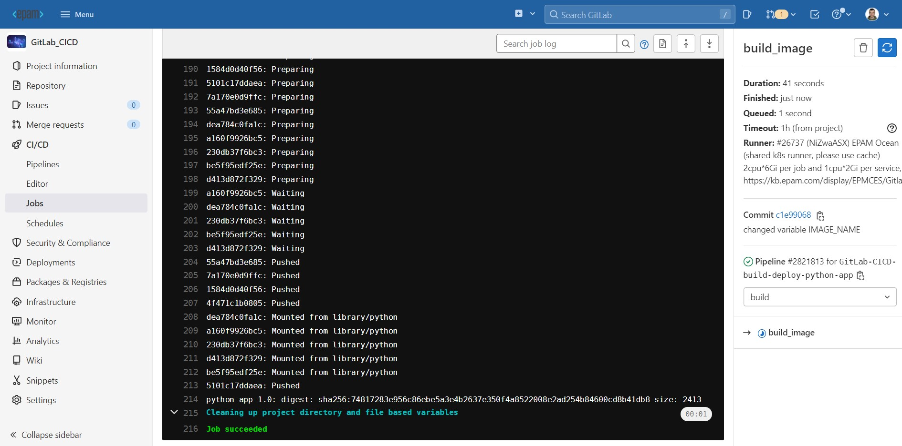
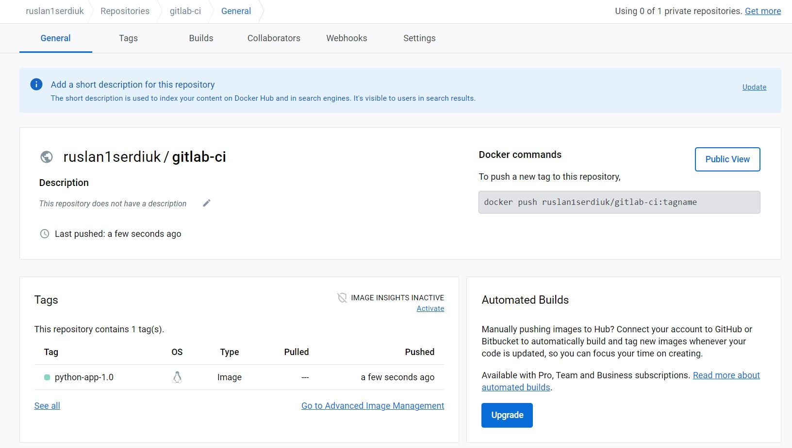

To build an image in Docker the command below is used:
`docker build -t username/repository_name .` :heavy_check_mark:

#### IMPORTANT INFORMATION :warning: :warning: :warning:
1. First case: **Error: Cannot perform an interactive login from a non TTY device** :exclamation:
    > For all of you fighting with error "Error: Cannot perform an interactive login from a non TTY device", if your branch is NOT protected, then your variable in GitLab should also be NOT protected. Otherwise (protected variable on non-protected branch) it will not work and you'll get docker login fail on abovementioned error message.

    So, go to the **Settings** -> **Repository** -> and just select necessary branch and set Protected branches option **enable**


2. Second case: **Cannot connect to the Docker daemon at unix:///var/run/docker.sock. Is the docker daemon running?** :bangbang:
    > you need to add the **DOCKER_HOST** setting to your gitlab-ci.yml so that your docker connects to the dind service!

    ```
    variables:
      DOCKER_HOST: tcp://docker:2375
    ```

    > But sometimes **tcp://docker:2375** didn't work, but meybe it will be work with **tcp://localhost:2375** (probably because Kubernetes pods all share one network namespace)! Awesome! 
    > 
    > This link helped me: https://gitlab.com/gitlab-org/charts/gitlab/-/issues/478

    #### In my case this works so: :mending_heart:
    ```
    build_image:
      stage: build
      image: docker:stable
      services:
        - docker:18.09.7-dind
      variables:
        DOCKER_HOST: tcp://localhost:2375
        DOCKER_TLS_CERTDIR: "/certs"
    ```

3. Third case: **Docker in Docker without internet connection**. :grey_exclamation: :exclamation:
    >  Build your image appending the flag **--networks host**
    ```
      script:
        - docker build --network host -t $IMAGE_NAME:$IMAGE_TAG .
    ```


## _Deploy Docker image to an Ubuntu server and run there Docker App_

> For that we first need a Deployment Server!

So, I'll just launch an Ubuntu instance on **AWS** and install Docker there with **user data**:
```
#!/bin/bash

sudo su
apt update
apt install docker.io
```

#### So, how is Gitlab deploying our app to the remote server? 
Also with ssh connect!
1. Gitlab runner will start a container for deploy job
2. And inside the container executing ssh command for connect to remote server!

Which means, we need to make this **ssh private key** also **available to GitLab**! 

Go to the CI/CD Variable again and create variable for the SSH Private Key!
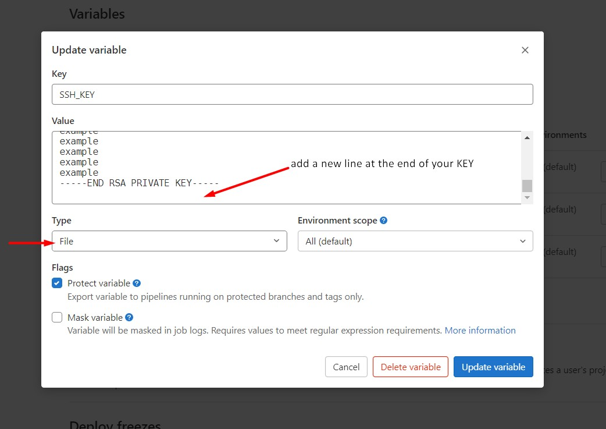

Deploy code:
```
variables:
  IMAGE_NAME: ruslan1serdiuk/gitlab-ci
  IMAGE_TAG: python-app-1.0
  GITLAB_RUNNER_IP: "3.144.244.142"

stages:
  - test
  - build
  - deploy

run_tests:
  stage: test
  image: python:3.9-slim-buster
  before_script:
    - apt-get update && apt-get install make
  script:
    - make test


build_image:
  stage: build
  image: docker:stable
  services:
    - docker:18.09.7-dind
  variables:
    DOCKER_HOST: tcp://localhost:2375
    DOCKER_TLS_CERTDIR: "/certs"
  before_script:
    - docker login -u $DOCKERHUB_USER -p $DOCKERHUB_PASSWORD
  script:
    - pwd
    - docker build --network host -t $IMAGE_NAME:$IMAGE_TAG .
    - docker image push $IMAGE_NAME:$IMAGE_TAG

deploy:
  stage: deploy
  image: docker:stable
  services:
    - docker:18.09.7-dind
  variables:
    DOCKER_HOST: tcp://localhost:2375
    DOCKER_TLS_CERTDIR: "/certs"
  before_script:
    - docker login -u $DOCKERHUB_USER -p $DOCKERHUB_PASSWORD
    - apt install wget
  script:
    - docker run -d -p 5000:5000 $IMAGE_NAME:$IMAGE_TAG
    - wget -O- localhost:5000

deploy:
  stage: deploy
  before_script:
    - chmod 400 $SSH_KEY
    - apt update && apt install openssh-client -y
  script:
    - ssh -o StrictHostKeyChecking=no -i $SSH_KEY ubuntu@$GITLAB_RUNNER_IP "
        sudo su | docker login -u $DOCKERHUB_USER -p $DOCKERHUB_PASSWORD &&
        docker ps -aq | xargs docker stop | xargs docker rm &&
        docker run -d -p 5000:5000 $IMAGE_NAME:$IMAGE_TAG"
```

### NEED TO SOLVE PROBLEM WITH IP!
> We don't know the Gitlab IP address where our application is running!


# Containers

Public container image is [available on GitHub Container Registry](https://github.com/users/benc-uk/packages/container/package/python-demoapp)

Run in a container with:

```bash
docker run --rm -it -p 5000:5000 ghcr.io/benc-uk/python-demoapp:latest
```

## _LINKS:_
+ _https://kb.epam.com/display/EPMCES/GitlabCI?focusedCommentId=1922466768&preview=/885111995/911210123/Gitlab%20CI.pptx#comment-1922466768_
+ _https://docs.gitlab.com/ee/ci/yaml/_
+ _https://docs.gitlab.com/runner/register/_
+ _https://docs.gitlab.com/runner/executors/_