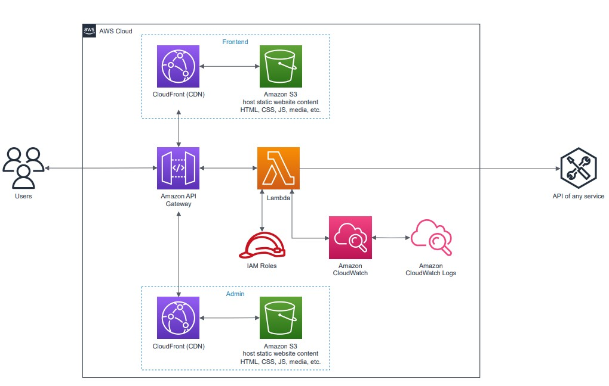
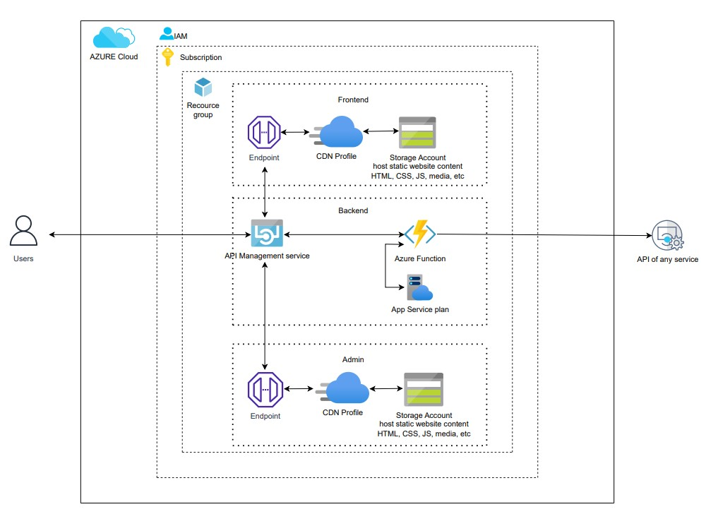

# Serverless Lambda + Static CDN :link:

### Pipelines deploy code on the following architecture:

#### _AWS Architecture_

#### _AZURE Architecture_

+ [backend](https://github.com/RuslanSerdiuk/DevOps_Tasks_and_solutions/tree/main/CICD/Gitlab-CI/Serverless%20Lambda%20%2B%20Static%20CDN/backend) :white_medium_small_square:
+ [frontend](https://github.com/RuslanSerdiuk/DevOps_Tasks_and_solutions/tree/main/CICD/Gitlab-CI/Serverless%20Lambda%20%2B%20Static%20CDN/frontend) :white_medium_small_square: