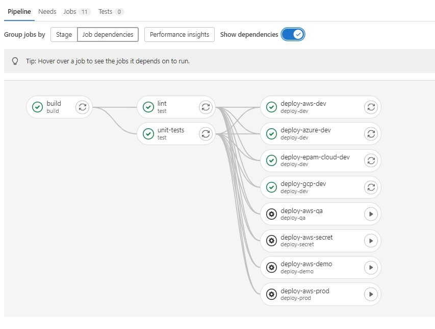

# Backend Pipelines :wrench:

### _master_gitlab-ci:_
#### Rules:
1. The master pipeline automatically deploys the code to the **dev** environment when you commit to the master branch.
2. To deploy to **any other** environments, confirmation is required. 
3. If the branch is **NOT** a master, only the build is executed, and **confirmation is required** to deploy even to the dev environment! 

    
    

### _prod_gitlab-ci:_
1. This pipeline is created separately only for the prod environment, for the release of application versions :repeat:
2. This pipeline can be used in a similar way for any other environment. Examples are given: **qa_gitlab-ci**, **demo_gitlab-ci** and etc.

#### Don't forget to add environment variables for the pipeline in advance: **Settings** > **CI/CD** > **Variables** :exclamation:

