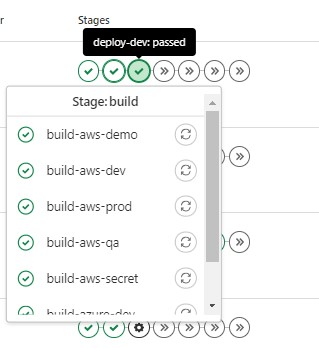
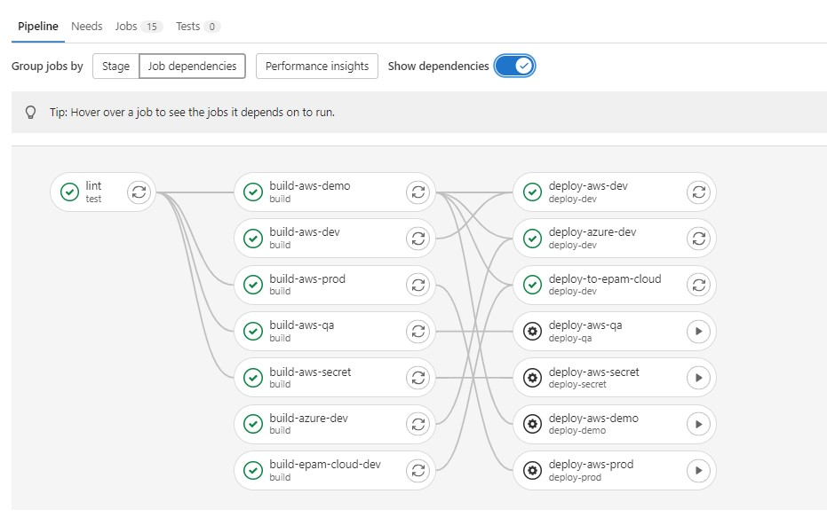

# Frontend Pipelines :infinity:

### _front_master_gitlab-ci:_
#### Rules:
1. The master pipeline automatically **build code for all envs** and deploy code to the **dev** environment when you commit to the master branch :heavy_check_mark:
2. To deploy to **any other** environments, confirmation is required :green_circle:
3. If the branch is **NOT** a master, only the build is executed, and **confirmation is required** to deploy even to the dev environment :exclamation:

    
    

### _front_prod_gitlab-ci:_
1. This pipeline is created separately only for the **prod** environment, for the release of application versions :repeat:
2. This pipeline can be used in a similar way for any other environment.

#### Don't forget to add environment variables for the pipeline in advance: **Settings** > **CI/CD** > **Variables** :bangbang:

