# Jenkins - Build and Deploy Lambda

### _TASK: write pipeline_
1. Create image (create script for run lambdas simple)
2. Requirement: add versioning for images
3. Push to ecr
4. Notifications
5. Addition:
   - Trigger another job in pipeline
   - Transfer some parameters to another Job in pipeline
   - Deploy lambda (create CloudFormation Stack  with parameters and use template file)
   - Invoke Lambda and check responce!
   - Set description for Job

#### _Prerequisites:_
1. [Installed and Configured Jenkins Server + Worker Node in AWS]() 


### _Connect Git to Jenkins Server_
1. [Generate your ssh-key](https://phoenixnap.com/kb/generate-ssh-key-windows-10)
2. Go to the your **GitHub** - **Settings** - **Deploy Keys** - **Add deploy key** - and put your **public** key! 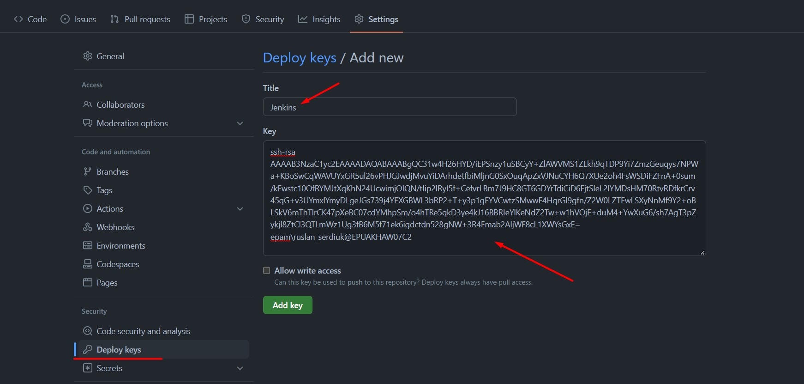
3. Open your dashboard - **Manage Jenkins** - **Credentials** - **add credentials** 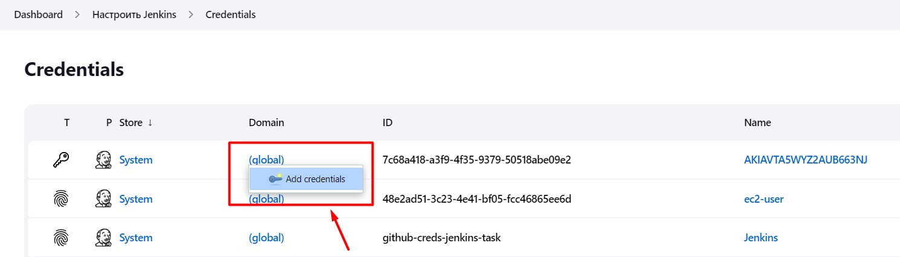
4. 
   - **Kind:** SSH Username with private key**
   - **ID:** github-creds-jenkins-task
   - **Username:**  Jenkins (or anything else that your entered in the **title** fiel of GitHub, when adding the Deploy key)
   - **Private Key:** your ssh private key. 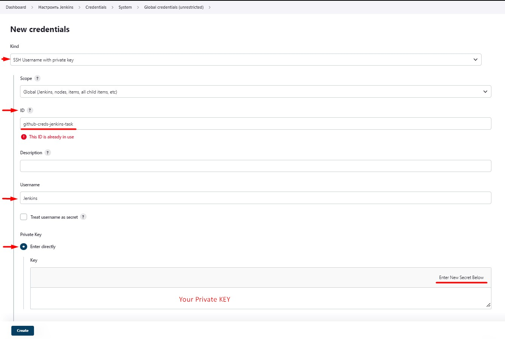
   


### _Create Job: cdp-lambda-build_
Go to the **Dashboard** - **Create Item** - select **pipeline** - give name "cdp-lambda-build" and **Create**
1. Add this url: 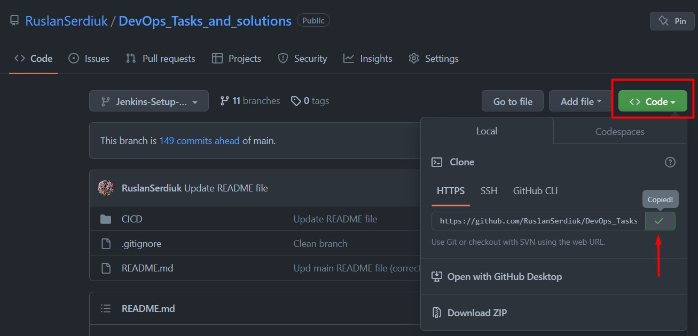 to the **GitHub Project**: 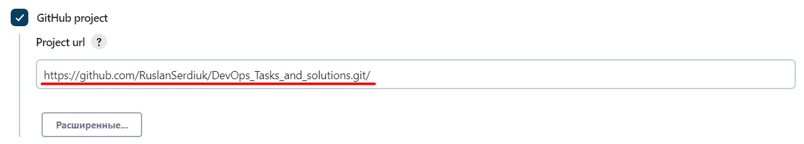
2. Next - **Delete outdated builds** and set at least 5.
3. Select **Build Triggers** - **GitHub hook trigger for GITScm polling**: 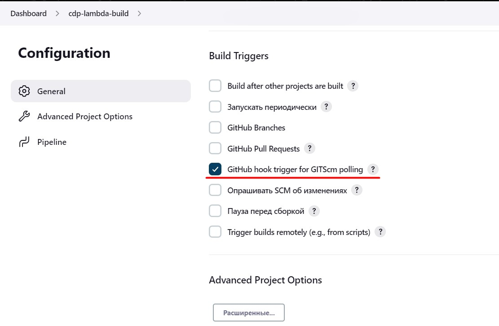
4. Go to the **GitHub** - **Webhooks** - **add webhook**:
   - **Payload URL:** <your_jenkins_master_public_dns>**:8080//github-webhook/**
   - **Content type:** application/json
   - **Secret:** empty field
   - **Which events would you like to trigger this webhook?** - Just the push event. 
   - Create! 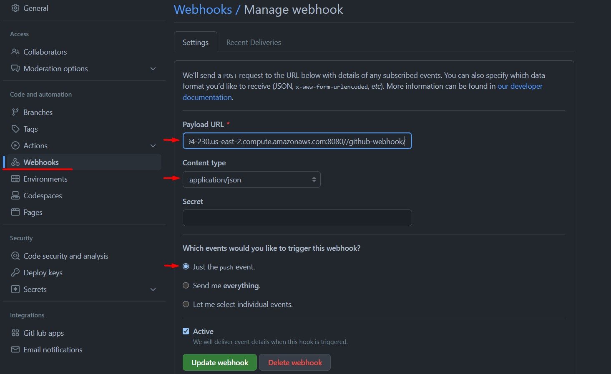
5. After that, click **Recent Deliveries** - three dots - and click **Redeliver!** Must be green: 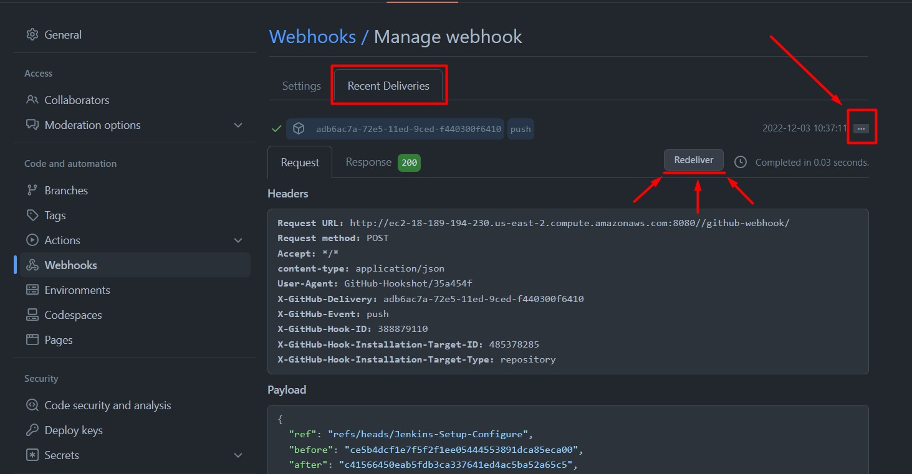
6. Back to the settings. Now **Pipeline**:
   - **Definition:** Pipeline script from the SCM.
   - **SCM:** Git
   - **Repository URL:** Add this url: 
   - **Credentials:** seclect "Jenkins" (we created it earlier in the credentials) 
   - **Branches to build:** fill in the name of the branch where your pipeline will be located. */Jenkins-Setup-Configure
   - **Script Path:** fill in the path, where your pipeline will be located. 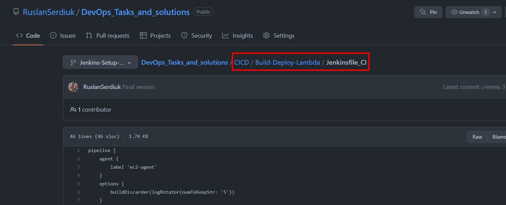 CICD/Build-Deploy-Lambda/Jenkinsfile_CI
   - **Save!**


### _Create Piupeline:_
> Jenkinsfile is a text file that contains the definition of a Jenkins Pipeline and is checked into source control. 

1. Go to our Repo "CICD/Lambda-Build-Deploy" and create pipeline **Jenkinsfile_CI**:
   ```
   pipeline {
       agent {
           label 'ec2-agent'
       }
       options {
           buildDiscarder(logRotator(numToKeepStr: '5'))
       }
       stages {
           stage('Checkout') {
               steps{
                   git branch: "Jenkins-Setup-Configure", credentialsId: 'github-creds-jenkins-task', url: 'https://github.com/RuslanSerdiuk/DevOps_Tasks_and_solutions.git'
                   }
           }
       }
   }
   ```

2. Check the work: commit + push to Repo! Go to **Dashboard** - select job **cdp-lambda-build**: 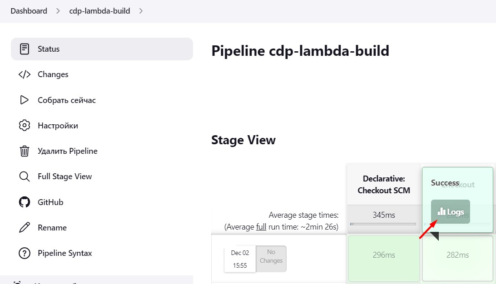 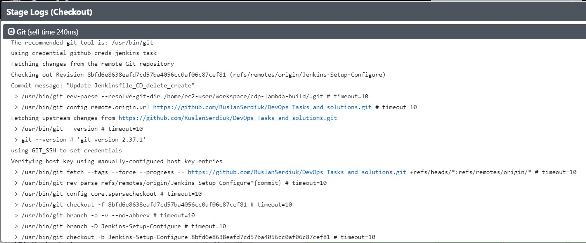
   - As we can see, our trigger works and Jenkinsfile_CI too! :ok_hand:


### _Stage: "Checkout"_
The [following GIT plugin](https://plugins.jenkins.io/git/#plugin-content-checkout-extensions) provides functionality available through Pipeline-compatible steps.

Checkout extensions modify the git operations that place files in the workspace from the git repository on the agent. The extensions can adjust the maximum duration of the checkout operation, the use and behavior of git submodules, the location of the workspace on the disc, and more.
```
        stage('Checkout') {
            steps{
                git branch: "Jenkins-Setup-Configure", credentialsId: 'github-creds-jenkins-task', url: 'https://github.com/RuslanSerdiuk/DevOps_Tasks_and_solutions.git'
                }
        }
```
- **brach:** fill in name your branch in the Repo.
- **credentialsId:** paste ID of your Jenkins Creds
- **url:** Add this url: 


### _Build + Tag + Push:_
```
        stage('Build') {
            steps {
                sh 'sudo docker build -f ./CICD/Build-Deploy-Lambda/Dockerfile -t ruslan.serdiuk/lambda:latest ./CICD/Build-Deploy-Lambda/'
            }
        }
        stage('Login + Tag') {
            steps {
                sh 'aws ecr get-login-password --region us-east-2 | docker login --username AWS --password-stdin 384461882996.dkr.ecr.us-east-2.amazonaws.com'
                sh 'docker tag ruslan.serdiuk/lambda  384461882996.dkr.ecr.us-east-2.amazonaws.com/ruslan.serdiuk:version-$BUILD_NUMBER-latest'
            }
        }
        stage('Push') {
            steps {
                sh 'docker push 384461882996.dkr.ecr.us-east-2.amazonaws.com/ruslan.serdiuk:version-$BUILD_NUMBER-latest'
            }
        }
```
:warning: It is very important to give context to the docker: **./CICD/Build-Deploy-Lambda/**


### _Sending email_
Using **[Email Extension Plugin](https://plugins.jenkins.io/email-ext/)** – This plugin lets you configure every aspect of email notifications. You can customize things such as when to send the email, who receives it, and what the email says.
1. Setup Plugin!
2. Configure System:
   - Now go to **Manage Jenkins** -> **Configure System**. 
   - Here scroll down to the email notification section. If you are using Gmail then type smtp.gmail.com for the SMTP server. Click on Advanced and select Use SMTP authentication. 
   - Enter your Gmail username and password. 
   - Select the **Use SSL** option and enter the port number as **465**. 
   - Click on **Apply** and then **Save**. 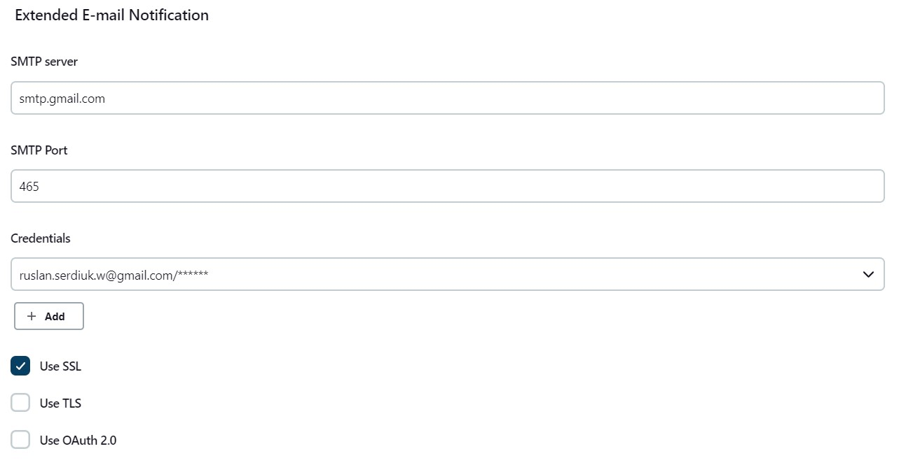
3. After that, select it to the Jenkinsfile_CI:
   ```
       post {
           always {
           emailext body: 'Test Message',
               subject: 'Test Subject',
               to: 'ruslan.serdiuk.w@gmail.com'
           }
       }
   ```


### _Create Job: cdp-lambda-deploy_
Go to the **Dashboard** - **Create Item** - select **pipeline** - give name "cdp-lambda-deploy" and **Create**
1. Add this url:  to the **GitHub Project**: 
2. Next - **Delete outdated builds** and set at least 5. 
3. Now **Pipeline settings**:
   - **Definition:** Pipeline script from the SCM.
   - **SCM:** Git
   - **Repository URL:** Add this url: 
   - **Credentials:** seclect "Jenkins" (we created it earlier in the credentials) 
   - **Branches to build:** fill in the name of the branch where your pipeline will be located. */Jenkins-Setup-Configure
   - **Script Path:** fill in the path, where your pipeline will be located. 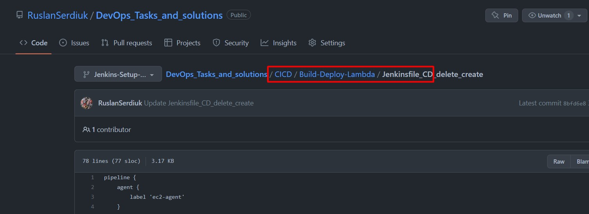 CICD/Build-Deploy-Lambda/Jenkinsfile_CD
   - **Save!**


### _Create trigger (+ transfer perameter) to another job in pipeline_
You can trigger another job if the first one is successful and pass some important information from the first job to the second one using parameters!

In my case, I pass the TAG of the last successful container build that was sent to ECR. And in the second job I use this tag to deploy the lambda with this container from a template using CloudFormation:
- ```
   aws cloudformation create-stack --stack-name jenkins-lambda --template-body file://CICD/Build-Deploy-Lambda/lambda-template.yaml --parameters ParameterKey=ImageId,ParameterValue=384461882996.dkr.ecr.us-east-2.amazonaws.com/ruslan.serdiuk:version-${ImageTag}-latest
   ```

- ClodFormation template:
   ```
   AWSTemplateFormatVersion: 2010-09-09
   Parameters:
     ImageId:
       Type: String
       Description: Enter image's ID + tag
   
   Resources:
     JenkinsTask:
       Type: "AWS::Lambda::Function"
       Properties:
         FunctionName: "JenkinsTask"
         Role: "arn:aws:iam::384461882996:role/JenkinsTask"
         PackageType: "Image"
         Code: 
           ImageUri: !Ref ImageId
         Timeout: 300
   ```

1. ON THE FIRST JOB:
   ```
   pipeline {
       agent {
           label 'ec2-agent'
       }
       options {
           buildDiscarder(logRotator(numToKeepStr: '5'))
       }
       post {
           always {
           build job: 'cdp-lambda-deploy', parameters: [
                                               [$class: 'StringParameterValue', name: 'ImageTag', value: "384461882996.dkr.ecr.us-east-2.amazonaws.com/ruslan.serdiuk:version-$BUILD_NUMBER-latest"]
                                           ]
           }
       }
   }
   ```
2. ON THE SECOND JOB:
   ```
   pipeline {
       agent {
           label 'ec2-agent'
       }
       options {
           buildDiscarder(logRotator(numToKeepStr: '5'))
       }
       parameters {
           string(defaultValue: "", description: 'K', name: 'ImageTag')
       }
       stages {
           stage('PrintParameter'){
               steps{
                   echo "Value of the ImageTag: ${ImageTag}"
               }
           }
           stage('Deploy Lambda') {
               steps {
                   sh 'aws cloudformation create-stack --stack-name jenkins-lambda --template-body file://CICD/Build-Deploy-Lambda/lambda-template.yaml --parameters ParameterKey=ImageId,ParameterValue=384461882996.dkr.ecr.us-east-2.amazonaws.com/ruslan.serdiuk:version-${ImageTag}-latest'
                   sleep time: 90, unit: 'SECONDS'
               }
           }
       }
   }
   ```


### _Deleting workspace_
When you want to clean the workspace after the build, you can add this step under a suitable condition in the post section of your Pipeline job. If you want to clean the workspace before the build starts, you need to add some extra configuration to be able to clean before the sources are checked out from SCM. See the examples below for details.

For example:
```
        stage('Delete workspace before build starts') {
            steps {
                echo 'Deleting workspace'
                deleteDir()
            }
        }
```


### _Invoke Lambda_
Now we need to invoke our lambda and see if it works or not!

1. To do this, I will send her a prepared json file:
   ```
   {
       "first_name": "Ruslan",
       "last_name": "Serdiuk"
   }
   ```

2. Or I can dicrectly set these values in the cli:
   ```
   aws lambda invoke --invocation-type Event --function-name JenkinsTask --payload $(echo '{"first_name": "Ruslan", "last_name": "Serdiuk"}' | base64) out | awk '{print $2}'
   ```
   #### BUT, we need to save the result of executing this command to a variable!

3. We will use the following script:
   ```
   RESPONCE = sh (
           script: 'aws lambda invoke --invocation-type Event --function-name JenkinsTask --payload $(echo \'{"first_name": "Ruslan", "last_name": "Serdiuk"}\' | base64) out | awk \'{print $2}\'',
           returnStdout: true
       ).trim()
   ```
   The **.trim()** method helps to remove spaces in our output

4. So, we have following stage:
   ```
         stage('Invoke Lambda - Type:Event') {
             steps {
                 script {
                     RESPONCE = sh (
                             script: 'aws lambda invoke --invocation-type Event --function-name JenkinsTask --payload $(echo \'{"first_name": "Ruslan", "last_name": "Serdiuk"}\' | base64) out | awk \'{print $2}\'',
                             returnStdout: true
                         ).trim()
                         echo "Lambda responce code: ${RESPONCE}"
                     }
                 sh 'aws lambda invoke --invocation-type Event --function-name JenkinsTask --cli-binary-format raw-in-base64-out --payload file://CICD/Build-Deploy-Lambda/payloadfile.json response.json | awk \'{print $2}\''
             }
         }
   ```

5. Check work! 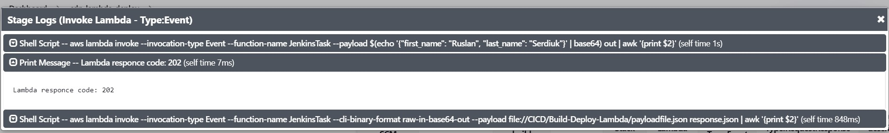


### _Set description_
This way sets the display name of a build to something other than #1, #2, #3, ... 
so that you can use an identifier that makes more sense in your context. 

Your job configuration page gets additional setting that lets you specify a build name for each new build. 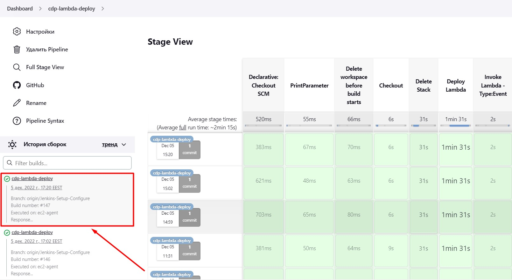 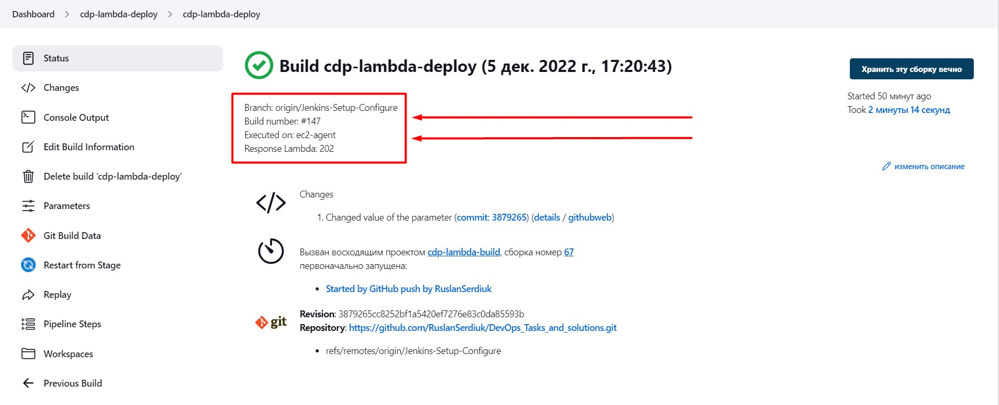

This is how the plugin can be used via pipeline approach. Name and the description can be changed like any other steps. Mind that there are a few conventions which can be used to modify name or description:
```
        stage("Set description") {
            steps {
                script {
                    currentBuild.displayName = "${JOB_NAME}"
                    currentBuild.description = "Branch: $env.GIT_BRANCH \n" +
                                               "Build number: #${BUILD_NUMBER} \n" +
                                               "Executed on: ${NODE_NAME}\n" +
                                               "Response Lambda: ${RESPONCE} \n"
                }
            }
        }
```


## _Jenkinsfile_CI:_
```
pipeline {
    agent {
        label 'ec2-agent'
    }
    options {
        buildDiscarder(logRotator(numToKeepStr: '5'))
    }
    environment {
        DOCKERHUB_CREDENTIALS = credentials('DockerHub')
        ECR_CREDENTIALS = credentials('ecr-creds')
    }
    stages {
        stage('Checkout') {
            steps{
                git branch: "Jenkins-Setup-Configure", credentialsId: 'github-creds-jenkins-task', url: 'https://github.com/RuslanSerdiuk/DevOps_Tasks_and_solutions.git'
                }
        }
        stage('Build') {
            steps {
                sh 'sudo docker build -f ./CICD/Build-Deploy-Lambda/Dockerfile -t ruslan.serdiuk/lambda:latest ./CICD/Build-Deploy-Lambda/'
            }
        }
        stage('Login + Tag') {
            steps {
                sh 'aws ecr get-login-password --region us-east-2 | docker login --username AWS --password-stdin 384461882996.dkr.ecr.us-east-2.amazonaws.com'
                sh 'docker tag ruslan.serdiuk/lambda  384461882996.dkr.ecr.us-east-2.amazonaws.com/ruslan.serdiuk:version-$BUILD_NUMBER-latest'
            }
        }
        stage('Push') {
            steps {
                sh 'docker push 384461882996.dkr.ecr.us-east-2.amazonaws.com/ruslan.serdiuk:version-$BUILD_NUMBER-latest'
            }
        }
    }
    post {
        always {
        sh 'docker logout'
        emailext body: 'Test Message',
            subject: 'Test Subject',
            to: 'ruslan.serdiuk.w@gmail.com'
        build job: 'cdp-lambda-deploy', parameters: [
                                            [$class: 'StringParameterValue', name: 'ImageTag', value: "384461882996.dkr.ecr.us-east-2.amazonaws.com/ruslan.serdiuk:version-$BUILD_NUMBER-latest"]
                                        ]
        }
    }
}

```


## _Jenkinsfile_CD:_
```
pipeline {
    agent {
        label 'ec2-agent'
    }
    options {
        buildDiscarder(logRotator(numToKeepStr: '5'))
    }
    parameters {
        string(defaultValue: "", description: 'K', name: 'ImageTag')
    }
    stages {
        stage('PrintParameter'){
            steps{
                echo "Value of the ImageTag: ${ImageTag}"
            }
        }
        stage('Delete workspace before build starts') {
            steps {
                echo 'Deleting workspace'
                deleteDir()
            }
        }
        stage('Checkout') {
            steps{
                git branch: "Jenkins-Setup-Configure", credentialsId: 'github-creds-jenkins-task', url: 'https://github.com/RuslanSerdiuk/DevOps_Tasks_and_solutions.git'
                }
        }
        stage('Delete Stack') {
            steps {
                script {
                    sh 'aws cloudformation delete-stack --stack-name jenkins-lambda'
                    sleep time: 30, unit: 'SECONDS'
                }   
            }
        }
        stage('Deploy Lambda') {
            steps {
                sh 'aws cloudformation create-stack --stack-name jenkins-lambda --template-body file://CICD/Build-Deploy-Lambda/lambda-template.yaml --parameters ParameterKey=ImageId,ParameterValue=${ImageTag}'
                sleep time: 90, unit: 'SECONDS'
            }
        }
        stage('Invoke Lambda - Type:Event') {
            steps {
                script {
                    RESPONCE = sh (
                            script: 'aws lambda invoke --invocation-type Event --function-name JenkinsTask --payload $(echo \'{"first_name": "Ruslan", "last_name": "Serdiuk"}\' | base64) out | awk \'{print $2}\'',
                            returnStdout: true
                        ).trim()
                        echo "Lambda responce code: ${RESPONCE}"
                    }
                sh 'aws lambda invoke --invocation-type Event --function-name JenkinsTask --cli-binary-format raw-in-base64-out --payload file://CICD/Build-Deploy-Lambda/payloadfile.json response.json | awk \'{print $2}\''
            }
        }
        stage('Invoke Lambda - Type:RequestResponse') {
            steps {
                sh 'aws lambda invoke --invocation-type RequestResponse --function-name JenkinsTask --payload $(echo \'{"first_name": "Ruslan", "last_name": "Serdiuk"}\' | base64) out'
                sh 'aws lambda invoke --invocation-type RequestResponse --function-name JenkinsTask --cli-binary-format raw-in-base64-out --payload file://CICD/Build-Deploy-Lambda/payloadfile.json response.json'
            }
        }
        stage("Set description") {
            steps {
                script {
                    currentBuild.displayName = "${JOB_NAME}"
                    currentBuild.description = "Branch: $env.GIT_BRANCH \n" +
                                               "Build number: #${BUILD_NUMBER} \n" +
                                               "Executed on: ${NODE_NAME}\n" +
                                               "Response Lambda: ${RESPONCE} \n"
                }
            }
        }
        stage('Ls work dir') {
            steps {
                sh "ls -la"
            }
        }

    }
}
```


## _LINKS:_
+ _https://www.jenkins.io/doc/_
+ _https://plugins.jenkins.io/email-ext/#plugin-content-pipeline-step_
+ _https://www.jenkins.io/doc/book/pipeline/_
+ _https://stackoverflow.com/questions/37025175/how-to-pass-boolean-parameter-value-in-pipeline-to-downstream-jobs_
+ _https://serverfault.com/questions/910356/in-jenkins-how-to-pass-a-parameter-from-pipeline-job-to-a-freestyle-job_
+ _https://docs.aws.amazon.com/AWSCloudFormation/latest/UserGuide/parameters-section-structure.html_
+ _https://docs.aws.amazon.com/AWSCloudFormation/latest/UserGuide/using-cfn-cli-creating-stack.html_
