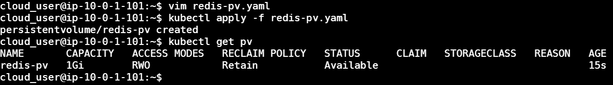
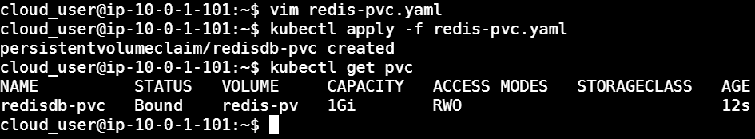
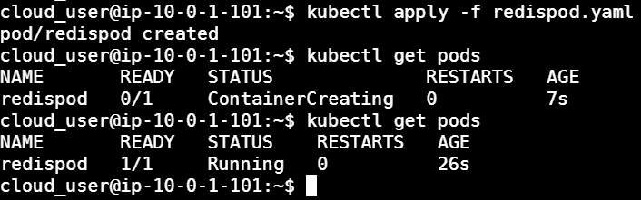
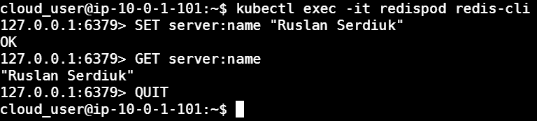
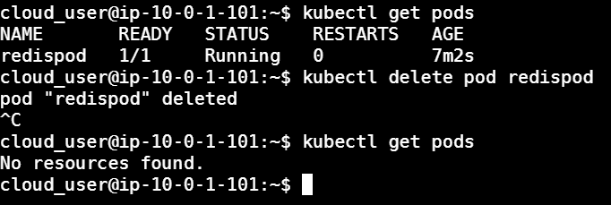
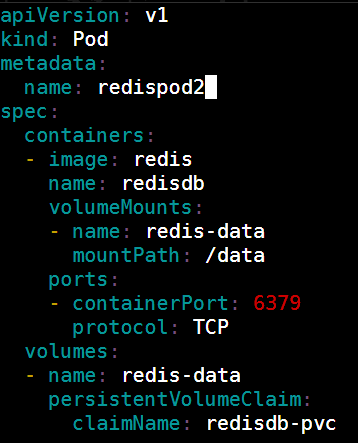
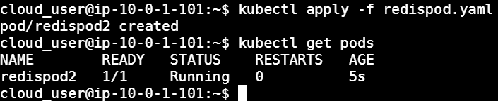
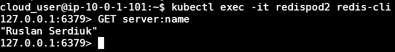

# Creating Persistent Storage for Pods in Kubernetes

## Task:
Decouple our storage from our pods & create a persistent volume to mount for use by our pods:
1. Deploy a any image. 
2. Create the persistent volume, then create the pod YAML for deploying the pod to mount the volume. 
3. Then delete the pod and create a new pod, which will access that same volume.


### _Create a PersistentVolume_
1. Create the file, named `redis-pv.yaml`(you can choose any other image):
    ```
    apiVersion: v1
    kind: PersistentVolume
    metadata:
      name: redis-pv
    spec:
      storageClassName: ""
      capacity:
    storage: 1Gi
    accessModes:
       - ReadWriteOnce
     hostPath:
       path: "/mnt/data"
   ```


3. Then, create the PersistentVolume:


### _Create a PersistentVolumeClaim_
1. Create the file, named `redis-pvc.yaml`:
   ```
    apiVersion: v1
    kind: PersistentVolumeClaim
    metadata:
      name: redisdb-pvc
    spec:
      storageClassName: ""
      accessModes:
        - ReadWriteOnce
    resources:
      requests:
        storage: 1Gi
   ```


2. Then, create the PersistentVolumeClaim:

    
    
    
### _Create a pod from the redispod image, with a mounted volume to mount path `/data`_
1. Create the file, named `redispod.yaml`:
    ```
    apiVersion: v1
    kind: Pod
    metadata:
      name: redispod
    spec:
      containers:
      - image: redis
        name: redisdb
        volumeMounts:
        - name: redis-data
          mountPath: /data
        ports:
        - containerPort: 6379
          protocol: TCP
      volumes:
      - name: redis-data
        persistentVolumeClaim:
          claimName: redisdb-pvc
    ```


2. Then, create the pod:



### _Connect to the container and write some data_
1. Connect to the container and run the `redis-cli`:
   ```
   kubectl exec -it redispod redis-cli
   ```
2. Set the key space `server:name` and any value and exit:



### _Delete `redispod` and create a new pod named `redispod2`_
1. Delete the existing `redispod`:


2. Open the file `redispod.yaml` and change name to `redispod2`:




### _Verify the volume has persistent data_
1. Connect to the container and run `redis-cli`:
   ```
   kubectl exec -it redispod redis-cli
   ```
2. Run the `GET` command to retrieve the data written previously:


   #### Congratulations!


### _LINKS:_
+ _https://kubernetes.io/docs/concepts/storage/persistent-volumes/_
+ _https://portworx.com/tutorial-kubernetes-persistent-volumes/_

