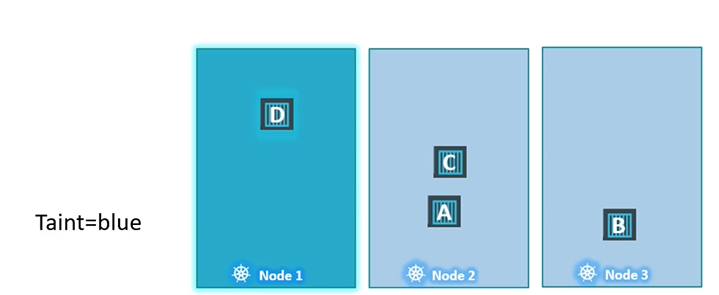
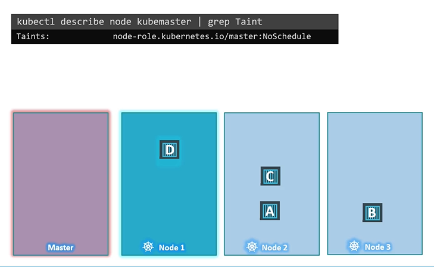
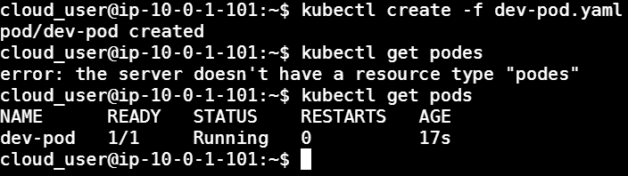

# Scheduling Pods with Taints and Tolerations

#### Taints and Tolerations are used to set restrictions on what pods can be scheduled on a node.
- Only pods which are tolerant to the particular taint on a node will get scheduled on that node.

  

## Taints
- Use **`kubectl taint nodes`** command to taint a node.

  Syntax
  ```
  $ kubectl taint nodes <node-name> key=value:taint-effect
  ```

  Example
  ```
  $ kubectl taint nodes node1 app=blue:NoSchedule
  ```

- The taint effect defines what would happen to the pods if they do not tolerate the taint.
- There are 3 taint effects
  - **`NoSchedule`**
  - **`PreferNoSchedule`**
  - **`NoExecute`**

  

## Tolerations
   - Tolerations are added to pods by adding a **`tolerations`** section in pod definition.
     ```
     apiVersion: v1
     kind: Pod
     metadata:
      name: myapp-pod
     spec:
      containers:
      - name: nginx-container
        image: nginx
      tolerations:
      - key: "app"
        operator: "Equal"
        value: "blue"
        effect: "NoSchedule"
     ```
   


#### Taints and Tolerations do not tell the pod to go to a particular node. Instead, they tell the node to only accept pods with certain tolerations.
- To see this taint, run the below command
  ```
  $ kubectl describe node kubemaster |grep Taint
  ```

     


## Task:
We have a three-node cluster. 

Within that cluster, we must to taint the production node in order to repel work. 
1. We need create the necessary taint to properly label one of the nodes “prod.” 
2. Then, we need deploy two pods — one to each environment. 
One pod spec will contain the toleration for the taint.

### _Taint one of the worker nodes to repel work._
1. List out the nodes:
   - `kubectl get nodes`
   

2. Taint the node:
   - `kubectl taint node ip-10-0-1-102  node-type=prod:NoSchedule`
   


### _Schedule a pod to the `dev` environment._
1. Create the `dev-pod.yaml` file:
   - ```
     apiVersion: v1
     kind: Pod
     metadata: 
       name: dev-pod 
       labels:
         app: busybox
     spec:
       containers:
       - name: dev
         image: busybox
         command: ['sh', '-c', 'echo Hello Kubernetes! && sleep 3600']
     ```

2. Create the pod:
   - `kubectl create -f dev-pod.yaml`
   


### _Schedule a pod to the `prod` environment._

1. Create the prod-deployment.yaml file:
   - ```
     apiVersion: apps/v1
     kind: Deployment
     metadata:
       name: prod
     spec:
       replicas: 1
       selector:
         matchLabels:
           app: prod
       template:
         metadata:
           labels:
             app: prod
         spec:
           containers:
           - args:
           - sleep
           - "3600"
           image: busybox
           name: main
        tolerations:
        - key: node-type
          operator: Equal
          value: prod
          effect: NoSchedule
     ```
      

### _Verify each pod has been scheduled to the correct environment._
1. Verify the pods have been scheduled:
   - `kubectl get pods -o wide`

2. Scale up the deployment:
   - `kubectl scale deployment/prod --replicas=3`

3. Look at our deployment again:
   - `kubectl get pods -o wide`

   


#### We should see that two more pods have been deployed.

### _LINKS:_
+ _https://kubernetes.io/docs/concepts/configuration/taint-and-toleration/_