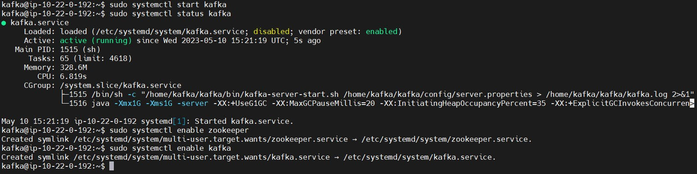
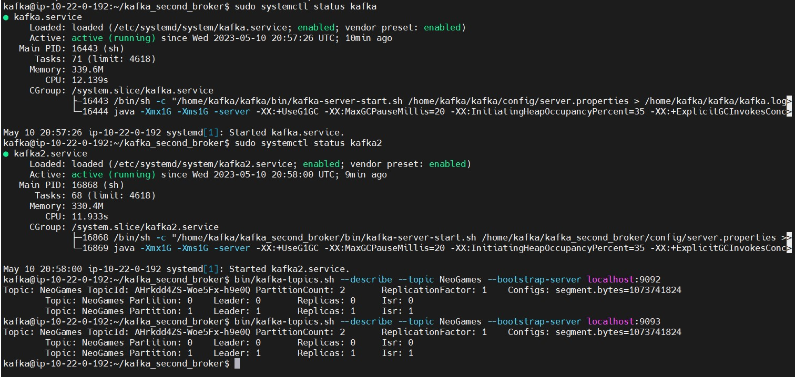

# KAFKA

## Task:
1. Bring up Kafka broker on a Linux VM. Create a topic called NeoGames.
2. Bring up another broker and create a cluster between brokers. Reassign 20 partition to NeoGames topic so that both brokers get assigned half of the partition
3. Write a producer and consumer in Python. Use them to produce and consume from NeoGames topic
4. List consumer groups
5. List consumer offset lag
6. Change offset topic replication factor to 2
7. Set log retention to 24 hours.

### _Prerequisites:_
- Ubuntu 20.04 server
- OpenJDK 11
- Python

#### All screenshots you can find [here](https://github.com/RuslanSerdiuk/DevOps_Tasks_and_solutions/tree/home-assignment/HomeAssignment/Kafka/img) :warning:


### _Creating a User for Kafka_
1. Log in to your server as your non-root sudo user, then create a user called kafka:
    ```
    sudo adduser kafka
    ```
2. Next, add the kafka user to the sudo group with the adduser command. You need these privileges to install Kafka’s dependencies:
    ```
    sudo adduser kafka sudo
    ```
3. Your kafka user is now ready. Log in to the kafka account using su:
    ```
    su -l kafka
    ```


### _Downloading and Extracting the Kafka Binaries_
1. In this step, you’ll download and extract the Kafka binaries into dedicated folders in your kafka user’s home directory.
To start, create a directory in /home/kafka called Downloads to store your downloads:
    ```
    mkdir ~/Downloads
    ```
2. Use curl to download the Kafka binaries:
    ```
    curl "https://downloads.apache.org/kafka/2.8.2/kafka_2.13-2.8.2.tgz" -o ~/Downloads/kafka.tgz
    ```
3. Create a directory called kafka and move to this directory. You’ll use this directory as the base directory of the Kafka installation:
    ```
    mkdir ~/kafka && cd ~/kafka
    ```
4. Extract the archive you downloaded using the tar command:
    ```
    tar -xvzf ~/Downloads/kafka.tgz --strip 1
    ```
> You specify the `--strip 1` flag to ensure that the archive’s contents are extracted in `~/kafka/` itself and not in another directory (such as `~/kafka/kafka_2.13-2.8.2/`) inside of it.


### _Configuring the Kafka Server_
1. Kafka’s configuration options are specified in server.properties. Open this file with nano or your favorite editor:
    ```
    nano ~/kafka/config/server.properties
    ```
2. First, add a setting that will allow you to delete Kafka topics. Add the following line to the bottom of the file:
    ```
    delete.topic.enable = true
    ```
3. Second, you’ll change the directory where the Kafka logs are stored by modifying the log.dirs property. Find the log.dirs property and replace the existing route with the highlighted route:
    ```
    log.dirs=/home/kafka/kafka/logs
    ```
4. Change offset topic replication factor to 2:
    ```
    offsets.topic.replication.factor=2
    ```
5. Set log retention to 24 hours:
    ```
    log.retention.hours=24
    ```
6. `server.properties` file you can find and check [here](https://github.com/RuslanSerdiuk/DevOps_Tasks_and_solutions/blob/home-assignment/HomeAssignment/Kafka/kafka/config/server.properties) 


### _Creating `systemd` Unit Files and Starting the Kafka Server_
1. Create the unit file for `zookeeper`:
    ```
    sudo nano /etc/systemd/system/zookeeper.service
    ```
2. Enter the following unit definition into the file:
    ```
    [Unit]
    Requires=network.target remote-fs.target
    After=network.target remote-fs.target
    
    [Service]
    Type=simple
    User=kafka
    ExecStart=/home/kafka/kafka/bin/zookeeper-server-start.sh /home/kafka/kafka/config/zookeeper.properties
    ExecStop=/home/kafka/kafka/bin/zookeeper-server-stop.sh
    Restart=on-abnormal
    
    [Install]
    WantedBy=multi-user.target
    ```
3. Next, create the systemd service file for `kafka`:
    ```
    sudo nano /etc/systemd/system/kafka.service
    ```
4. Enter the following unit definition into the file:
    ```
   [Unit]
    Requires=zookeeper.service
    After=zookeeper.service
    
    [Service]
    Type=simple
    User=kafka
    ExecStart=/bin/sh -c '/home/kafka/kafka/bin/kafka-server-start.sh /home/kafka/kafka/config/server.properties > /home/kafka/kafka/kafka.log 2>&1'
    ExecStop=/home/kafka/kafka/bin/kafka-server-stop.sh
    Restart=on-abnormal
    
    [Install]
    WantedBy=multi-user.target
    ```
5. Now that you have defined the units, **Bring up Kafka broker on a Linux VM** with the following command:
   ```
   sudo systemctl start kafka
   ```
6. To ensure that the server has started successfully, check the journal logs for the `kafka` unit:
   ```
   sudo systemctl status kafka
   ```
   
7. You have started the `kafka` service. But if you reboot your server, Kafka will not restart automatically. To enable the `kafka` service on server boot, run the following command:
   ```
   sudo systemctl enable zookeeper
   
   sudo systemctl enable kafka
   ```


### _Create a topic called `NeoGames`_
1. To begin, create a topic named `NeoGames`:
   ```
   ~/kafka/bin/kafka-topics.sh --create --bootstrap-server localhost:9092 --replication-factor 1 --partitions 1 --topic NeoGames
   ```
2. Now publish the string "Welcome! This is second message" to the NeoGames topic:
   ```
   ~/kafka/bin/kafka-console-producer.sh --topic NeoGames --bootstrap-server localhost:9092
   ```
   

3. Open another terminal session and run the console consumer client to read the events you just created:
   ```
   bin/kafka-console-consumer.sh --topic NeoGames --from-beginning --bootstrap-server localhost:9092 --partition 0
   ```
   


### _Bring up another broker and create a cluster between brokers_
1. Copy Kafka directory: Copy your existing Kafka directory to create a new instance of Kafka for the second broker.
2. Configure the second broker: Open a terminal and navigate to the directory of the second Kafka broker (kafka_second_broker). Edit the [server.properties](https://github.com/RuslanSerdiuk/DevOps_Tasks_and_solutions/blob/home-assignment/HomeAssignment/Kafka/kafka_second_broker/config/server.properties) file to configure the broker. Make the following changes:
   ```
   broker.id=1
   listeners=PLAINTEXT://:9093
   log.dirs=/home/kafka/kafka_second_broker/logs
   ```
3. Next, create the systemd service file for kafka second broker:
   ```
   sudo nano /etc/systemd/system/kafka2.service
   ```
4. Enter the following unit definition into the file:
   ```
   [Unit]
   Requires=zookeeper.service
   After=zookeeper.service
   
   [Service]
   Type=simple
   User=kafka
   ExecStart=/bin/sh -c '/home/kafka/kafka_second_broker/bin/kafka-server-start.sh /home/kafka/kafka_second_broker/config/server.properties > /home/kafka/kafka_second_broker/kafka.log 2>&1'
   ExecStop=/home/kafka/kafka_second_broker/bin/kafka-server-stop.sh
   Restart=on-abnormal
   
   [Install]
   WantedBy=multi-user.target
   ```
5. Now that you have defined the units, start Kafka second broker with the following command:
   ```
   sudo systemctl start kafka2
   
   sudo systemctl status kafka2
   ```

6. And check our Kafka cluster with these commands:
   ```
   bin/kafka-topics.sh --describe --topic NeoGames --bootstrap-server localhost:9092
   
   bin/kafka-topics.sh --describe --topic NeoGames --bootstrap-server localhost:9093
   ```

   


### _Reassigning 20 partition to NeoGames topic so that both brokers get assigned half of the partition_
1. Alter topic to reate 20 partition:
   ```
   bin/kafka-topics.sh --bootstrap-server localhost:9092 --alter --topic NeoGames \--partitions 20
   ```

2. Create a JSON file (e.g., [reassignment.json](https://github.com/RuslanSerdiuk/DevOps_Tasks_and_solutions/blob/home-assignment/HomeAssignment/Kafka/reassignment.json)) with the following content:
   ```
   {
     "version": 1,
     "partitions": [
       {"topic": "NeoGames", "partition": 0, "replicas": [0, 1]},
       {"topic": "NeoGames", "partition": 1, "replicas": [0, 1]},
       {"topic": "NeoGames", "partition": 2, "replicas": [0, 1]},
       {"topic": "NeoGames", "partition": 3, "replicas": [0, 1]},
       {"topic": "NeoGames", "partition": 4, "replicas": [0, 1]},
       {"topic": "NeoGames", "partition": 5, "replicas": [0, 1]},
       {"topic": "NeoGames", "partition": 6, "replicas": [0, 1]},
       {"topic": "NeoGames", "partition": 7, "replicas": [0, 1]},
       {"topic": "NeoGames", "partition": 8, "replicas": [0, 1]},
       {"topic": "NeoGames", "partition": 9, "replicas": [0, 1]},
       {"topic": "NeoGames", "partition": 10, "replicas": [0, 1]},
       {"topic": "NeoGames", "partition": 11, "replicas": [0, 1]},
       {"topic": "NeoGames", "partition": 12, "replicas": [0, 1]},
       {"topic": "NeoGames", "partition": 13, "replicas": [0, 1]},
       {"topic": "NeoGames", "partition": 14, "replicas": [0, 1]},
       {"topic": "NeoGames", "partition": 15, "replicas": [0, 1]},
       {"topic": "NeoGames", "partition": 16, "replicas": [0, 1]},
       {"topic": "NeoGames", "partition": 17, "replicas": [0, 1]},
       {"topic": "NeoGames", "partition": 18, "replicas": [0, 1]},
       {"topic": "NeoGames", "partition": 19, "replicas": [0, 1]}
     ]
   }
   ```
   > Modify the "replicas" array to include the broker IDs (0 and 1) that should be assigned to each partition.

3. Execute the partition reassignment using the following command:
   ```
   bin/kafka-reassign-partitions.sh --bootstrap-server localhost:2181 --reassignment-json-file ~/kafka_second_broker/reassignment.json --execute
   ```
   

4. Also you can check the status of the partition reassignment using the following command:
```
bin/kafka-reassign-partitions.sh --bootstrap-server localhost:2181 --reassignment-json-file ~/kafka_second_broker/reassignment.json --verify
```


### _Write a producer and consumer in Python. Use them to produce and consume from NeoGames topic_
1. Make sure you have the `kafka-python` library installed. You can install it using pip:
   ```
   pip install kafka-python
   ```
2. Write [Producer](https://github.com/RuslanSerdiuk/DevOps_Tasks_and_solutions/blob/home-assignment/HomeAssignment/Kafka/kafka_producer.py):
   ```
   from kafka import KafkaProducer
   
   # Kafka broker address
   bootstrap_servers = 'localhost:9092'
   
   # Create Kafka producer instance
   producer = KafkaProducer(bootstrap_servers=bootstrap_servers)
   
   # Topic to produce messages to
   topic = 'NeoGames'
   
   # Produce messages
   messages = [
       'Hello, NeoGames!',
       'Welcome to the task from Ruslan Serdiuk.',
       'Enjoy your gaming experience!'
   ]
   
   for message in messages:
       producer.send(topic, message.encode('utf-8'))
   
   # Wait for all messages to be sent
   producer.flush()
   
   # Close the producer
   producer.close()
   ```

3. Write [Consumer](https://github.com/RuslanSerdiuk/DevOps_Tasks_and_solutions/blob/home-assignment/HomeAssignment/Kafka/kafka_consumer.py):
   ```
   from kafka import KafkaConsumer
   
   # Kafka broker address
   bootstrap_servers = 'localhost:9092'
   
   # Create Kafka consumer instance
   consumer = KafkaConsumer('NeoGames', bootstrap_servers=bootstrap_servers)
   
   # Consume messages from the 'NeoGames' topic
   for message in consumer:
       print(message.value.decode('utf-8'))
   
   # Close the consumer
   consumer.close()
   ```

4. To produce messages, run the producer script in one terminal window:
   ```
   python3 kafka_producer.py
   ```
   

5. To consume messages, run the consumer script in another terminal window:
   ```
   python3 kafka_consumer.py
   ```
   


### _List consumer groups & List consumer offset lag_
1. List consumer groups:
   ```
   bin/kafka-consumer-groups.sh --bootstrap-server localhost:9092 --list
   ```
2. List consumer offset lag:
   ```
   bin/kafka-consumer-groups.sh --bootstrap-server localhost:9092 --describe --all-groups
   ```
   


#### The End!


### _LINKS:_
+ _https://kafka.apache.org/downloads_
+ _https://kafka.apache.org/quickstart_
+ _https://kafka.apache.org/documentation/#basic_ops_cluster_expansion_
+ _https://openjdk.org/_
+ _https://docs.bitnami.com/google-templates/infrastructure/kafka/administration/create-cluster/_
