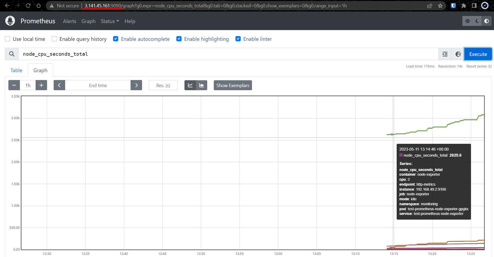

# Kubernetes

## Task:
1. Deploy Kubernetes Cluster on your preferred platform.
2. Deploy Redis, Jenkins & NGINX on the cluster using ansible. 
   + Each service should be deployed on a different new namespace.
3. Configure network policy that blocked communication between pods.
4. Monitoring and logging:
   + Set up a monitoring and logging solution for a Kubernetes cluster using tools like Prometheus, Grafana for metrics and Fluentd and ELK for logs. 
   + The solution should be able to collect metrics and logs from the cluster and provide visualizations.


> Instead of a full-fledged Kubernetes cluster, I was decided to deploy a `minikube`. Because it's much faster!

#### All screenshots you can find [here](https://github.com/RuslanSerdiuk/DevOps_Tasks_and_solutions/tree/home-assignment/HomeAssignment/Kubernetes/img) :warning:

### _Prerequisites:_
1. For machine with Ansible:
   - Ansible server
   - aws plugin for dynamic inventory
   - `boto3` library, which allows Ansible to interact with AWS
2. For machne with Kubernetes cluster:
   - kubectl
   - docker
   - minikube
   - helm


### _Connect Ansible to Linux server_
1. Launch a Linux Server instance in AWS. You can choose any Linux Server version that is supported by Ansible.
    

2. Set up AWS credentials: Ansible needs AWS credentials to authenticate and access your AWS resources. You can either set the credentials in environment variables or create a separate credentials file. For environment variables, set the following:
    ```
    export AWS_ACCESS_KEY_ID=<your-access-key>
    export AWS_SECRET_ACCESS_KEY=<your-secret-key>
    ```

3. Create an Ansible inventory file: Ansible uses an inventory file to define the hosts it should manage. With Dynamic Inventory for AWS, you don't need to manually specify hosts; Ansible will fetch them from AWS. Create an inventory file - [aws_ec2.yml](https://github.com/RuslanSerdiuk/DevOps_Tasks_and_solutions/blob/home-assignment/HomeAssignment/Kubernetes/aws_ec2.yaml), and add the following content:
    ```
    plugin: aws_ec2
    regions:
      - us-east-2
    filters:
      tag:Name:
      - Minikube
    keyed_groups:
      # Add e.g. x86_64 hosts to an arch_x86_64 group
      - prefix: arch
        key: 'architecture'
      # Add hosts to tag_Name_Value groups for each Name/Value tag pair
      - prefix: tag
        key: tags
      # Add hosts to e.g. instance_type_z3_tiny
      - prefix: instance_type
        key: instance_type
    ```
    > Adjust the `regions` value according to your desired AWS region.

4. Test the dynamic inventory. You can test the dynamic inventory by running the following command:
    ```
    sudo ansible-inventory -i aws_ec2.yaml --list
    ```


### _Deploy Kubernetes Cluster on your preferred platform_
1. How to install `minikube` you can find [here](https://kubernetes.io/ru/docs/tasks/tools/install-minikube/)
    


### _Deploy Redis, Jenkins & NGINX on the cluster using Ansible_
1. Create [tag_Name_Minikube](https://github.com/RuslanSerdiuk/DevOps_Tasks_and_solutions/blob/home-assignment/HomeAssignment/Kubernetes/group_vars/tag_Name_Minikube):
    ```
    ---
    ansible_user                         : ubuntu
    ansible_ssh_private_key_file         : /home/ubuntu/Ruslan-key-Ohio-TASK2.2.pem
    ```

2. Tasks you can find [here](https://github.com/RuslanSerdiuk/DevOps_Tasks_and_solutions/blob/home-assignment/HomeAssignment/Kubernetes/roles/deploy_to_minikube/tasks/main.yml). Also [Vars](https://github.com/RuslanSerdiuk/DevOps_Tasks_and_solutions/blob/home-assignment/HomeAssignment/Kubernetes/roles/deploy_to_minikube/vars/main.yml). Playbook:
    ```
    ---
    - name: Install Redis, Jenkins & NGINX to Minikube
      hosts: tag_Name_Minikube
      become: yes
    
      roles:
        - deploy_to_minikube
    ```

3. Run Playbook:
    ```
    sudo ansible-playbook playbook_minikube.yml -i aws_ec2.yaml
    ```
    
    

4. Go to the Linux instance with `minikube` and check results:
    


### _Configure network policy that blocked communication between pods_
1. Create task and run playbook:
    ```
    - name: Block communication between pods
      k8s:
          state: present
          kubeconfig: "/home/ubuntu/.kube/config"
          definition:
            apiVersion: networking.k8s.io/v1
            kind: NetworkPolicy
            metadata:
              name: deny-all
              namespace: redis
            spec:
              podSelector: {}
              policyTypes:
              - Ingress
              ingress: []
    ```

2. Check result:
    


### _Monitoring and logging_
1. Playbook for set up Prometheus and Grafana for metrics:
   - Role [here](https://github.com/RuslanSerdiuk/DevOps_Tasks_and_solutions/tree/home-assignment/HomeAssignment/Kubernetes/roles/monitoring_visualization)
   - Tasks [here](https://github.com/RuslanSerdiuk/DevOps_Tasks_and_solutions/blob/home-assignment/HomeAssignment/Kubernetes/roles/monitoring_visualization/tasks/main.yml)
   - Templates [here](https://github.com/RuslanSerdiuk/DevOps_Tasks_and_solutions/tree/home-assignment/HomeAssignment/Kubernetes/roles/monitoring_visualization/templates)
   - Vars [here](https://github.com/RuslanSerdiuk/DevOps_Tasks_and_solutions/blob/home-assignment/HomeAssignment/Kubernetes/roles/monitoring_visualization/vars/main.yml)
    ```
    ---
    - name: Install Prometheus, Grafana, Elasticsearch, Kibana, Filebeat for metrics and logging monitoring
      hosts: tag_Name_Minikube
      become: yes
    
      roles:
        - monitoring_visualization
    ```

2. Run Playbook:
    ```
    sudo ansible-playbook playbook_monitoring_visualization.yml -i aws_ec2.yaml
    ```
    

3. Go to the Linux instance with `minikube` and check results:
    

4. Go to the `public ip` of the `minikube` instance and check **Prometheus** metrics:
    
    

6. Go to the `public ip` of the `minikube` instance and check **Grafana** visualization:
    

7. Enter default `username - Admin` and `Password - prom-operator`
    

8. Check Grafana dashboars:
    
    


#### There were problems with the logging. I used helm to deploy Elasticsearch. But the pods do not pass the Readiness probe!


8. Although I changed the [value](https://github.com/RuslanSerdiuk/DevOps_Tasks_and_solutions/blob/home-assignment/HomeAssignment/Kubernetes/roles/monitoring_visualization/templates/value.yaml) for one replica in the `statefulset`:

    ```
    ---
    # Permit co-located instances for solitary minikube virtual machines.
    antiAffinity: "soft"
    
    # Shrink default JVM heap.
    esJavaOpts: "-Xmx512m -Xms512m"
    
    # Allocate smaller chunks of memory per pod.
    resources:
      requests:
        cpu: "500m"
        memory: "1024M"
      limits:
        cpu: "1000m"
        memory: "1024M"
    
    # Request smaller persistent volumes.
    volumeClaimTemplate:
      accessModes: [ "ReadWriteOnce" ]
      storageClassName: "standard"
      resources:
        requests:
          storage: 100M
    
    replicas: 1
    minimumMasterNodes: 1
    clusterHealthCheckParams: "wait_for_status=green&timeout=1s"
    
    
    readinessProbe: 
       failureThreshold: 3 
       initialDelaySeconds: 10 
       periodSeconds: 10 
       successThreshold: 3 
       timeoutSeconds: 5 
    ```


> Since time was limited, unfortunately, I did not have time to correct and finalize the logging solution.


#### The End!


### _LINKS:_
+ _https://docs.ansible.com/ansible/latest/collections/kubernetes/core/k8s_module.html_
+ _https://docs.ansible.com/ansible/latest/collections/kubernetes/core/helm_module.html_
+ _https://helm.sh/docs/intro/install/_
+ _https://artifacthub.io/packages/helm/elastic/elasticsearch_
+ _https://artifacthub.io/packages/helm/elastic/kibana_
+ _https://artifacthub.io/packages/helm/elastic/filebeat_
+ _https://artifacthub.io/packages/helm/bitnami/fluentd_
+ _https://www.digitalocean.com/community/tutorials/how-to-set-up-an-elasticsearch-fluentd-and-kibana-efk-logging-stack-on-kubernetes_
+ _https://github.com/elastic/helm-charts/issues/909_
