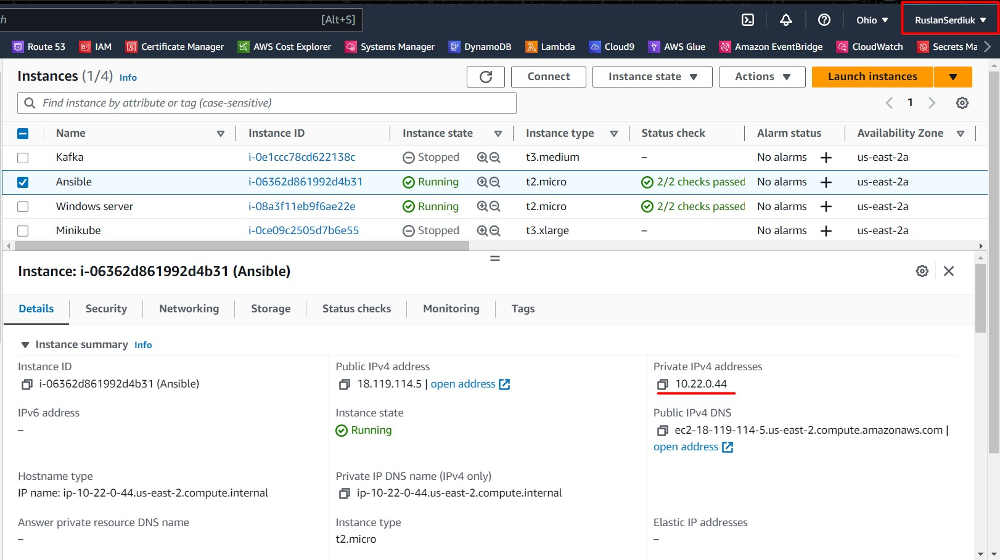
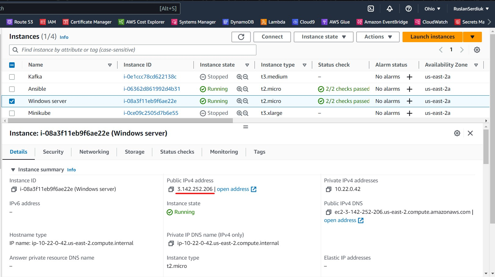
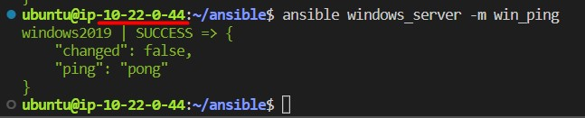
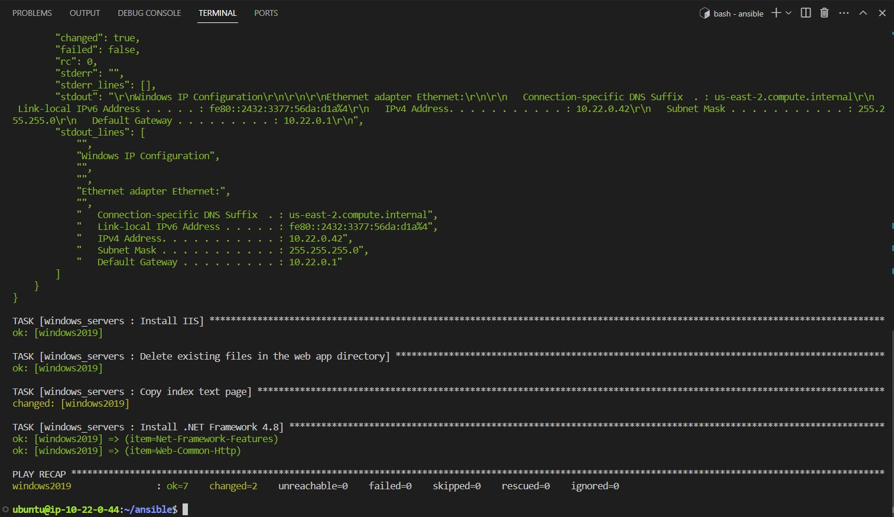
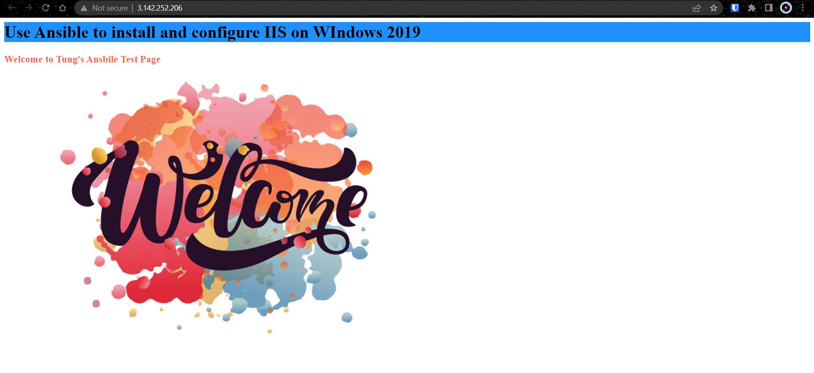

# Windows - Ansible

## Task:
1. Write an Ansible playbook that installs and configures IIS on a Windows Server 2019 machine. The playbook should include tasks for installing IIS, creating a new website, and deploying a sample web application.
2. Write an Ansible playbook that automates the deployment of a Windows service on a Windows Server 2019 machine. The playbook should include tasks for installing the service, setting up its dependencies, and starting it.

#### All screenshots you can find [here](https://github.com/RuslanSerdiuk/DevOps_Tasks_and_solutions/tree/home-assignment/HomeAssignment/WindowsAnsible/img) :warning:

#### Role you can find [here](https://github.com/RuslanSerdiuk/DevOps_Tasks_and_solutions/tree/home-assignment/HomeAssignment/WindowsAnsible/roles/windows_servers)
#### group_vars [here](https://github.com/RuslanSerdiuk/DevOps_Tasks_and_solutions/blob/home-assignment/HomeAssignment/WindowsAnsible/group_vars/windows_server)
#### Playbook [here](https://github.com/RuslanSerdiuk/DevOps_Tasks_and_solutions/blob/home-assignment/HomeAssignment/WindowsAnsible/playbook_windows_server.yml)
#### Sample web [here](https://github.com/RuslanSerdiuk/DevOps_Tasks_and_solutions/blob/home-assignment/HomeAssignment/WindowsAnsible/sample_web_app/index.html)


### _Connect Ansible to Windows server_
1. Launch a Windows Server instance in AWS. You can choose any Windows Server version that is supported by Ansible. 
   > **I also perform all actions from my own account on AWS**



2. Configure Windows Server instance so that Ansible can run its commands there. To do this, log in to the Windows Server instance and run this [script](https://github.com/ansible/ansible/blob/devel/examples/scripts/ConfigureRemotingForAnsible.ps1).
3. Configure Ansible to connect to the Windows Server instance: You'll need to configure Ansible to use WinRM to connect to the Windows Server instance. Here's my Ansible [inventory file](https://github.com/RuslanSerdiuk/DevOps_Tasks_and_solutions/blob/home-assignment/HomeAssignment/WindowsAnsible/hosts.txt):
    ```
    [windows_server]
    windows2019    ansible_host=3.142.252.206
    ```
    > All other vars here:[group_vars/windows_server](https://github.com/RuslanSerdiuk/DevOps_Tasks_and_solutions/blob/home-assignment/HomeAssignment/WindowsAnsible/group_vars/windows_server):
   
    ```
    ---
    ansible_user                         : Administrator
    ansible_password                     : <your_password>
    ansible_port                         : 5986
    ansible_connection                   : winrm
    ansible_winrm_server_cert_validation : ignore
    ```

4. Test the Ansible connection: You can test the Ansible connection to the Windows Server instance using the win_ping module:
   ```
   ansible windows_server -m win_ping
   ```
   


### _Playbook for installing IIS, creating a new website, and deploying a sample web application_
1. Tasks in the Playbook:
   ```
   - name: Disable Windows Updates Service
     win_service:
       name: wuauserv
       state: stopped
   
   
   - name: Run ipconfig and return IP address information.
     raw: ipconfig
     register: ipconfig
   - debug: var=ipconfig
   
   
   - name: Install IIS
     win_feature:
       name: "Web-Server"
       state: present
       restart: yes
       include_sub_features: yes
       include_management_tools: yes
   
   - name: Delete existing files in the web app directory
     win_shell: |
       Remove-Item -Path "C:\\inetpub\\wwwroot\\*" -Recurse -Force
     changed_when: false
   
   - name: Copy index text page
     win_copy:
       src: "{{ web_app_source }}"
       dest: "{{ web_app_path }}"
   
   - name: Install .NET Framework 4.8
     win_feature:
       name: '{{ item }}'
       state: present
     with_items:
       - Net-Framework-Features
       - Web-Common-Http
     notify: Restart IIS
   ```
   > Handler [here](https://github.com/RuslanSerdiuk/DevOps_Tasks_and_solutions/blob/home-assignment/HomeAssignment/WindowsAnsible/roles/windows_servers/handlers/main.yml)
   > 
   > Vars [here](https://github.com/RuslanSerdiuk/DevOps_Tasks_and_solutions/blob/home-assignment/HomeAssignment/WindowsAnsible/roles/windows_servers/vars/main.yml)
   >  
   > Test index.html [here](https://github.com/RuslanSerdiuk/DevOps_Tasks_and_solutions/blob/home-assignment/HomeAssignment/WindowsAnsible/sample_web_app/index.html)


2. Run playbook:
   ```
   sudo ansible-playbook playbook_windows_server.yml
   ```
   

3. Check the result! Go to the `http://3.142.252.206/`:
   


### _Installing the service, setting up its dependencies_
   > I don't know which service to install. As an example, in the `previous playbook`, I installed `Net-Framework-Features` using the `win_feature` module. 

#### Also here's an example of an Ansible playbook that installs a Windows service, sets up its dependencies, and starts it:
```
- name: Copy service files
    win_copy:
      src: /path/to/service/files
      dest: C:\path\to\service\directory
      force: yes

- name: Install service dependencies
  win_chocolatey:
    name: '{{ item }}'
    state: present
  with_items:
    - dependency1
    - dependency2
    # Add more dependencies as needed

- name: Install service
  win_shell: |
    sc create "ServiceName" binPath= "C:\path\to\service\directory\service.exe"
    sc config "ServiceName" start= auto
  args:
    executable: cmd.exe
    chdir: C:\path\to\service\directory

- name: Start service
  win_service:
    name: "ServiceName"
    state: started
    start_mode: auto
```


#### The End!


### _LINKS:_
+ _https://docs.ansible.com/ansible/latest/os_guide/windows_setup.html_
+ _https://docs.ansible.com/ansible/2.9/modules/list_of_windows_modules.html_
+ _https://docs.ansible.com/ansible/2.9/modules/win_iis_virtualdirectory_module.html#win-iis-virtualdirectory-module_
+ _https://docs.ansible.com/ansible/2.9/modules/win_iis_webapplication_module.html#win-iis-webapplication-module_
+ _https://docs.ansible.com/ansible/2.9/modules/win_iis_webapppool_module.html#win-iis-webapppool-module_
+ _https://docs.ansible.com/ansible/2.9/modules/win_iis_webbinding_module.html#win-iis-webbinding-module_
