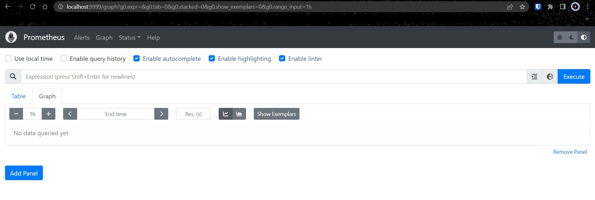

# Setup Prometheus Monitoring On Kubernetes Cluster

## About Prometheus
[Prometheus](https://prometheus.io/) is a high-scalable open-source monitoring framework. 
It provides out-of-the-box monitoring capabilities for the Kubernetes [container orchestration platform](https://devopscube.com/docker-container-clustering-tools/). 
Also, In the observability space, it is gaining huge popularity as it helps with metrics and alerts.

### _The Kubernetes Prometheus monitoring stack has the following components:_


1. Prometheus Server
2. Alert Manager
3. Grafana

## Setup on Kubernetes
> I assume that you have a kubernetes cluster up and running with kubectl setup on your workstation.

All the configuration files I mentioned in this repo are hosted on Github. 
You can clone the repo using the following command.
```
git clone -b Kubernetes https://github.com/RuslanSerdiuk/DevOps_Tasks_and_solutions.git
```


### _Create a Namespace & ClusterRole_
First, we will create a Kubernetes namespace for all our monitoring components. 
If you don’t create a dedicated namespace, all the Prometheus kubernetes deployment objects get deployed on the default namespace.
```
kubectl create namespace monitoring
```
Prometheus uses Kubernetes APIs to read all the available metrics from Nodes, Pods, Deployments, etc. 
For this reason, we need to create an RBAC policy with `read access` to required API groups and bind the policy to the `monitoring` namespace.
1. Create a file named `clusterRole.yaml` and copy the following RBAC role.
   >  In the role, given below, you can see that we have added get, list, and watch permissions to nodes, services endpoints, pods, and ingresses. The role binding is bound to the monitoring namespace. If you have any use case to retrieve metrics from any other object, you need to add that in this cluster role.
    ```
    apiVersion: rbac.authorization.k8s.io/v1
    kind: ClusterRole
    metadata:
      name: prometheus
    rules:
    - apiGroups: [""]
      resources:
      - nodes
      - nodes/proxy
      - services
      - endpoints
      - pods
      verbs: ["get", "list", "watch"]
    - apiGroups:
      - extensions
      resources:
      - ingresses
      verbs: ["get", "list", "watch"]
    - nonResourceURLs: ["/metrics"]
      verbs: ["get"]
    ---
    apiVersion: rbac.authorization.k8s.io/v1
    kind: ClusterRoleBinding
    metadata:
      name: prometheus
    roleRef:
      apiGroup: rbac.authorization.k8s.io
      kind: ClusterRole
      name: prometheus
    subjects:
    - kind: ServiceAccount
      name: default
      namespace: monitoring
    ```

2. Create the role using the following command:
    ```
    kubectl create -f clusterRole.yaml
    ```


### _Create a Config Map_
All configurations for Prometheus are part of `prometheus.yaml` file and all the alert rules for Alertmanager are configured in `prometheus.rules`.

- `prometheus.yaml`: This is the main Prometheus configuration which holds all the scrape configs, service discovery details, storage locations, data retention configs, etc)
- `prometheus.rules`: This file contains all the Prometheus alerting rules

    > By externalizing Prometheus configs to a Kubernetes config map, you don’t have to build the Prometheus image whenever you need to add or remove a configuration. 
      You need to update the config map and restart the Prometheus pods to apply the new configuration.

    #### The config map with all the [Prometheus scrape config]() and alerting rules gets mounted to the Prometheus container in `/etc/prometheus` location as `prometheus.yaml` and `prometheus.rules` files.

- Execute the following command to create the config map in Kubernetes:
    ```
    kubectl create -f config-map.yaml
    ```
    It creates two files inside the container.

    > In Prometheus terms, the config for collecting metrics from a collection of endpoints is called a job.

    The prometheus.yaml contains all the configurations to discover pods and services running in the Kubernetes cluster dynamically. 
    We have the following [scrape jobs](https://prometheus.io/docs/concepts/jobs_instances/) in our Prometheus scrape configuration:
    - `kubernetes-apiservers`: It gets all the metrics from the API servers. 
    - `kubernetes-nodes`: It collects all the kubernetes node metrics. 
    - `kubernetes-pods`: All the pod metrics get discovered if the pod metadata is annotated with prometheus.io/scrape and prometheus.io/port annotations. 
    - `kubernetes-cadvisor`: Collects all cAdvisor metrics. 
    - `kubernetes-service-endpoints`: All the Service endpoints are scrapped if the service metadata is annotated with prometheus.io/scrape and prometheus.io/port annotations. It can be used for black-box monitoring.

    `prometheus.rules` contains all the alert rules for sending alerts to the Alertmanager.


### _Create a Prometheus Deployment_
1. Create a deployment on monitoring namespace using the [prometheus-deployment.yaml]() file. In this configuration, we are mounting the Prometheus config map as a file inside `/etc/prometheus` as explained in the previous section:
    ```
    kubectl create -f prometheus-deployment.yaml 
    ```

    > This deployment uses the latest [official Prometheus image](https://hub.docker.com/r/prom/prometheus/) from the docker hub. 
      Also, we are not using any [persistent storage volumes](https://devopscube.com/persistent-volume-google-kubernetes-engine/) for Prometheus storage as it is a basic setup. 
      When setting up Prometheus for production uses cases, make sure you add persistent storage to the deployment.

2. You can check the created deployment using the following command:
    ```
    kubectl get deployments --namespace=monitoring -o wide
    ```

3. You can also get details from the Lens as shown below:


## Connecting To Prometheus Dashboard
#### You can view the deployed Prometheus dashboard in three different ways:
1. Using Kubectl port forwarding 
2. Exposing the Prometheus deployment as a service with NodePort or a Load Balancer. 
3. Adding an [Ingress object](https://devopscube.com/kubernetes-ingress-tutorial/) if you have an Ingress controller deployed.

We'll be using first and second ways :point_down:

### _Using Kubectl port forwarding_

Using kubectl port forwarding, you can access a pod from your local workstation using a selected port on your `localhost`. 

1. First, get the Prometheus pod name:
    ```
    kubectl get pods --namespace=monitoring -o wide
    NAME                                     READY   STATUS    RESTARTS   AGE     IP           NODE       NOMINATED NODE   READINESS GATES
    prometheus-deployment-84f65c89c5-dxnkv   1/1     Running   0          6m55s   172.17.0.3   minikube   <none>           <none>
    ```

2. Execute the following command with your pod name to access Prometheus from localhost port 8080:
    ```
    kubectl port-forward prometheus-deployment-84f65c89c5-dxnkv 8080:9090 -n monitoring
    
    Forwarding from 127.0.0.1:8080 -> 9090
    Forwarding from [::1]:8080 -> 9090
    Handling connection for 8080
    Handling connection for 8080
    ```

    #### :warning: Replace `prometheus-deployment-84f65c89c5-dxnkv` with your pod name.

3. Now, if you access http://localhost:8080 on your browser, you will get the Prometheus home page:
   


### _Exposing Prometheus as a Service [NodePort & LoadBalancer]_
To access the Prometheus dashboard over a IP or a DNS name, you need to expose it as a Kubernetes service.

1. Create the service using the following command. We will expose Prometheus on all kubernetes node IP’s on port `30000`:
    > The `annotations` in the above service `YAML` makes sure that the service endpoint is scrapped by Prometheus. The `prometheus.io/port` should always be the target port mentioned in service YAML

    ```
    kubectl create -f prometheus-service.yaml --namespace=monitoring
    ```

2. Once created, you can access the Prometheus dashboard using any of the Kubernetes nodes IP on port 30000.

    #### :warning: BUT, because of we used minikube - our node is not access. And we again need to forward the port for our service:

    ```
    kubectl port-forward service/prometheus-service 9999:8080 -n monitoring
    
    Forwarding from 127.0.0.1:9999 -> 9090
    Forwarding from [::1]:9999 -> 9090
    Handling connection for 9999
    Handling connection for 9999
    ```

    This solution is more suitable for a separate worker node :grey_exclamation:

3. Now check `localhost:9999`:
   

    If you have an existing **ingress controller setup**, you can create an ingress object to route the Prometheus DNS to the Prometheus backend service.


## Setting Up Grafana
Using Grafana you can create dashboards from Prometheus metrics to monitor the kubernetes cluster.

The best part is, you don’t have to write all the PromQL queries for the dashboards. There are many community dashboard templates available for Kubernetes. You can import it and modify it as per your needs. I have covered it in the article.

For the Grafana setup, please follow ==> [How To Setup Grafana On Kubernetes]()

### _LINKS:_
+ _https://prometheus.io/_
+ _https://prometheus.io/docs/prometheus/latest/installation/_
+ _https://devopscube.com/setup-prometheus-monitoring-on-kubernetes/_
+ _https://github.com/prometheus-operator/kube-prometheus_
