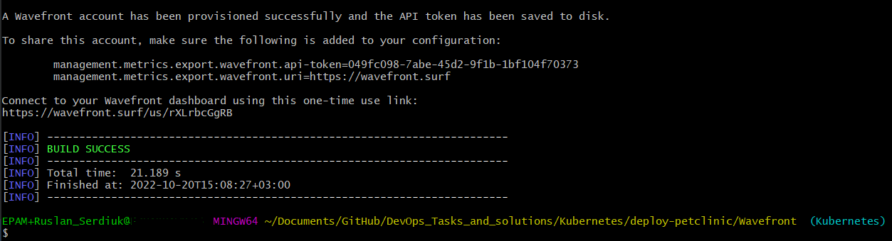

# Deploy Pet-Clinic in Kubernetes :wheel_of_dharma:

### _Task:_
- Deploy [pet-clinic](https://github.com/spring-projects/spring-petclinic) in Kubernetes cluster.


### _Prerequarements:_
- [kinikube](https://kubernetes.io/ru/docs/tasks/tools/install-minikube/)
- [kubectl](https://kubernetes.io/ru/docs/tasks/tools/install-kubectl/)
- [Lens (optional)](https://k8slens.dev/)
- [jdk](https://docs.oracle.com/en/java/javase/11/install/installation-jdk-microsoft-windows-platforms.html#GUID-A7E27B90-A28D-4237-9383-A58B416071CA)
- [maven](https://maven.apache.org/install.html)


### _Solution_
To [demonstrate](https://www.martinfowler.com/articles/microservices.html) how to split sample Spring application into microservices.
But, we'll take a ready-made [solution](https://hub.docker.com/u/springcommunity). **Our main goal is to deploy these microservices in a Kubernetes cluster!**

We will also demonstrate the use of free distributed tracing with [Wavefront's Tanzu Observability](https://docs.wavefront.com/wavefront_springboot.html), which provides cloud-based monitoring.


### _Setting up [Wavefront](https://docs.wavefront.com/wavefront_springboot.html)_
Just follow these steps:
1. Navigate to https://start.spring.io. 
2. Select Spring 2.3.0 or later as the Spring Boot version and define the other parameters for your project.
3. Click **Generate** to download the project as a zip file.
4. To view your data, you first run your project from the command line, and then click the link that directs you to Wavefront. Follow these steps:
   1. Run: `./mvnw spring-boot:run`
   2. You see the following printed on your console:
        ```
      To share this account, make sure the following is added to your configuration:

      management.metrics.export.wavefront.api-token=049fc098-7abe-45d2-9f1b-1bf104f70373
      management.metrics.export.wavefront.uri=https://wavefront.surf
      
      Connect to your Wavefront dashboard using this one-time use link: https://wavefront.surf/us/rXLrbcGgRB
      ```
      :warning: Remember the your Token and uri :bangbang:
   

5. **After deploy APP** - click the link (for example, `https://wavefront.surf/us/rXLrbcGgRB`) and you are taken to the Wavefront Spring Boot Inventory dashboard where you can examine the data sent by your application.  


### _Setting things up in Kubernetes_
1. Run: `git clone -b Kubernetes https://github.com/RuslanSerdiuk/DevOps_Tasks_and_solutions.git` and `cd` to root directory.

2. Docker images for kubernetes have been published into DockerHub in the springcommunity organization. We can use these images. Setup an env variable to target our Docker registry, simple provide username:
   - `export REPOSITORY_PREFIX=springcommunity`
3. Create the `spring-petclinic` namespace for Spring petclinic:
   - `kubectl apply -f Manifests/init-namespace/`
4. Create a Kubernetes secret to store the URL and API Token of Wavefront (replace values with your own real ones):
   - `kubectl create secret generic wavefront -n spring-petclinic --from-literal=wavefront-url=https://wavefront.surf --from-literal=wavefront-api-token=049fc098-7abe-45d2-9f1b-1bf104f70373`
5. Create the Wavefront proxy pod, and the various Kubernetes services that will be used later on by our deployments:
   - `kubectl apply -f Manifests/init-services`
   
   1. Verify the services are available:
   - ```
     kubectl get svc -n spring-petclinic
     NAME                TYPE           CLUSTER-IP     EXTERNAL-IP   PORT(S)             AGE
     api-gateway         LoadBalancer   10.7.250.24    <pending>     80:32675/TCP        36s
     customers-service   ClusterIP      10.7.245.64    <none>        8080/TCP            36s
     vets-service        ClusterIP      10.7.245.150   <none>        8080/TCP            36s
     visits-service      ClusterIP      10.7.251.227   <none>        8080/TCP            35s
     wavefront-proxy     ClusterIP      10.7.253.85    <none>        2878/TCP,9411/TCP   37s
     ```
   2. Verify the wavefront proxy is running:
   - ```
     kubectl get pods -n spring-petclinic
     NAME                              READY   STATUS    RESTARTS   AGE
     wavefront-proxy-dfbd4b695-fdd6t   1/1     Running   0          36s
     ```


### _Settings up database with helm_
We'll now need to deploy our database. For that, we'll use helm. You'll need helm 3 and above!

1. Make sure you have a single default StorageClass in your Kubernetes cluster:
   - ```
     kubectl get sc
     NAME                 PROVISIONER                RECLAIMPOLICY   VOLUMEBINDINGMODE   ALLOWVOLUMEEXPANSION   AGE
     standard (default)   k8s.io/minikube-hostpath   Delete          Immediate           false                  21s
     ```

2. Deploy the database:
   - `helm repo add bitnami https://charts.bitnami.com/bitnami`
   - `helm repo update`
   - `helm install mysql bitnami/mysql --namespace spring-petclinic --version 9.4.1 --set auth.database=service_instance_db`
     


### _Deploying the application_
Our deployment YAMLs have a placeholder called REPOSITORY_PREFIX so we'll be able to deploy the images from any Docker registry. 
1. Sadly, Kubernetes doesn't support environment variables in the YAML descriptors. We have a small script to do it for us and run our deployments:
   - `./deployToKubernetes.sh`
2. Verify the pods are deployed:
   - ```
     kubectl get pods -n spring-petclinic
     NAME                                 READY   STATUS    RESTARTS      AGE
     api-gateway-798b5df54b-7dvfq         0/1     Running   0             26s
     customers-service-7d4994df85-cd8cq   0/1     Running   0             26s
     mysql-0                              0/1     Running   5 (73s ago)   10m
     vets-service-56585648bc-8bh87        0/1     Running   0             26s
     visits-service-5fb6888ff9-dmvtw      0/1     Running   0             26s
     wavefront-proxy-7c4d99c8d8-r2vw7     1/1     Running   0             13m
     ```
   - Aslo, you can chek it in the Lens 

3. Get the `EXTERNAL-IP` of the API Gateway:
   - ```
     kubectl get svc -n spring-petclinic api-gateway
     NAME          TYPE           CLUSTER-IP    EXTERNAL-IP      PORT(S)        AGE
     api-gateway   LoadBalancer   10.7.250.24   34.1.2.22   80:32675/TCP   18m
     ```
   Or just go to Lens - Services - select `api-gateway` - and click `Port forward` 

4. You can now browse to that IP in your browser and see the application running.

5. You should also see monitoring and traces from Wavefront under the application name spring-petclinic-k8s:


### _LINKS:_
+ _https://github.com/spring-projects/spring-petclinic_
+ _https://docs.wavefront.com/wavefront_springboot.html_
+ _https://start.spring.io/_
+ _https://kubernetes.io/docs/reference/kubectl/cheatsheet/_
+ _https://github.com/spring-petclinic/spring-petclinic-cloud#compiling-and-pushing-to-kubernetes_
