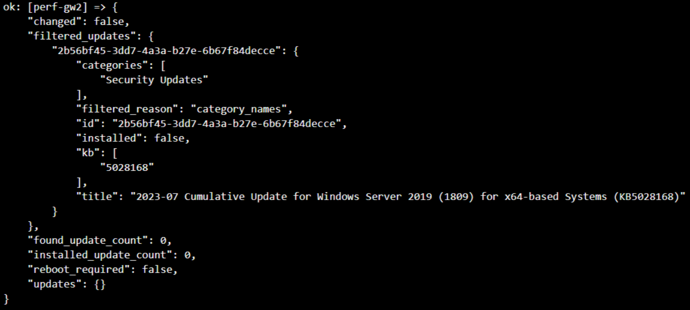
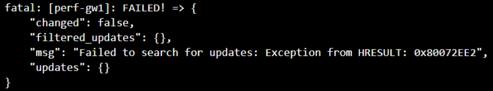

# Parse Ansible Output :shipit:

### Description: :arrow_down:
> We have an ansible script that checks for Windows Updates on the servers we specify. There can be 3 results of the check:
1 - Updates found.
2 - No updates found (they are not needed).
3 - An error occurred while searching for updates (you need to get this error from the logs and display it to the user).
!I already got all these 3 outputs and put them in 3 json files!

## TASK:
> Depending on one of the 3 json files that you will receive in the script, you need to output: :point_down:
1. If Updates are found - the 'filtered_updates' field will NOT be empty - and you need to display the fields nested in it by the key 'title' and 'categories'.(i.e. "2023-07 Cumulative Update for Windows Server 2019 (1809) for x64-based Systems (KB5028168)" AND "Security Updates") 
2. If no updates are found, the 'filtered_updates' field will be empty and you just need to check it, if there is nothing there, then display to the user "Your system is up to date bla bla bla"
3. If there is an error in the search for updates, the 'filtered_updates' field will ALSO be empty, BUT there will also be an error in the 'msg' field. THIS is the error that you will need to display to the user. (i.e. "Failed to search for updates: Exception from HRESULT: 0x80072EE2") 

:warning: Here's a hint - create conditions on the 'filtered_updates' key.

