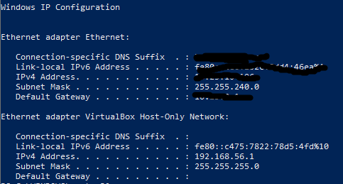
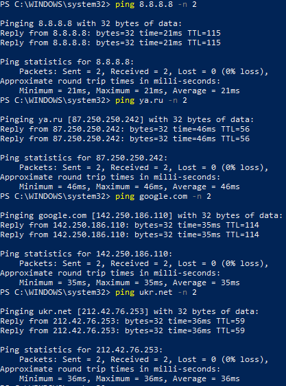
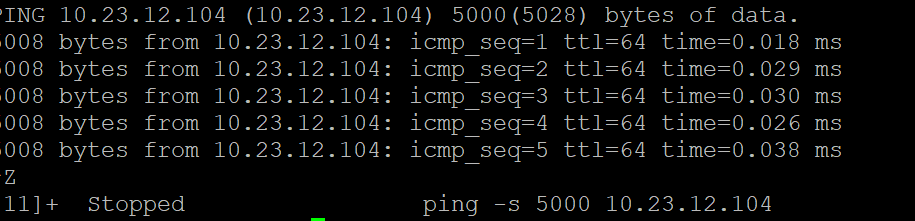
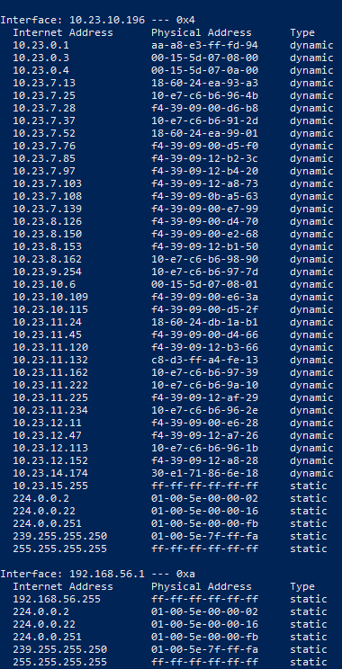
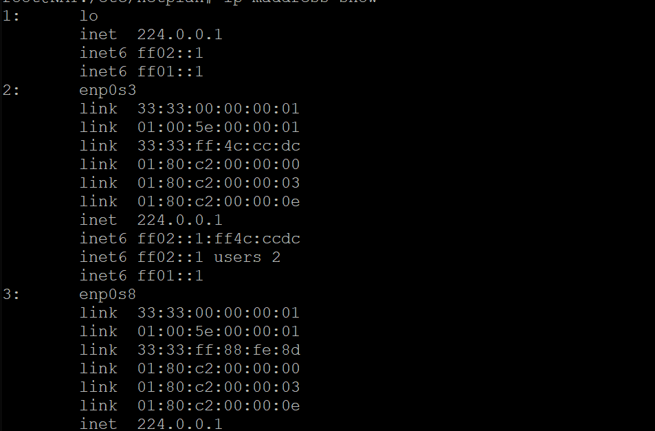
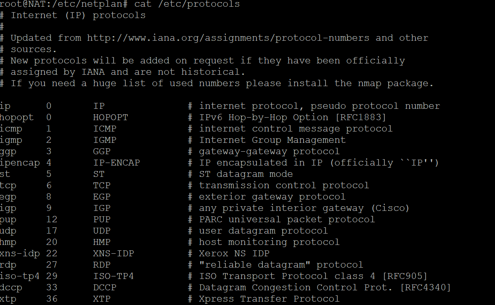

# Network

## Network Task 1. Traffic analysis
### Explore network configuration
Исследовать сетевые настройки на вашем компьютере. Выполнить проверку относительно всех доступных сетевых интерфейсов в системе. (ipconfig / ifconfig / ip)
```
> ipconfig
```
 

### Check network quality 
Проверить качество связи (на домены ukr.net, ya.ru, google.com, 8.8.8.8, и другие , объяснить вывод команды ping.
```
> ping 8.8.8.8 -n 2
> ping google.com -n 2
> ping ya.ru -n 2
> ping ukr.net -n 2 
```
Проверить качество связи (на ваш host), максимально нагрузить host. (использовать
команду ping, mtr, tracert)
```
 ping -f -I enp0s8 -n 4294967295 8.8.8.8
 mtr --tcp --port 80 -r -i 1 -s 1 -c 90000000 google.com
Start: 2022-01-13T17:49:58+0000
```




### Изучение MTU:
a. получить значения MTU локальных интерфейсов;
``` 
ip a | grep -i mtu
1: lo: <LOOPBACK,UP,LOWER_UP> mtu 65536 qdisc noqueue state UNKNOWN group default qlen 1000
2: enp0s3: <BROADCAST,MULTICAST,UP,LOWER_UP> mtu 1500 qdisc fq_codel state UP group default qlen 1000
3: enp0s8: <BROADCAST,MULTICAST,UP,LOWER_UP> mtu 1500 qdisc fq_codel state UP group default qlen 1000
```
b. изменить значение MTU локальных интерфейсов. Определить допустимые значения MTU.`ip link set mtu 1200 dev enp0s8, ip link set mtu 64000 dev lo`

c. Включите режим Jumbo Frame. Промоделировать преимущества и недостатки. Настроить
между двумя виртуальными машинами.
* Windows - Network and Internet - Advanced network settings - Change adapter options - Ethernet - Properties - Configure - Advanced - Jambo Packet - 5000 bytes

d. Объединиться в команды по 3 человека. Два участника команды на своих VM изменяют MTU
и не сообщают его третьему участнику. Третий член команды должен вычислить MTU канала
связи. (Описать процесс вычисления). Все члены команды должны написать свой скрипт для
поиска MTU и выполнить поиск MTU.
```
#!/bin/bash

PKT_SIZE=1200
HOSTNAME=$1

count=`ping -M do -c 4 -s $PKT_SIZE $HOSTNAME | grep -c "Frag needed"`

while [ $count -eq 1 ]; do
 ((PKT_SIZE--))
 count=$((`ping -M do -c 4 -s $PKT_SIZE $HOSTNAME | grep -c "Frag needed"`))
done

printf "Your Maximum MTU is [ $((PKT_SIZE + 28)) ] \n"
```
e. Измените длину очереди передачи и промоделируйте ее работу после изменений. Сделайте
несколько изменений.
```
ip link set enp0s8 txqueuelen 10000
```
### Study MAC
Get all ip interfaces in the local network.
```
> arp -a
```




##  Администрирование
1. Выполнить статическую настройку сетевого интерфейса (для Ubuntu 20.04, CentOS 7, Oracle
Linux 8).
a. Установить временный статический IP-адрес.
* sudo ip addr add 172.16.20.3/24 dev enp0s8
* sudo ip addr add 172.16.20.3/24 dev enp0s8
* sudo ip addr add 172.16.20.3/24 dev enp0s8
b. Установить перманентный статический IP-адрес.

c. Установить статический IP-адрес:
```
sudo cat <<'EOF' > /etc/netplan/50-vagrant.yaml
---
network:
  version: 2
  renderer: networkd
  ethernets:
    enp0s8:
      addresses:
      - 172.16.20.3/26
      gateway4: 172.16.20.2
      nameservers:
        addresses: [172.16.20.7]

EOF
sudo netplan apply
```
d. Назначить несколько IP адресов на один интерфейс канального уровня.
Could be configured with netplan
e. Способы изменения MAC-адреса в операционных системах. Установить локально
администрируемый MAC-адрес.
`sudo ip link set dev enp0s8 down`
`sudo ip link set dev enp0s8 up`
f. Получить список MAC адресов для мультикаст.
`ip maddress show`

g. Проверить выполненное с помощью команды ip and ipconfig (ifconfig).
1. Настроить адрес шлюза. В случае использования нескольких интерфейсов объяснить, как
будут работать шлюзы.
ip route add 172.16.20.0 via 172.16.20.2 
3. Назначение маски на хосте и на роутере.
* Mask 255.255.255.0
* Host ip - 172.16.20.2 
4. Получить список сетевых протоколов и их версий, которые поддерживаются ядром системы.
5. 

## Анализ трафика
#### 1. Выполнить установку в ОС Windows и Linux
a. Wireshark - https://www.wireshark.org/download.html
b. tcpdump - sudo apt install tcpdump

#### 2. Захватить трафик на своем хосте
a. Найти кадры Ethernet
i. Найти unicast кадр (определить чей)
tcpdump not multicast
ii. Найти широковещательный кадр (определить сервис, который его
получает/отправляет)
`tcpdum broadcast | grep -i arp`
#### 3. Перехватить трафик, моделирующий работу протокола ARP.
i. Определить сервис прикладного уровня принадлежит он и какой вид трафика
`sudo tcpdump -c 5 -nnvvv ip`
ii. Найти входящий и исходящий ip пакет
`sudo tcpdump -i any ip -ennvv src 172.16.20.2`
iii. Найти пакеты, которые являются (unicast, broadcast, multicast)
`sudo tcpdump broadcast; sudo tcdump multicast`
iv. Найти пакеты, которые подтверждают выполнение фрагментации IP на
Ethernet. (определить какие размеры пакетов пришли получателю и какое
количество)
`sudo tcpdump -i lo port 10086 -s 1500 -v`
v. Выполнить передачу больших пакетов. Найти пакеты которые были
фрагментированы. Проанализировать фрагментацию для входящих так
исходящих пакетов.
`ping -s 65507 google.com; sudo tcpdump -i lo port 10086 -s 1500 -v`
#### 4. Найти сегменты:
i. TCP которые подтверждают процесс установки соединения (handshaking)
`sudo tcpdump -i any ip -ennvv src 172.16.20.2`
ii. TCP которые подтверждают процесс передачи данных соединения
(ESTABLISHED)
`sudo ss -t | grep 'ESTABLISHED'`
iii. TCP которые подтверждают общение клиента и сервера в состоянии
соединение установлено (ESTABLISHED), но без передачи данных.
`netstat -t | grep 'ESTABLISHED'`
iv. TCP которые подтверждают процесс завершения соединения.
v. Выполнить передачу больших сегментов TCP/UDP. Вычислить MSS.
Просмотреть весь трафик передачи большого сегмента на нижних уровнях
модели TCP/IP.
#### 5. Найти данные протоколы (настроить фильтр):
i. DNS (UDP/TCP дейтаграммы)
`sudo tcpdump -n -s 15000 udp and port 53: sudo tcpdump -n -s 1500 tcp and port 53`
ii. DHCP (UDP/TCP дейтаграммы)
`sudo tcpdump -i enp0s3 -n udp and port 67; sudo tcpdump -i enp0s3 -n tcp and port 67`
iii. HTTP (TCP’s segments)
`sudo tcpdump -n tcp and port 443; sudo tcpdump -n udp and port 443`
#### 3. Выполнить поиск логинов и паролей в трафике HTTP и FTP.
Use wireshark,  request method *POST*
#### 4. Выполнить тестирование пропускной способности сети по протоколам TCP, UDP и SCTP* с
`sudo apt install iperf3`
`sudo ufw allow 5201`
`sudo iperf3 -s -D --logfile ~/iperf.log`
`ss -tulpn | grep 5201`
`iperf3 -c 172.16.20.2 -f K`


## 6.1. Диагностика хостов
1. Выполнить мониторинг сетевой активности локальной системы (команда netstat, ss, iptraf, nc)
a. выявить активные соединения
`netstat -l`
`ss -It`
`sudo apt install iptraf -y`

b. проанализировать открытые порты (UDP, TCP). Дать их классификацию
TCP - port 22 for ssh connection
UDP - port 53. Port for DNS
c. объяснить в каком состоянии находятся сетевые соединение
CLOSED	Закрыт. Сокет не используется.
LISTEN (LISTENING)	Ожидает входящих соединений.
SYN_SENT	Активно пытается установить соединение.
SYN_RECEIVED	Идет начальная синхронизация соединения.
ESTABLISHED	Соединение установлено.
CLOSE_WAIT	Удаленная сторона отключилась; ожидание закрытия сокета.
FIN_WAIT_1	Сокет закрыт; отключение соединения.
CLOSING	Сокет закрыт, затем удаленная сторона отключилась; ожидание подтверждения.
LAST_ACK	Удаленная сторона отключилась, затем сокет закрыт; ожидание подтверждения.
FIN_WAIT_2	Сокет закрыт; ожидание отключения удаленной стороны.
TIME_WAIT	Сокет закрыт, но ожидает пакеты, ещё находящиеся в сети для обработки
d. определить основные, запущенные сетевые службы (процессы). Какие их них
работают в режиме сервера
`sudo service --status-all; netstat | grep /; ss | grep /`

e. объяснить в каком состоянии находится соединение
TCP - port 22 for ssh connection
UDP - port 53. Port for DNS
c. объяснить в каком состоянии находятся сетевые соединение
CLOSED	Закрыт. Сокет не используется.
LISTEN (LISTENING)	Ожидает входящих соединений.
SYN_SENT	Активно пытается установить соединение.
SYN_RECEIVED	Идет начальная синхронизация соединения.
ESTABLISHED	Соединение установлено.
CLOSE_WAIT	Удаленная сторона отключилась; ожидание закрытия сокета.
FIN_WAIT_1	Сокет закрыт; отключение соединения.
CLOSING	Сокет закрыт, затем удаленная сторона отключилась; ожидание подтверждения.
LAST_ACK	Удаленная сторона отключилась, затем сокет закрыт; ожидание подтверждения.
FIN_WAIT_2	Сокет закрыт; ожидание отключения удаленной стороны.
TIME_WAIT	Сокет закрыт, но ожидает пакеты, ещё находящиеся в сети для обработки
1. Выполнить проверку открытых портов по протоколам TCP/UDP (netstat, ss, iptraf, nc, lsof):
a. на локальном хосте
`netstat -at; netstat -au`
`ss -at; ss -au`
`nc -zv 172.16.20.2`
b. на удаленном хосте
`netstat -at 172.16.20.23; netstat -au 172.16.20.23`
c. объяснить принцип проверки, на чем он основан.
d. предложить utils для проверки открытых портов.
`sudo netstat -tulpn`
`sudo ss -tulpn`
`suo Isod -i -P`
`nmap localhost`
...